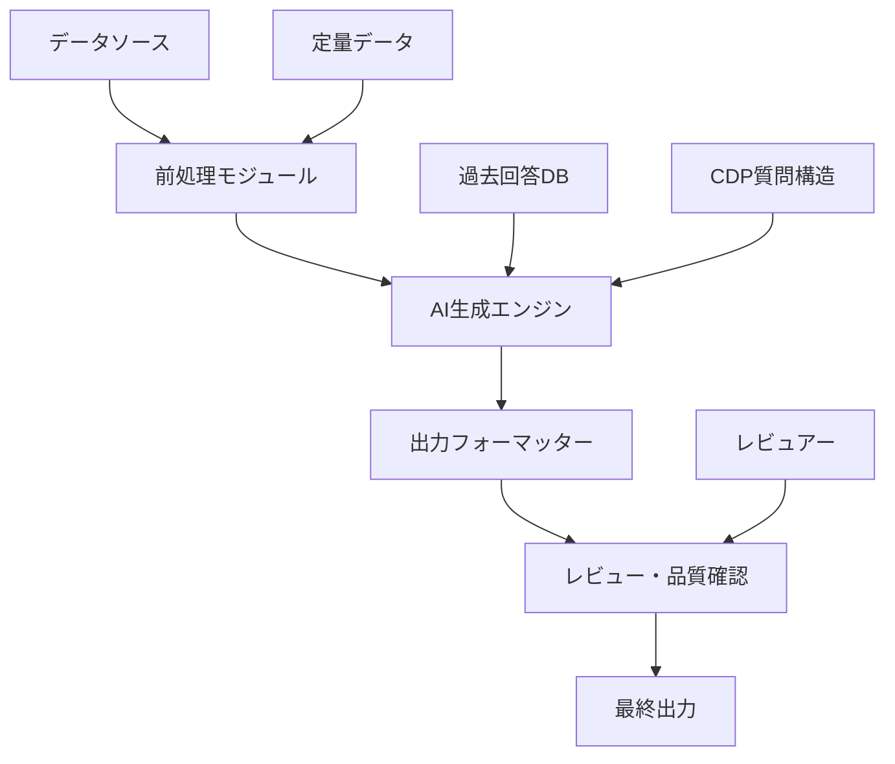
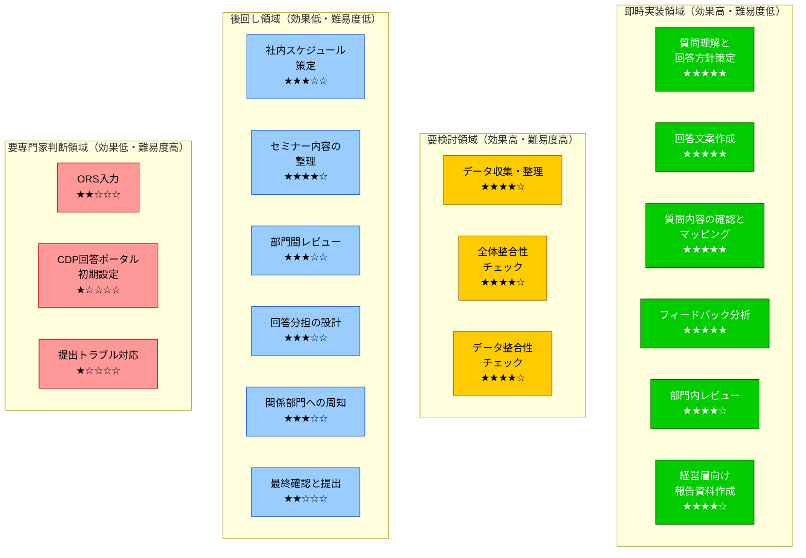
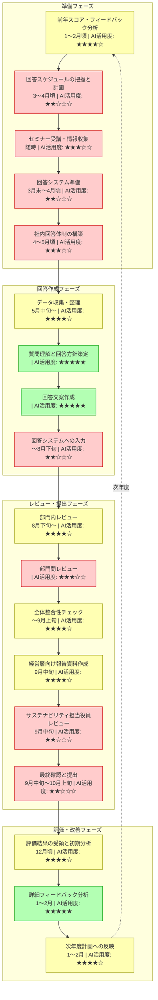
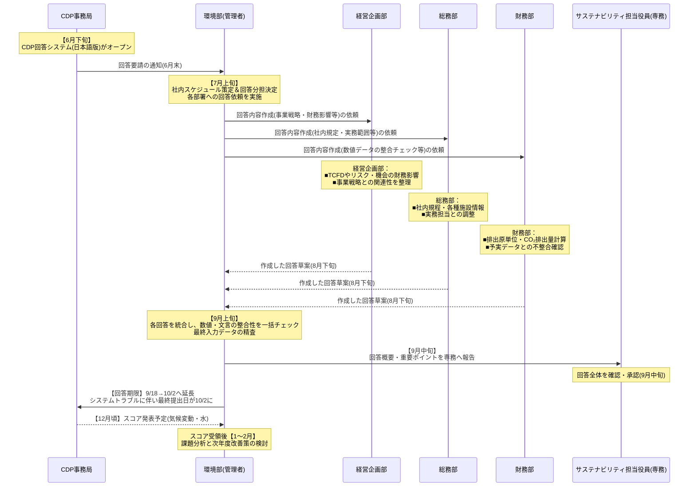

# environment フォルダ内容集約

## 目次

1. [D:\BMS\workspace\business_tasks_workspace\memory_bank\environment_department_project](#1-environment_department_project)
   - [activeContext.md](#1-environment_department_project-activecontext-md)
   - [productContext.md](#1-environment_department_project-productcontext-md)
   - [projectbrief.md](#1-environment_department_project-projectbrief-md)
2. [D:\BMS\workspace\business_tasks_workspace\projects\environment_department_project](#2-environment_department_project)
   - [README.md](#2-environment_department_project-readme-md)
   - [ai_application_analysis.md](#2-environment_department_project-ai_application_analysis-md)
   - [ai_implementation_design.md](#2-environment_department_project-ai_implementation_design-md)
   - [20250325_CDP業務AI分析_まとめ.md](#2-environment_department_project-20250325_cdp業務ai分析_まとめ-md)
   - [20250325_CDP業務AI実装優先度マップ.html](#2-environment_department_project-20250325_cdp業務ai実装優先度マップ-html)
   - [20250325_CDP業務AI実装優先度マップ.md](#2-environment_department_project-20250325_cdp業務ai実装優先度マップ-md)
   - [20250325_CDP業務フロー分析と詳細AI活用可能性評価.md](#2-environment_department_project-20250325_cdp業務フロー分析と詳細ai活用可能性評価-md)
   - [20250325_CDP業務フロー図.html](#2-environment_department_project-20250325_cdp業務フロー図-html)
   - [20250325_CDP業務フロー図.md](#2-environment_department_project-20250325_cdp業務フロー図-md)
   - [README.md](#2-environment_department_project-readme-md)
   - [20250325_環境部CDP対応レポート自動化プロジェクトMTG議事録.md](#2-environment_department_project-20250325_環境部cdp対応レポート自動化プロジェクトmtg議事録-md)
   - [20250324_CDP対応業務ヒアリング結果と分析.md](#2-environment_department_project-20250324_cdp対応業務ヒアリング結果と分析-md)
   - [next_actions.md](#2-environment_department_project-next_actions-md)
   - [nextactions.md](#2-environment_department_project-nextactions-md)
   - [20250325_環境部CDP対応レポート自動化プロジェクトMTG_ネクストアクション表.md](#2-environment_department_project-20250325_環境部cdp対応レポート自動化プロジェクトmtg_ネクストアクション表-md)
   - [project_detail.md](#2-environment_department_project-project_detail-md)
3. [D:\BMS\workspace\business_tasks_workspace\projects\environment_department_project\archive](#3-archive)
   - [20250325_CDP業務AI分析_まとめ.md](#3-archive-20250325_cdp業務ai分析_まとめ-md)
   - [20250325_CDP業務AI実装優先度マップ.html](#3-archive-20250325_cdp業務ai実装優先度マップ-html)
   - [20250325_CDP業務AI実装優先度マップ.md](#3-archive-20250325_cdp業務ai実装優先度マップ-md)
   - [20250325_CDP業務フロー分析と詳細AI活用可能性評価.md](#3-archive-20250325_cdp業務フロー分析と詳細ai活用可能性評価-md)
   - [20250325_CDP業務フロー図.html](#3-archive-20250325_cdp業務フロー図-html)
   - [20250325_CDP業務フロー図.md](#3-archive-20250325_cdp業務フロー図-md)
   - [README.md](#3-archive-readme-md)
   - [20250325_環境部CDP対応レポート自動化プロジェクトMTG議事録.md](#3-archive-20250325_環境部cdp対応レポート自動化プロジェクトmtg議事録-md)
   - [20250324_CDP対応業務ヒアリング結果と分析.md](#3-archive-20250324_cdp対応業務ヒアリング結果と分析-md)
4. [D:\BMS\workspace\business_tasks_workspace\projects\environment_department_project\archive\documents](#4-documents)
   - [20250325_CDP業務AI分析_まとめ.md](#4-documents-20250325_cdp業務ai分析_まとめ-md)
   - [20250325_CDP業務AI実装優先度マップ.html](#4-documents-20250325_cdp業務ai実装優先度マップ-html)
   - [20250325_CDP業務AI実装優先度マップ.md](#4-documents-20250325_cdp業務ai実装優先度マップ-md)
   - [20250325_CDP業務フロー分析と詳細AI活用可能性評価.md](#4-documents-20250325_cdp業務フロー分析と詳細ai活用可能性評価-md)
   - [20250325_CDP業務フロー図.html](#4-documents-20250325_cdp業務フロー図-html)
   - [20250325_CDP業務フロー図.md](#4-documents-20250325_cdp業務フロー図-md)
   - [README.md](#4-documents-readme-md)
   - [20250325_環境部CDP対応レポート自動化プロジェクトMTG議事録.md](#4-documents-20250325_環境部cdp対応レポート自動化プロジェクトmtg議事録-md)
   - [20250324_CDP対応業務ヒアリング結果と分析.md](#4-documents-20250324_cdp対応業務ヒアリング結果と分析-md)
5. [D:\BMS\workspace\business_tasks_workspace\projects\environment_department_project\archive\documents\analysis](#5-analysis)
   - [20250325_CDP業務AI分析_まとめ.md](#5-analysis-20250325_cdp業務ai分析_まとめ-md)
   - [20250325_CDP業務AI実装優先度マップ.html](#5-analysis-20250325_cdp業務ai実装優先度マップ-html)
   - [20250325_CDP業務AI実装優先度マップ.md](#5-analysis-20250325_cdp業務ai実装優先度マップ-md)
   - [20250325_CDP業務フロー分析と詳細AI活用可能性評価.md](#5-analysis-20250325_cdp業務フロー分析と詳細ai活用可能性評価-md)
   - [20250325_CDP業務フロー図.html](#5-analysis-20250325_cdp業務フロー図-html)
   - [20250325_CDP業務フロー図.md](#5-analysis-20250325_cdp業務フロー図-md)
   - [README.md](#5-analysis-readme-md)
6. [D:\BMS\workspace\business_tasks_workspace\projects\environment_department_project\archive\documents\minutes](#6-minutes)
   - [20250325_環境部CDP対応レポート自動化プロジェクトMTG議事録.md](#6-minutes-20250325_環境部cdp対応レポート自動化プロジェクトmtg議事録-md)
7. [D:\BMS\workspace\business_tasks_workspace\projects\environment_department_project\archive\documents\reports](#7-reports)
   - [20250324_CDP対応業務ヒアリング結果と分析.md](#7-reports-20250324_cdp対応業務ヒアリング結果と分析-md)
8. [D:\BMS\workspace\business_tasks_workspace\projects\environment_department_project\output](#8-output)
   - [20250325_環境部CDP対応レポート自動化プロジェクトMTG_ネクストアクション表.md](#8-output-20250325_環境部cdp対応レポート自動化プロジェクトmtg_ネクストアクション表-md)
9. [D:\BMS\workspace\business_tasks_workspace\projects\environment_department_project\output\next_actions](#9-next_actions)
   - [20250325_環境部CDP対応レポート自動化プロジェクトMTG_ネクストアクション表.md](#9-next_actions-20250325_環境部cdp対応レポート自動化プロジェクトmtg_ネクストアクション表-md)

---

## 1. environment_department_project

**フォルダパス**: `D:\BMS\workspace\business_tasks_workspace\memory_bank\environment_department_project`

**ファイル数**: 3

### ファイル一覧

- `D:\BMS\workspace\business_tasks_workspace\memory_bank\environment_department_project\activeContext.md`
- `D:\BMS\workspace\business_tasks_workspace\memory_bank\environment_department_project\productContext.md`
- `D:\BMS\workspace\business_tasks_workspace\memory_bank\environment_department_project\projectbrief.md`

### ファイル内容

#### activeContext.md

**パス**: `D:\BMS\workspace\business_tasks_workspace\memory_bank\environment_department_project\activeContext.md`

```markdown
# CDP対応レポート自動化プロジェクト - アクティブコンテキスト

## 現在の作業焦点

### 現在のフェーズ
要件定義・計画フェーズ（2025年2月〜3月）

### アクティブなタスク
1. 環境部へのヒアリング実施
   - 環境部との初回ミーティング完了（業務フロー・ボトルネック確認）
   - CDP回答プロセスの詳細調査進行中（進捗70%）
   - 現行の課題と改善ポイントの洗い出し中
   
2. CDPレポート作成業務の分析
   - 実際のCDP質問書・回答内容の分析中（進捗60%）
   - 質問カテゴリ別の回答特性整理
   - 部門間連携が必要な項目の特定
   
3. AI技術の適用可能性検討
   - 生成AIによる回答試験生成の準備
   - 株主総会問答集での経験の応用検討
   - セキュリティ・機密情報の取り扱い方針検討

## 最近の変更

### 2025/3/14
- プロジェクト立ち上げ会議実施
- 経営品質本部 中村役員との初期ミーティング
- CDP対応業務の概要把握と課題初期整理

### 2025/3/15
- 環境部との初回ヒアリング実施
- CDP質問書サンプルと過去回答の入手
- CDPレポート作成プロセスの基本フロー確認

### 2025/3/16
- 部門間情報連携における課題詳細化
- 各部署（経営企画部・財務部等）の役割と提供情報の整理
- 生成AI適用の優先領域検討ワークショップ実施

### 2025/3/24
- 環境部詳細ヒアリング結果の整理
- CDP回答作業の工数・ボトルネック詳細分析
- AI適用領域別の優先度付けと実現可能性評価

## 次のステップ

### 短期アクション（1週間以内）
1. 環境部CDPレポート担当者との詳細ヒアリング完了
2. 過去のCDP回答内容の分析レポート作成
3. CDP質問カテゴリ別のAI生成難易度評価
4. データ連携要件の初期洗い出し

### 中期アクション（2-4週間）
1. システム要件定義書の作成
2. 生成AIモデル選定とテスト計画立案
3. 部門間データ収集フォーマットの標準化検討
4. 実際のCDP質問に対するAI回答生成試験実施

### 重要なマイルストーン
1. 要件定義完了：2025/3/末
2. データ連携・システム要件定義：2025/4/上旬
3. AI生成モデル調整完了：2025/4/末
4. 試験運用開始：2025/5/上旬

## アクティブな決定事項

### 決定済み事項
1. 株主総会問答集AIモデルをベースとした開発方針採用
   - 決定日：2025/3/14
   - 決定者：AI推進チームリーダー、経営品質本部 中村役員
   - 根拠：既存成功事例の応用による開発効率向上、類似した質問応答形式

2. 部門ごとの情報入力・レビュー体制の構築
   - 決定日：2025/3/15
   - 決定者：環境部責任者、AI推進チームリーダー
   - 根拠：各部門の専門性を活かした正確な情報提供と確認体制の確保

### 未決定事項
1. AIモデルの具体的選定
   - オプション：社内開発モデル vs クラウドサービス利用
   - 決定期限：2025/3/末
   - 決定に必要な情報：セキュリティ要件、精度評価、コスト比較
   
2. データ連携方法と自動化レベル
   - オプション：完全自動化 vs 半自動（人間の確認・修正プロセス含む）
   - 決定期限：2025/4/上旬
   - 決定に必要な情報：試験結果分析、環境部担当者のフィードバック

## 発生中の課題と考慮事項

### 技術的課題
1. CDPの年次質問変更への対応の柔軟性確保
   - 対応策検討中：質問構造の抽象化モデリング、更新容易なプロンプト設計
   
2. 生成AI出力の正確性・信頼性の担保
   - 対応策検討中：人間とAIの役割分担明確化、複数段階のレビュープロセス

3. CDPシステム連携の限界と対応策
   - 現状調査結果：インポート機能は限定的でコピー＆ペーストが中心になる見込み
   - 対応策検討中：RPA活用の可能性評価、ユーザーフレンドリーな出力フォーマット設計

### 組織的課題
1. 複数部署からの情報収集の効率化と期限遵守
   - 対応策検討中：明確なタイムラインと責任者設定、進捗管理ダッシュボード

2. 機密情報・内部データの適切な取り扱い
   - 対応策検討中：セキュリティガイドライン策定、アクセス権限管理

3. データ整合性・精度確保の自動化
   - 新たに把握した課題：現状では手動計算と目視確認に依存したデータチェック
   - 対応策検討中：自動計算驚きチェック、年度変化の誤差範囲判定ルール設計

### リスク状況
1. スケジュールリスク：CDP質問書の公開遅延による対応期間短縮
   - リスク評価：影響大・発生可能性中
   - 軽減策：事前準備の徹底、優先度に基づく機能リリース計画
   
2. 品質リスク：生成AIによる不適切な回答・誤情報の混入
   - リスク評価：影響大・発生可能性中
   - 軽減策：段階的なレビュープロセス、重要項目のチェックリスト作成

3. 対投資効果（ROI）リスク：工数削減予測の見誤り
   - リスク評価：影響中・発生可能性中
   - 軽減策：保守的な工数削減計画、段階的導入・効果測定の実施
```

---

#### productContext.md

**パス**: `D:\BMS\workspace\business_tasks_workspace\memory_bank\environment_department_project\productContext.md`

```markdown
# CDP対応レポート自動化プロジェクト - プロダクトコンテキスト

## プロジェクトの存在理由

### 解決すべき課題
環境部は現在、CDP（Carbon Disclosure Project）対応において以下の課題を抱えています：
1. レポート作成における作業負荷の高さ（膨大な質問数、専門用語、内容理解の困難さ）
2. 毎年変化する質問内容やスコアリング基準への対応
3. グループ全体の環境活動情報やデータの収集・整理の煩雑さ
4. 手入力を中心とした非効率なデータ登録プロセス
5. 部門間での整合性確認や平仄合わせにかかる工数

### 課題がもたらす影響
- 環境部担当者への過度な負担集中と時間的制約
- 限られた期間での大量の作業による品質リスクの増大
- データ入力ミスや不整合による評価スコアへの悪影響
- CDPや環境情報開示への対応遅延リスク
- 担当者のノウハウに依存した属人的な対応体制

### 解決による期待効果
- レポート作成工数の大幅削減と担当者の負担軽減
- 統一的・一貫性のある回答品質の確保
- 部門間連携の効率化とコミュニケーションの円滑化
- 過去回答の効率的な活用による知識継承の促進
- 継続的なCDP評価スコアの維持・向上

## ユーザー視点での利用シナリオ

### 環境部担当者（主利用者）
**主要ニーズ**：レポート作成の効率化、情報収集の簡素化、回答品質の向上
**利用シナリオ**：
1. AIが過去の回答や関連資料から質問の意図を理解し、回答案を自動生成
2. 複雑な英語からの翻訳や専門用語の理解をAIが支援
3. 最新のスコアリング基準を反映した回答提案を受け取り、効率的に修正

### 経営企画部担当者
**主要ニーズ**：財務影響情報や戦略的情報の適切な提供、一貫性のある回答作成
**利用シナリオ**：
1. 気候変動リスク・機会の財務影響に関する情報入力の支援
2. 将来戦略に関する過去回答との整合性確認
3. 経営視点からの環境戦略表現のサポート

### 財務部・総務部担当者
**主要ニーズ**：適切なデータ提供、部門間の情報整合性の確保
**利用シナリオ**：
1. 排出量取引やコスト分析データの効率的な提出
2. 環境関連施設情報や社内規程情報の構造化された入力
3. 他部門データとの整合性自動チェック

### 事業本部担当者
**主要ニーズ**：環境貢献や排出量データの適切な提出と反映
**利用シナリオ**：
1. 事業活動における環境貢献情報の標準フォーマットでの入力
2. 温室効果ガス排出量データの効率的な集計と提出
3. 事業戦略と環境への取り組みの関連付けサポート

## 主要機能概要

### CDPレポート自動生成システム
- 質問理解・意図解釈機能
- 過去回答参照・活用機能
- 回答案自動生成機能
- レビュー・修正支援機能

### データ収集・管理機能
- 部門横断的なデータ収集フォーマット
- 収集データの一元管理・統合
- データ検証・整合性チェック
- 年次データ比較・傾向分析

### CDPスコア最適化支援
- スコアリング基準分析機能
- 回答内容の評価シミュレーション
- 改善提案機能
- ベストプラクティス参照機能

### 部門間連携ツール
- タスク進捗管理・可視化
- 共同編集・レビュー機能
- 通知・アラート機能
- フィードバック収集機能

## ユーザー体験目標

### 使いやすさ
- CDPの複雑な質問構造を理解しやすい表示形式
- 部門ごとの入力インターフェースのカスタマイズ
- 過去回答との比較が容易な操作性

### 効率性
- データ入力・回答作成の大幅な時間短縮
- 自動生成と人間レビューの最適なバランス
- 繰り返し作業の自動化によるミス削減

### 信頼性
- 生成AI出力内容の正確性と信頼性の確保
- 機密情報の適切な取り扱いとセキュリティ確保
- 最終回答の品質保証メカニズム

### 価値提供
- 環境情報開示の質的向上
- CDP評価スコアの継続的改善
- 環境活動の戦略的位置づけの明確化
- 年次の対応ノウハウの組織的蓄積
```

---

#### projectbrief.md

**パス**: `D:\BMS\workspace\business_tasks_workspace\memory_bank\environment_department_project\projectbrief.md`

```markdown
# CDP対応レポート自動化プロジェクト

## プロジェクト基本情報

### プロジェクト名
環境部案件 - CDP対応レポート自動化プロジェクト

### プロジェクトID
BT-ENV-001

### 作成日
2025年3月15日

### 最終更新日
2025年3月15日

### ステータス
新規

### 関連部署
- 環境部（主管部署）
- 経営品質本部
- AI推進チーム

## 核心要件

### プロジェクト目的
環境部がCDP（Carbon Disclosure Project）に提出するレポート作成にかかる負荷を軽減するため、生成AIを活用してレポートの自動作成を実現し、全体の業務効率と正確性を向上させる。

### 主要目標
1. CDP関連レポート作成の工数削減
2. レポート内容の品質と一貫性の向上
3. 生成AIを活用した環境情報の効率的な集約と分析
4. 複数部署間の情報共有・連携の強化

### 成功指標
1. レポート作成工数の40%以上削減
2. CDP評価スコアの維持または向上
3. 内部レビュー・修正サイクルの30%短縮
4. 回答の正確性・網羅性の向上

## プロジェクト範囲

### 含まれる範囲
- CDPレポート作成プロセスの分析と改善
- 生成AI活用による自動レポート作成システムの設計・実装
- 環境データ収集・整理の自動化
- 内部レビュープロセスの効率化

### 除外される範囲
- CDP以外の環境関連レポート作成
- 環境データ収集の基盤システム変更
- 社内環境管理体制の変更

### 依存関係
- AI推進チームの技術サポート
- 各部署の情報提供協力
- CDPの質問形式・回答システム

## 主要ステークホルダー

### 内部ステークホルダー
- 環境部（主管部署）
- 経営品質本部 中村役員（提案者）
- 経営企画部（財務影響分析担当）
- 財務部
- 総務部
- 事業本部

### 外部ステークホルダー
- CDP事務局

## リスクと制約

### 主要リスク
1. CDP質問内容の年次変更による対応必要性
2. 生成AI出力内容の精度・正確性の担保
3. 部門間の情報収集調整の難航
4. セキュリティ・機密情報の取り扱い

### 制約条件
1. CDP提出期限（2025年9月中旬〜10月上旬）までの完了必須
2. 限定されたプロジェクトメンバーでの遂行
3. ORS（オンライン回答システム）への手動入力必要性

## タイムライン概要

### フェーズ1: 要件定義・計画（2025年2月〜3月）
- 環境部との初回ヒアリング（業務フロー・ボトルネック確認）
- データ連携・システム要件定義

### フェーズ2: 設計・開発（2025年4月〜5月）
- AI生成モデルの調整
- レビュー体制構築
- 試験運用と改修

### フェーズ3: 本格運用（2025年6月〜8月）
- CDP質問書公開後の対応開始
- レポート回答作成
- 内部レビュー実施

### フェーズ4: 提出・評価（2025年9月〜10月）
- 最終提出
- 効果測定
- フィードバック収集と改善
```

---

## 2. environment_department_project

**フォルダパス**: `D:\BMS\workspace\business_tasks_workspace\projects\environment_department_project`

**ファイル数**: 16

### ファイル一覧

- `D:\BMS\workspace\business_tasks_workspace\projects\environment_department_project\README.md`
- `D:\BMS\workspace\business_tasks_workspace\projects\environment_department_project\ai_application_analysis.md`
- `D:\BMS\workspace\business_tasks_workspace\projects\environment_department_project\ai_implementation_design.md`
- `D:\BMS\workspace\business_tasks_workspace\projects\environment_department_project\archive\documents\analysis\20250325_CDP業務AI分析_まとめ.md`
- `D:\BMS\workspace\business_tasks_workspace\projects\environment_department_project\archive\documents\analysis\20250325_CDP業務AI実装優先度マップ.html`
- `D:\BMS\workspace\business_tasks_workspace\projects\environment_department_project\archive\documents\analysis\20250325_CDP業務AI実装優先度マップ.md`
- `D:\BMS\workspace\business_tasks_workspace\projects\environment_department_project\archive\documents\analysis\20250325_CDP業務フロー分析と詳細AI活用可能性評価.md`
- `D:\BMS\workspace\business_tasks_workspace\projects\environment_department_project\archive\documents\analysis\20250325_CDP業務フロー図.html`
- `D:\BMS\workspace\business_tasks_workspace\projects\environment_department_project\archive\documents\analysis\20250325_CDP業務フロー図.md`
- `D:\BMS\workspace\business_tasks_workspace\projects\environment_department_project\archive\documents\analysis\README.md`
- `D:\BMS\workspace\business_tasks_workspace\projects\environment_department_project\archive\documents\minutes\20250325_環境部CDP対応レポート自動化プロジェクトMTG議事録.md`
- `D:\BMS\workspace\business_tasks_workspace\projects\environment_department_project\archive\documents\reports\20250324_CDP対応業務ヒアリング結果と分析.md`
- `D:\BMS\workspace\business_tasks_workspace\projects\environment_department_project\next_actions.md`
- `D:\BMS\workspace\business_tasks_workspace\projects\environment_department_project\nextactions.md`
- `D:\BMS\workspace\business_tasks_workspace\projects\environment_department_project\output\next_actions\20250325_環境部CDP対応レポート自動化プロジェクトMTG_ネクストアクション表.md`
- `D:\BMS\workspace\business_tasks_workspace\projects\environment_department_project\project_detail.md`

### ファイル内容

#### README.md

**パス**: `D:\BMS\workspace\business_tasks_workspace\projects\environment_department_project\README.md`

```markdown
# 環境部案件 AIエージェントルール

## プロジェクト概要
環境部におけるAI技術の活用可能性を検証し、業務効率化や新たな価値創造を目指すプロジェクト。

## ディレクトリ構造 
projects/company_ai_promotion/projects/environment_department_project/
├── ai_agent_rule.md # プロジェクトルール
├── project_detail.md # プロジェクト詳細
├── input/ # 入力データ
├── output/ # 成果物
└── archive/ # アーカイブ
├── documents/ # ドキュメント類
│ ├── specifications/ # 仕様書
│ ├── reports/ # レポート
│ └── presentations/ # プレゼン資料
├── data/ # データファイル
│ ├── raw/ # 生データ
│ ├── processed/ # 加工済みデータ
│ └── analysis/ # 分析データ
└── other/ # その他のファイル
├── templates/ # テンプレート
└── references/ # 参考資料


## ファイル管理ルール
1.  すべてのinputデータは`input/`ディレクトリに格納する。
2.  AIによる分析結果や生成物などのoutputデータは`output/`ディレクトリに格納する。
3.  プロジェクト完了後、最終成果物や重要なドキュメントは`archive/`ディレクトリに整理して保管する。
4.  データやドキュメントの更新履歴は`project_detail.md`に記録する。

## テスト管理
1.  各タスクにおいて、実施するテスト内容と期待される結果を明確に定義する。
2.  テストケースを作成し、`test_cases.md`に記録する。
3.  テスト実施後、結果を`test_results.md`に記録し、合否判定を行う。

## レポーティング
1.  日々の進捗状況は`daily_progress.md`に記録する。
2.  週次でプロジェクトの進捗概要を`weekly_report.md`にまとめる。
3.  月次で詳細な評価レポート`monthly_report.md`を作成する。

## コミュニケーション
1.  プロジェクトメンバー間のコミュニケーションは、Slackなどのチャットツールを基本とする。
2.  重要な決定事項や議事録は`minutes/`ディレクトリに保管する。
3.  定期的な進捗会議や報告会を実施し、情報共有と課題解決を行う。

## その他
1.  プロジェクトで使用するツールや環境は、`environment.md`に記述する。
2.  セキュリティに関する事項は、`security_policy.md`にまとめる。
3.  本ルールに変更が必要な場合は、プロジェクトメンバーで合意の上、`ai_agent_rule.md`を更新する。

最終更新日: 2025/02/17

# 環境部プロジェクトディレクトリ構成

このディレクトリは環境部関連のプロジェクトファイルを管理するための構造です。

## ディレクトリ構成

- `archive/` - 完了したプロジェクトファイルの保管用ディレクトリ
- `docs/` - プロジェクト関連のドキュメント保管用ディレクトリ
- `meeting_notes/` - 会議録保管用ディレクトリ
- `reports/` - レポート類保管用ディレクトリ
- `resources/` - プロジェクトで使用する各種リソースファイル保管用ディレクトリ

## 使用規則

1. 完了したプロジェクトファイルは`archive`ディレクトリに移動する
2. ドキュメントは必ず日付をファイル名に含める（例：`YYYYMMDD_document_name.md`）
3. 会議録は`YYYYMMDD_meeting_title.md`の形式で保存する
4. レポートは`YYYYMMDD_report_title.md`の形式で保存する
5. リソースファイルは適切なサブディレクトリを作成して整理する

## ファイル命名規則

1. すべてのファイル名は英数字を使用
2. スペースの代わりにアンダースコア（_）を使用
3. 日付は`YYYYMMDD`形式で記載
4. 小文字を基本とする

## バージョン管理

1. ドキュメントの更新履歴は各ファイル内に記録
2. 重要な更新の場合は、更新前のファイルを`archive`に移動
3. ファイル名に`_v1`、`_v2`などのバージョン番号を付与

```

---

#### ai_application_analysis.md

**パス**: `D:\BMS\workspace\business_tasks_workspace\projects\environment_department_project\ai_application_analysis.md`

```markdown
# CDP対応レポート自動化プロジェクト - AI適用領域分析

## 業務ブロック分析とAI適用候補領域

本分析は、CDP回答プロセスを業務ブロックに分解し、生成AIの適用可能性と期待効果を評価するものです。環境部へのヒアリング結果に基づき、AIを活用した効率化とレポート品質向上の可能性を検討しています。

### 業務ブロック一覧と適用可能性評価

| # | 業務ブロック | 現状の課題 | AI適用可能性 | 優先度 |
|--|------------|----------|------------|-------|
| A | 質問の分析・要点抽出 | 膨大な質問を理解するのに時間がかかる、英語や専門用語理解が難しい | ★★★（高） | 高 |
| B | 過去回答や関連文書の検索・再利用 | 転記に手間がかかる、部署ごとの情報を探す労力 | ★★★（高） | 高 |
| C | 初稿の自動生成 | 200問近い質問への回答作成の工数大、文章品質の均一化の難しさ | ★★★（高） | 高 |
| D | データ整合性チェック | 排出量計算などの数値間矛盾を手作業でチェック、ヒューマンエラーリスク | ★★☆（中〜高） | 中〜高 |
| E | レビュー支援・コメント集約 | 複数部署からの修正依頼管理、バージョン管理の難しさ | ★★☆（中〜高） | 中〜高 |
| F | CDPシステムトラブル対応 | ORS側の不具合、公開遅延など根本対策は困難 | ★★☆（中〜低） | 中〜低 |
| G | 社内他部署とのヒアリング調整 | 部署間の連携、情報収集フローの非効率 | ★★☆（中） | 中 |
| H | 事業戦略・リスク評価の代行 | 経営判断に関わる内容はAI代行が難しい | ★☆☆（低） | 低 |
| I | 外部専門機関との調整 | 第三者保証など法的手続きはAI代行不可 | ★☆☆（低） | 低 |
| J | CDPへの入力作業 | API・インポート機能不足、手入力が必要 | ★★☆（中） | 中 |

## 各業務ブロックの詳細分析

### A: 質問の分析・要点抽出

**対象作業**:
- CDP質問書（英語・日本語）の膨大な設問を読み込み、要件を素早く把握
- 毎年変わる設問の差分確認（前年と今年の比較など）

**必要な機能**:
- 自動要約機能: 質問文を分かりやすく要約
- 差分抽出機能: 前年度からの変更点を強調表示

**期待効果**:
- 英語・専門用語が多い質問文を素早く理解でき、回答担当者の負荷軽減
- 質問の意図（スコア取得ポイントなど）を早期に把握可能

**実装アプローチ**:
- 過去のCDP質問書と新質問書の比較分析を行うモデルを構築
- 質問内容とスコアリング基準を関連付ける知識ベースの整備
- 複雑な質問を分解し、回答ポイントを明示する機能の開発

### B: 過去回答や関連文書の検索・再利用

**対象作業**:
- 過去のCDP回答（定性情報・定量データの文章表現など）を再利用
- 他部署の類似資料から必要な記載内容を抽出

**必要な機能**:
- 文書検索・類似回答探索: Embeddingなどを用い、過去文書から類似回答候補を提示
- 抜粋・再構成機能: 必要箇所を自動引用・リライト

**期待効果**:
- 定型的質問への回答を効率化し、転記作業を削減
- 担当者のリサーチ時間を圧縮し、回答精度も向上

**実装アプローチ**:
- 過去回答データベースの構築とベクトル検索機能の実装
- 既存の文書管理システム（BOX、EcoTrackなど）との連携
- 類似質問の識別と再利用候補の自動提案機能の開発

### C: 初稿の自動生成（回答文ドラフト作成）

**対象作業**:
- 設問に応じた回答案のドラフトをAIが文章化
- CO2排出量や施策内容などの定量・定性データを反映してレポート初稿を作成

**必要な機能**:
- テンプレートベース回答生成: 質問テンプレ＋社内データベースの内容を組み合わせる
- ナレッジベース統合: EcoTrack等から定量データを取り込む
- 日本語・英語対応: 必要に応じて英語下書きも作成

**期待効果**:
- "たたき台"がすぐに用意でき、回答作成工数を大幅に削減
- 大量設問への一括対応が可能

**実装アプローチ**:
- 質問カテゴリごとに最適化されたプロンプトテンプレートの開発
- 排出量データなど定量情報の自動埋め込み機能の実装
- 回答品質と網羅性を確保するためのチェックリスト機能の追加

### D: データ整合性チェック

**対象作業**:
- CO2排出量などの数値の整合確認（合計値と内訳、年度比較など）
- フリーテキスト回答内の数値とDB上の数値に食い違いがないか検証

**必要な機能**:
- 数値検証ロジック: 合計値とサブ合計、前年対比で大幅乖離があればアラート
- クロスチェック: 回答文中とDB値の照合

**期待効果**:
- 提出直前のダブルチェック工数を大幅に削減
- 数値不整合によるスコアダウンや再提出リスクを軽減

**実装アプローチ**:
- 数値検証ルールエンジンの開発（合計値確認、前年比異常値検出など）
- 文中に記載された数値と定量データの自動照合機能
- 不整合発見時のアラート・修正提案システムの実装

### E: レビュー支援・コメント集約

**対象作業**:
- 最終的に回答文を複数部署・役員がレビューする際のコメント管理
- 修正要望を一元化し、バージョン管理を可視化

**必要な機能**:
- レビュー管理: 担当者ごとにコメントや修正内容を集約
- 変更履歴の可視化: AIが校閲し、修正点をサマリー表示

**期待効果**:
- メールやExcelでのやり取りを減らし、承認フローを効率化
- 進捗把握と修正履歴管理が容易になり、提出遅延リスクを低減

**実装アプローチ**:
- コメント・修正管理ダッシュボードの開発
- 複数レビュアーからのフィードバック統合機能
- 変更履歴トラッキングと修正ポイントの可視化機能

### F〜J: その他の業務ブロック（中〜低優先度）

**F: CDPシステムトラブル対応**
- CDP側システムの問題に対しては根本的解決は困難
- 英語版早期対応サポートや文書翻訳支援は可能性あり

**G: 社内他部署とのヒアリング調整**
- 情報収集テンプレートやヒアリングガイド生成は支援可能
- ヒアリング自動化よりも構造化された情報収集方法の設計が重要

**H: 事業戦略・リスク評価の代行**
- 最終決定は人間が行うため直接的なAI適用は限定的
- 参考情報の整理や分析支援として部分的に活用可能

**I: 外部専門機関との調整**
- 法的手続きや第三者保証対応はAIでの代行が困難
- ドキュメント準備やチェックリスト作成での支援に限定

**J: CDPへの入力作業**
- 現状のCDPシステムはAPIやインポート機能が限定的
- RPA活用の可能性もあるが、手入力支援が中心となる見込み

## 優先的に実装すべき機能と実現方法

### 第1フェーズ（2025年4〜5月実装目標）

1. **質問分析・要点抽出（ブロックA）**
   - CDP質問書と過去回答の分析・要約機能
   - 改訂ポイント・スコアリング基準の抽出機能

2. **過去文書活用機能（ブロックB）**
   - 過去回答検索・類似質問検出システム
   - 部門別情報の抽出・統合機能

3. **回答ドラフト自動生成（ブロックC）**
   - 質問カテゴリ別の回答テンプレート
   - 定型質問への自動回答生成機能

### 第2フェーズ（2025年5〜6月実装目標）

4. **データ整合性チェック（ブロックD）**
   - 数値整合性検証エンジン
   - 前年比較・異常検出機能

5. **レビュー支援システム（ブロックE）**
   - レビューコメント集約ダッシュボード
   - 修正履歴管理・進捗確認機能

### 第3フェーズ（2025年6〜7月検討）

6. **入力支援ツール（ブロックJ）**
   - コピー&ペースト最適化フォーマット
   - RPA活用可能性の検証と実装検討

## 実装上の重要ポイント

1. **データセキュリティの確保**
   - 機密データ取り扱いポリシーの策定
   - アクセス権限管理と監査ログの設計

2. **精度と信頼性の確保**
   - 人間とAIの役割分担明確化
   - 段階的なレビュープロセスの確立
   - 特に数値データの精度保証メカニズム

3. **柔軟性と拡張性**
   - 質問内容の年次変更に対応できる設計
   - CDP側のシステム変更にも柔軟に対応可能な構造

4. **使いやすさと操作性**
   - ユーザーフレンドリーなインターフェース
   - 担当者の習熟度を考慮した設計
   - 手作業とAI支援のシームレスな連携

## 実装効果の予測

| 業務ブロック | 現状の工数 | 削減期待値 | 品質向上効果 |
|------------|---------|----------|----------|
| A: 質問分析 | 全体の15% | 70%削減 | 理解精度向上、見落とし防止 |
| B: 過去回答活用 | 全体の20% | 80%削減 | 整合性向上、網羅性確保 |
| C: 回答自動生成 | 全体の35% | 60%削減 | 表現統一、回答品質均一化 |
| D: 整合性チェック | 全体の15% | 80%削減 | ミス防止、数値精度向上 |
| E: レビュー支援 | 全体の10% | 40%削減 | 修正漏れ防止、進捗可視化 |
| J: 入力支援 | 全体の5% | 30%削減 | 入力ミス防止 |

**全体効果予測**:
- 総工数の約50%削減（10日×8時間×4名→5日×8時間×4名程度）
- 最終チェック期間の約30%削減（1週間→4〜5日程度）
- スコアリング対応のための質問理解度・回答品質の向上
- 部門間連携の効率化と担当者負担の軽減

## 次のステップ

1. 詳細要件定義の完了（2025年3月末）
2. 第1フェーズ機能の設計・開発（2025年4月中旬）
3. 環境部とのフィードバックセッション実施（2025年4月下旬）
4. 第2フェーズ機能の設計・開発（2025年5月中旬）
5. 実際のCDP質問書公開に備えた試験運用準備（2025年6月）

```

---

#### ai_implementation_design.md

**パス**: `D:\BMS\workspace\business_tasks_workspace\projects\environment_department_project\ai_implementation_design.md`

```markdown
# CDP対応レポート自動化プロジェクト - AI実装設計書

## 1. 概要

本設計書は、環境部によるCDP（Carbon Disclosure Project）レポート作成プロセスの効率化と品質向上を目的としたAI導入の技術的設計です。ヒアリング結果に基づき、生成AIを活用した自動化システムの構成、機能詳細、開発アプローチを定義します。

## 2. システムアーキテクチャ

### 2.1 全体構成



### 2.2 主要コンポーネント

1. **データ統合層**
   - EcoTrackからのCO2排出量データ取り込み
   - 過去回答アーカイブのベクトルDB化
   - CDP質問書のパーシングと構造化

2. **AI処理エンジン**
   - LLMを活用した質問分析モジュール
   - 回答生成モジュール
   - 数値整合性検証エンジン

3. **ユーザーインターフェース**
   - 回答管理ダッシュボード
   - レビュー・編集インターフェース
   - 進捗管理機能

4. **出力・連携モジュール**
   - Word/Excel形式の出力機能
   - コピー&ペースト最適化フォーマット
   - （将来的）CDPオンラインシステム連携

## 3. 主要機能の詳細設計

### 3.1 質問分析・要点抽出機能

**目的**: CDP質問の意図と要求事項を正確に理解し、回答方針を提案する

**入力**:
- CDP質問文（日本語/英語）
- 過去のスコアリング結果
- 回答ガイドライン

**処理**:
1. 質問テキストの言語処理と要約
2. キーワード・重要概念の抽出
3. 類似過去質問とのマッピング
4. スコアリング基準との関連付け分析

**出力**:
- 質問要約（簡潔な日本語表現）
- 対応すべき要点リスト
- 回答に必要なデータ項目リスト
- スコア向上のためのポイント

**プロンプト設計例**:
```
以下のCDP質問を分析し、要約してください。また、回答に必要な要点を箇条書きで抽出し、この質問にスコアを獲得するためのポイントを説明してください。

【質問】{質問文}

【過去スコア】{過去のスコア情報}

【ガイドライン】{関連するガイドライン情報}
```

### 3.2 過去回答・関連文書検索機能

**目的**: 類似質問の過去回答や関連資料を効率的に検索し、再利用候補を提案する

**入力**:
- 質問ID/テキスト
- 過去回答データベース
- 社内関連文書

**処理**:
1. 質問のベクトル化
2. 類似度スコアに基づく過去回答検索
3. 関連文書の特徴抽出と関連付け
4. 再利用候補のランキング

**出力**:
- 類似度が高い過去回答（最大5件）
- 関連文書の該当箇所
- 更新が必要な部分の指摘

**技術構成**:
- 埋め込みモデル: text-embedding-3-small
- ベクトルDB: LanceDB
- 検索アルゴリズム: 近似最近傍探索

### 3.3 回答ドラフト自動生成機能

**目的**: 質問への適切な回答文を自動生成し、人間による微調整を最小化する

**入力**:
- 質問分析結果
- 過去回答参照結果
- 定量データ
- 企業方針・実績データ

**処理**:
1. 質問カテゴリに応じたテンプレート選択
2. 必要データの自動埋め込み
3. 回答文の生成
4. 表現の一貫性・正確性チェック

**出力**:
- 構造化された回答文
- データ引用と出典
- 注釈付きの編集提案

**プロンプト設計例**:
```
以下の情報を基に、CDPの質問に対する回答を作成してください。
回答はCDPのスコアリング基準を満たす形式で、具体的かつ定量的に記述してください。

【質問】{質問文の要約}
【要点】{抽出された要点リスト}
【過去回答】{類似質問の過去回答}
【データ】{関連する定量データ}
【方針】{関連する企業方針}

【形式】
- 最初に要点を簡潔に回答
- 次に具体的な取り組みや実績を説明
- 最後に今後の見通しや課題について言及
- 数値データは正確に引用し、出典を明記
```

### 3.4 データ整合性チェック機能

**目的**: 回答内の数値データの整合性を自動検証し、人的ミスを防止する

**入力**:
- 回答ドラフト
- 参照元の定量データ
- 整合性ルール

**処理**:
1. 回答文からの数値データ抽出
2. 合計値と内訳の整合性検証
3. 前年比増減の妥当性分析
4. クロスリファレンスチェック

**出力**:
- 整合性チェック結果
- 不整合箇所の指摘と修正提案
- 数値の出典確認

**検証ルール例**:
- Scope 1+2の合計値と個別値の一致確認
- 年度間の急激な変動（±20%以上）の妥当性確認
- 文中の数値表記とデータ値の一致確認
- 単位変換の正確性確認

### 3.5 レビュー支援・コメント管理機能

**目的**: 複数関係者によるレビュープロセスを効率化し、進捗を可視化する

**入力**:
- 回答ドラフト
- レビューコメント
- 修正履歴

**処理**:
1. レビューコメントの分類・重要度付け
2. 修正内容の変更管理
3. 承認状態の追跡
4. レビュアー間の意見調整支援

**出力**:
- レビュー進捗ダッシュボード
- コメント処理状況
- 変更履歴の可視化
- 最終版への反映状況

## 4. AIモデル選定とプロンプト設計

### 4.1 モデル選定基準

| 要素 | 重要度 | 要件 |
|------|------|------|
| 応答品質 | 高 | 複雑な質問理解、正確な回答生成 |
| コンテキスト長 | 高 | 長文の質問・過去回答の参照（16K以上推奨） |
| 言語能力 | 高 | 日英両言語の高度な処理能力 |
| 実行速度 | 中 | 複数質問の一括処理に耐えうる性能 |
| コスト効率 | 中 | 大量処理時の経済性 |
| セキュリティ | 高 | 機密データ取り扱いの安全性 |

### 4.2 候補モデル比較

| モデル | 強み | 弱み | 推奨用途 |
|-------|------|------|----------|
| Claude 3 Opus | 高度な理解力、長文処理 | コスト高、処理速度 | 複雑質問の分析、初期ドラフト |
| Claude 3 Sonnet | バランス型、コスト効率 | 専門知識が若干弱い | 大量回答生成、日常的処理 |
| Claude 3 Haiku | 高速処理、低コスト | コンテキスト理解が限定的 | 簡易分析、反復処理 |
| GPT-4o | 高精度、マルチモーダル | コスト、ベンダー依存 | 専門分析、データ解釈 |
| 社内モデル | セキュリティ、カスタマイズ | 開発コスト、性能制約 | 機密データ処理 |

### 4.3 推奨モデル構成

**質問分析・要点抽出**: Claude 3 Opus または GPT-4o
- 複雑な質問理解と要点抽出に優れた性能
- 推論能力が高く必要なデータ項目の洞察に適している

**過去回答検索**: テキスト埋め込みモデル + ベクトルDB
- 過去回答の効率的な検索と関連付け
- 年次変更への適応性確保

**回答ドラフト生成**: Claude 3 Sonnet
- バランスの取れた性能とコスト効率
- 大量質問への対応に適している

**データ整合性チェック**: カスタムルールベースシステム + Haiku
- 特定のチェックルールに基づく精度確保
- 高速な数値処理と検証

### 4.4 プロンプトエンジニアリング戦略

**構造化プロンプト設計**:
- 明確な役割定義と指示
- 入力情報の体系的な提供
- 出力フォーマットの標準化

**継続的最適化プロセス**:
- A/Bテストによるプロンプト改善
- レスポンス品質の定量評価
- フィードバックに基づく微調整

**プロンプトライブラリの構築**:
- 質問カテゴリ別の専用プロンプト
- 回答パターンに応じたテンプレート
- 再利用可能なコンポーネント化

**例: 質問分析プロンプト**:
```
あなたはCDP（Carbon Disclosure Project）の回答支援エキスパートです。
以下のCDP質問を分析し、回答するために必要な情報を特定してください。

【質問】
{質問全文}

【分析タスク】
1. この質問の主要な意図と焦点を3行以内で要約してください。
2. この質問に回答するために必要なデータ項目をリストアップしてください。
3. 高評価を得るために含めるべき要素を5つ挙げてください。
4. 過去に類似した質問があれば、その質問番号と相違点を示してください。

【出力形式】
要約：
[質問の簡潔な要約]

必要データ：
- [データ項目1]
- [データ項目2]
...

高評価ポイント：
- [ポイント1]
- [ポイント2]
...

関連過去質問：
[過去質問番号と関連性/相違点]
```

## 5. 開発・実装計画

### 5.1 フェーズ別開発計画

**フェーズ1: 基盤構築と基本機能（4月上旬〜中旬）**
- データ収集・構造化
- 基本アーキテクチャ構築
- 質問分析・要点抽出機能の実装
- 過去回答検索機能の実装

**フェーズ2: コア機能開発（4月中旬〜5月上旬）**
- 回答ドラフト生成機能の実装
- データ整合性チェック機能の実装
- ユーザーインターフェース基本設計
- 統合テスト環境構築

**フェーズ3: UI開発とシステム統合（5月上旬〜中旬）**
- ユーザーインターフェース実装
- レビュー支援機能の実装
- 出力フォーマッター開発
- システム統合とテスト

**フェーズ4: チューニングと試験運用（5月中旬〜下旬）**
- パフォーマンス最適化
- ユーザーフィードバック収集と改善
- セキュリティ強化
- 本番環境準備

### 5.2 技術スタック

**バックエンド**:
- 言語: Python 3.10+
- APIフレームワーク: FastAPI
- データベース: PostgreSQL, LanceDB (ベクトルDB)
- AI/ML: OpenAI API, Anthropic API, HuggingFace Transformers

**フロントエンド**:
- フレームワーク: React + TypeScript
- UIライブラリ: Material-UI または Tailwind CSS
- 状態管理: Redux または Context API
- グラフ・可視化: Recharts, D3.js

**インフラ**:
- コンテナ化: Docker
- オーケストレーション: Kubernetes (必要に応じて)
- CI/CD: GitHub Actions
- クラウド環境: AWS または Azure

### 5.3 セキュリティ設計

**データ保護**:
- 保存データの暗号化
- 通信経路の暗号化（TLS 1.3）
- アクセス制御と認証

**プライバシー対策**:
- データ処理ログの匿名化
- 機密情報のマスキング処理
- 必要最小限のデータ転送

**コンプライアンス対応**:
- 社内情報セキュリティポリシーへの準拠
- 定期的なセキュリティレビュー
- インシデント対応計画

## 6. 検証・評価計画

### 6.1 性能評価指標

| 指標 | 測定方法 | 目標値 |
|------|---------|-------|
| 回答品質スコア | 人間評価（1-5） | 平均4.0以上 |
| 生成速度 | 処理時間/質問 | 30秒以内 |
| 整合性検出率 | 埋め込みエラーの検出率 | 95%以上 |
| 人間作業削減率 | 作業時間比較 | 40%以上削減 |
| システム安定性 | エラー発生率 | 1%未満 |

### 6.2 テスト計画

**単体テスト**:
- 各機能モジュールの独立テスト
- 境界条件・異常系のテストケース
- 自動化テストスイートの構築

**統合テスト**:
- コンポーネント間連携のテスト
- エンドツーエンドのワークフロー検証
- パフォーマンステスト

**ユーザー受入テスト**:
- 環境部担当者によるユーザビリティテスト
- 実データによる回答品質評価
- フィードバックサイクルの実施

### 6.3 継続的改善プロセス

**モニタリング体制**:
- パフォーマンス監視ダッシュボード
- 利用統計とボトルネック分析
- エラーログと例外処理のトラッキング

**フィードバックループ**:
- 定期的なユーザーフィードバックセッション
- 改善提案のトラッキング
- 優先度に基づく機能強化計画

**バージョン管理**:
- 計画的なリリースサイクル
- 変更管理と安定性確保
- 下位互換性の維持

## 7. リスクと対策

| リスク | 影響度 | 対策 |
|-------|-------|------|
| AIモデルの精度不足 | 高 | プロンプト最適化、人間レビュープロセスの強化 |
| データ連携の不整合 | 高 | 厳格な検証ルール、手動確認ポイントの設定 |
| システム導入の抵抗 | 中 | 段階的導入、トレーニング、成功体験の創出 |
| 開発スケジュール遅延 | 中 | バッファの確保、優先機能の明確化、アジャイル開発 |
| セキュリティ懸念 | 高 | 厳格なアクセス制御、監査ログ、定期レビュー |
| CDP質問変更への対応遅れ | 高 | 柔軟な設計、早期情報収集、素早い適応機能 |

## 8. 運用計画

### 8.1 運用体制

**役割と責任**:
- システム管理者: インフラ維持、アクセス管理
- AI運用担当: モデル性能監視、プロンプト調整
- ユーザーサポート: 利用者支援、トレーニング
- 品質管理: 出力チェック、改善提案

**サポート体制**:
- ヘルプデスク設置
- マニュアル・ガイドライン整備
- トラブルシューティングフロー確立

### 8.2 保守・更新計画

**定期メンテナンス**:
- 週次: ログ分析、パフォーマンス確認
- 月次: セキュリティアップデート、小規模改善
- 年次: 大規模機能更新、アーキテクチャ見直し

**緊急対応体制**:
- インシデント報告フロー
- エスカレーションルート
- 緊急パッチ適用プロセス

### 8.3 教育・トレーニング計画

**利用者トレーニング**:
- 基本操作トレーニング
- 高度な活用方法ワークショップ
- ベストプラクティス共有

**管理者トレーニング**:
- システム管理基礎
- トラブルシューティング
- パフォーマンス最適化

## 9. 将来拡張性

### 9.1 機能拡張ロードマップ

**短期（〜1年）**:
- レポート出力形式の多様化
- データ可視化機能の強化
- 過去データ分析機能の拡充

**中期（1〜2年）**:
- AIモデルの継続的な改善
- 他環境関連レポートへの対応拡大
- 社内情報システムとの統合強化

**長期（2年〜）**:
- 完全自動化プロセスの研究
- CDP API連携（CDPシステム進化に応じて）
- 予測分析・シミュレーション機能

### 9.2 スケールアップ戦略

**処理能力拡張**:
- 分散処理アーキテクチャの採用
- クラウドリソースの動的割り当て
- 処理の並列化と最適化

**ユーザー拡大**:
- マルチテナント対応
- アクセス制御の柔軟化
- ユーザー固有設定の導入

### 9.3 持続的革新の仕組み

**イノベーションプロセス**:
- ユーザーからのアイデア収集
- 技術動向のウォッチング
- 実験的機能のベータテスト

**知見の体系化**:
- ナレッジベースの構築
- ベストプラクティスのドキュメント化
- 成功事例のケーススタディ共有

## 10. まとめと次のステップ

本設計書に基づき、以下の次のステップを実施します：

1. **詳細要件のレビューと確定**（3月末）
   - 環境部との設計内容の共有と合意形成
   - 優先機能の最終確定

2. **開発環境の構築**（4月第1週）
   - 技術スタックの確定と環境設定
   - 開発チームの編成と役割分担

3. **プロトタイプ開発**（4月第2週〜）
   - 核となる機能の早期プロトタイプ構築
   - フィードバックループの確立

4. **反復開発サイクルの開始**（4月第3週〜）
   - 優先機能からの段階的実装
   - 定期的なデモとフィードバック収集

- - -

**作成日**: 2025年3月24日  
**作成者**: AI推進チーム  
**バージョン**: 1.0

```

---

#### 20250325_CDP業務AI分析_まとめ.md

**パス**: `D:\BMS\workspace\business_tasks_workspace\projects\environment_department_project\archive\documents\analysis\20250325_CDP業務AI分析_まとめ.md`

```markdown
# CDP業務AI分析まとめ

## 作成ドキュメント一覧

環境部CDP案件の業務フロー分析とAI活用可能性について、以下のドキュメントを作成しました。

1. **CDP業務フロー分析と詳細AI活用可能性評価**
   - ファイル名: `20250325_CDP業務フロー分析と詳細AI活用可能性評価.md`
   - 内容: CDP対応業務の詳細分析、作業ブロック単位でのAI活用可能性と課題の評価

2. **CDP対応業務フロー図**
   - ファイル名: `20250325_CDP業務フロー図.md`
   - 内容: 全体業務フローとAI活用度を視覚化したMermaidダイアグラム

3. **CDP詳細作業ブロック図**
   - ファイル名: `20250325_CDP詳細作業ブロック図.md`
   - 内容: 作業ブロック単位に細分化した業務フローとAI活用・難易度を示すMermaidダイアグラム

4. **CDP業務AI実装優先度マップ**
   - ファイル名: `20250325_CDP業務AI実装優先度マップ.md`
   - 内容: 効果と難易度に基づくAI実装優先度の4象限マップ

## 主要な分析結果

### AI活用優先度が特に高い領域

1. **質問理解と回答文案作成**
   - 膨大な質問（約200問）に対する理解・解釈の自動化
   - データに基づく回答文の自動生成
   - 期待効果：作業時間の60%削減、品質向上

2. **データ整合性チェック**
   - 数値間の整合性・一貫性の自動検証
   - セクション間のクロスリファレンス検証
   - 期待効果：ミス発見率向上、チェック時間の50%削減

3. **データ収集・整理の自動化**
   - 複数システム（EcoTrack、BOX、K-NET3等）からのデータ統合
   - 国別データの自動集計
   - 期待効果：データ準備工数の40%削減、正確性向上

4. **フィードバック分析と改善提案**
   - 評価結果の自動分析と重要ポイント抽出
   - スコア向上につながる改善提案
   - 期待効果：分析精度向上、次年度計画の質向上

### AI活用が難しい領域

1. **外部システム連携**
   - CDP回答ポータル（ORS）への直接連携は制限あり
   - 支払い手続きなど金銭取引を伴う業務
   - 対応策：入力フォーマットの最適化、コピー&ペースト効率化

2. **最終承認プロセス**
   - 経営層判断を要する意思決定
   - 組織としての方針確定
   - 対応策：意思決定材料の充実、説明資料の自動生成

3. **トラブル対応**
   - 予測困難な外部システムトラブル
   - CDP事務局とのコミュニケーション
   - 対応策：対応マニュアル整備、過去事例のナレッジベース化

4. **部門間調整**
   - 組織間の役割分担・責任所在の決定
   - 社内政治的側面を含む調整
   - 対応策：提案ベースの支援、スケジュール最適化

## AI導入による期待効果

1. **工数削減**
   - 現状：入力10日間×8時間×4人＋確認1週間（約480人時）
   - 目標：総工数の40%削減（約290人時）
   - 特に文書作成、データ整理、レビュー工程での削減効果大

2. **品質向上**
   - 人的ミスの削減
   - 一貫性・整合性の向上
   - スコアリング基準に最適化された回答の実現

3. **知識管理の改善**
   - CDP対応ノウハウの組織的蓄積
   - 属人化の解消
   - 過去データ・回答の効率的活用

4. **スケジュール遵守**
   - 作業進捗の可視化
   - ボトルネックの早期発見
   - 期限リスクの低減

## AI実装ロードマップ案

### 短期（1-3ヶ月）
1. 質問理解・解釈支援機能の実装
2. 過去回答参照機能の構築
3. データ整合性チェックツールの開発

### 中期（4-6ヶ月）
1. 回答文案自動生成機能の実装
2. データ収集・整理の自動化
3. レビュー支援ツールの開発

### 長期（7-12ヶ月）
1. 評価結果分析・改善提案機能の構築
2. 部門間連携プラットフォームの整備
3. 組織的知識管理システムの高度化

## 次のアクション

1. 環境部担当者と分析結果のレビューを実施
2. AI実装の優先順位と導入スケジュールの合意形成
3. 短期項目（質問理解・解釈支援機能など）の詳細設計着手
4. CDP質問書公開前の実装完了を目指した開発計画の策定

---

**作成日**: 2025年3月25日
**作成者**: AI推進チーム

```

---

#### 20250325_CDP業務AI実装優先度マップ.html

**パス**: `D:\BMS\workspace\business_tasks_workspace\projects\environment_department_project\archive\documents\analysis\20250325_CDP業務AI実装優先度マップ.html`

```html
<!DOCTYPE html>
<html lang="ja">
<head>
    <meta charset="UTF-8">
    <meta name="viewport" content="width=device-width, initial-scale=1.0">
    <title>CDP業務のAI実装優先度マップ</title>
    <script src="https://cdn.jsdelivr.net/npm/mermaid@10.6.1/dist/mermaid.min.js"></script>
    <style>
        body {
            font-family: 'Meiryo', 'Arial', sans-serif;
            margin: 0;
            padding: 20px;
            background-color: #f5f5f5;
        }
        .container {
            max-width: 1200px;
            margin: 0 auto;
            background-color: white;
            padding: 30px;
            border-radius: 8px;
            box-shadow: 0 2px 10px rgba(0,0,0,0.1);
        }
        h1 {
            color: #333;
            text-align: center;
            margin-bottom: 30px;
            border-bottom: 2px solid #4472C4;
            padding-bottom: 10px;
        }
        .mermaid {
            display: flex;
            justify-content: center;
            margin: 30px 0;
        }
        .footer {
            margin-top: 40px;
            text-align: center;
            color: #666;
            font-size: 14px;
        }
        .legend {
            margin: 30px auto;
            width: 90%;
            border: 1px solid #ddd;
            padding: 15px;
            border-radius: 5px;
            background-color: #f9f9f9;
        }
        .legend h3 {
            margin-top: 0;
            color: #444;
        }
        .legend-grid {
            display: grid;
            grid-template-columns: repeat(auto-fit, minmax(250px, 1fr));
            gap: 15px;
        }
        .legend-item {
            display: flex;
            align-items: center;
        }
        .legend-color {
            width: 20px;
            height: 20px;
            margin-right: 10px;
            border-radius: 3px;
        }
        .pri1 {
            background-color: #00cc00;
            border: 1px solid #006600;
        }
        .pri2 {
            background-color: #ffcc00;
            border: 1px solid #996600;
        }
        .pri3 {
            background-color: #99ccff;
            border: 1px solid #3366cc;
        }
        .pri4 {
            background-color: #ff9999;
            border: 1px solid #cc0000;
        }
        .explanation {
            margin-top: 30px;
            background-color: #f9f9f9;
            padding: 15px;
            border-radius: 5px;
            border-left: 4px solid #4472C4;
        }
    </style>
</head>
<body>
    <div class="container">
        <h1>CDP業務のAI実装優先度マップ</h1>
        
        <div class="mermaid">
            graph TD
                subgraph "即時実装領域（効果高・難易度低）"
                    A1["質問理解と<br>回答方針策定<br>★★★★★"]
                    A2["回答文案作成<br>★★★★★"]
                    A3["質問内容の確認と<br>マッピング<br>★★★★★"]
                    A4["フィードバック分析<br>★★★★★"]
                    A5["部門内レビュー<br>★★★★☆"]
                    A6["経営層向け<br>報告資料作成<br>★★★★☆"]
                end
                
                subgraph "要検討領域（効果高・難易度高）"
                    B1["データ収集・整理<br>★★★★☆"]
                    B2["全体整合性<br>チェック<br>★★★★☆"]
                    B3["データ整合性<br>チェック<br>★★★★☆"]
                end
                
                subgraph "後回し領域（効果低・難易度低）"
                    C1["社内スケジュール<br>策定<br>★★★☆☆"]
                    C2["セミナー内容の<br>整理<br>★★★★☆"]
                    C3["部門間レビュー<br>★★★☆☆"]
                    C4["回答分担の設計<br>★★★☆☆"]
                    C5["関係部門への周知<br>★★★☆☆"]
                    C6["最終確認と提出<br>★★☆☆☆"]
                end
                
                subgraph "要専門家判断領域（効果低・難易度高）"
                    D1["ORS入力<br>★★☆☆☆"]
                    D2["CDP回答ポータル<br>初期設定<br>★☆☆☆☆"]
                    D3["提出トラブル対応<br>★☆☆☆☆"]
                end
                
                classDef pri1 fill:#00cc00,stroke:#006600,color:white
                classDef pri2 fill:#ffcc00,stroke:#996600,color:black
                classDef pri3 fill:#99ccff,stroke:#3366cc,color:black
                classDef pri4 fill:#ff9999,stroke:#cc0000,color:black
                
                class A1,A2,A3,A4,A5,A6 pri1
                class B1,B2,B3 pri2
                class C1,C2,C3,C4,C5,C6 pri3
                class D1,D2,D3 pri4
        </div>

        <div class="legend">
            <h3>優先度領域の定義</h3>
            <div class="legend-grid">
                <div class="legend-item">
                    <div class="legend-color pri1"></div>
                    <div>即時実装領域（効果高・難易度低）</div>
                </div>
                <div class="legend-item">
                    <div class="legend-color pri2"></div>
                    <div>要検討領域（効果高・難易度高）</div>
                </div>
                <div class="legend-item">
                    <div class="legend-color pri3"></div>
                    <div>後回し領域（効果低・難易度低）</div>
                </div>
                <div class="legend-item">
                    <div class="legend-color pri4"></div>
                    <div>要専門家判断領域（効果低・難易度高）</div>
                </div>
            </div>
        </div>

        <div class="explanation">
            <h3>このマップについて</h3>
            <p>このマップは、CDP業務におけるAI実装の優先順位を「効果の高さ」と「実装の難易度」の2軸で評価し、4つの領域に分類しています。</p>
            <p><strong>即時実装領域</strong>は最も優先的に取り組むべき領域であり、特に「質問理解と回答方針策定」「回答文案作成」などAI活用効果が高く実装難易度が低い項目が含まれています。</p>
            <p><strong>要検討領域</strong>はAI活用効果は高いものの実装の難易度も高いため、追加のリソース投入や専門的な検討が必要な領域です。</p>
            <p><strong>後回し領域</strong>は効果が比較的低いため優先度は低いものの、実装は容易な領域です。リソースに余裕がある場合に取り組むことが推奨されます。</p>
            <p><strong>要専門家判断領域</strong>はAI活用効果が低く実装の難易度が高いため、人間による対応が効率的な領域です。</p>
        </div>

        <div class="footer">
            <p>作成日: 2025年3月25日 | 作成者: AI推進チーム | 環境部CDP案件分析</p>
        </div>
    </div>
    
    <script>
        mermaid.initialize({ 
            startOnLoad: true,
            theme: 'default',
            flowchart: {
                useMaxWidth: false,
                htmlLabels: true,
                curve: 'basis'
            }
        });
    </script>
</body>
</html>

```

---

#### 20250325_CDP業務AI実装優先度マップ.md

**パス**: `D:\BMS\workspace\business_tasks_workspace\projects\environment_department_project\archive\documents\analysis\20250325_CDP業務AI実装優先度マップ.md`

```markdown

# CDP業務のAI実装優先度マップ



## 解説

この図は、CDP業務におけるAI実装の優先度を効果と難易度の2軸で評価し、4つの領域に分類したものです。

### 1. 即時実装領域（効果高・難易度低）
最も優先的に取り組むべき領域です。AIの効果が高く、実装の難易度も比較的低い作業が含まれます。
- **質問理解と回答方針策定**: 質問内容の自動解析、過去回答の参照
- **回答文案作成**: データに基づく回答の自動生成
- **質問内容の確認とマッピング**: 質問の自動翻訳、前年との差分検出
- **フィードバック分析**: 評価結果の自動分析、改善提案の生成
- **部門内レビュー**: 回答間の整合性自動チェック
- **経営層向け報告資料作成**: ハイライト抽出、要約レポート生成

### 2. 要検討領域（効果高・難易度高）
AIの活用効果は高いが、実装に技術的課題や組織的制約があるため、慎重な検討が必要な領域です。
- **データ収集・整理**: 複数システムからのデータ統合
- **全体整合性チェック**: セクション間のクロスリファレンス検証
- **データ整合性チェック**: 数値間の整合性、計算検証

### 3. 後回し領域（効果低・難易度低）
AI活用の効果は限定的ですが、実装は比較的容易な領域です。リソースに余裕がある場合に取り組むことが推奨されます。
- **社内スケジュール策定**: 最適スケジュールの自動生成
- **セミナー内容の整理**: 音声認識による自動文字起こし
- **部門間レビュー**: レビューコメントの一元管理
- **回答分担の設計**: 質問内容の分析に基づく担当者推薦
- **関係部門への周知**: 部門別の依頼文書の自動生成
- **最終確認と提出**: 提出前チェックリストの自動生成

### 4. 要専門家判断領域（効果低・難易度高）
AI活用の効果が低く、実装の難易度が高い領域です。人間による対応が効率的であるか、専門家の判断を仰ぐべき領域となります。
- **ORS入力**: CDP外部システムへの入力
- **CDP回答ポータル初期設定**: アカウント設定、支払い手続き
- **提出トラブル対応**: CDPシステムトラブル時の対応

この優先度マップを活用することで、リソースを効果的に配分し、段階的にAI実装を進めることができます。

```

---

#### 20250325_CDP業務フロー分析と詳細AI活用可能性評価.md

**パス**: `D:\BMS\workspace\business_tasks_workspace\projects\environment_department_project\archive\documents\analysis\20250325_CDP業務フロー分析と詳細AI活用可能性評価.md`

```markdown
# 環境部プロジェクト（CDP案件）現行業務フロー分析とAI活用可能性

## 1. はじめに

本資料は、環境部が担当するCDP（Carbon Disclosure Project）対応業務について、現行の業務フローを詳細に分析し、AI技術の適用可能性を評価したものです。各プロセスを作業ブロック単位に分解し、それぞれにおけるAI活用の可能性と課題を明らかにしています。

## 2. CDP対応業務の全体像

CDPは気候変動や水セキュリティなどに関する企業の取り組みを評価する国際的な情報開示プログラムです。当社では環境部を中心に、経営企画部、財務部、総務部、各事業本部が連携して年次の回答を作成しています。現在の業務フローは大きく以下の10フェーズに分かれています。

1. 前年スコア・フィードバック分析（1〜2月頃）
2. 回答スケジュールの把握と計画（3〜4月頃）
3. セミナー受講・情報収集（随時）
4. 回答システム準備（3月末〜4月頃）
5. 社内回答体制の構築（4〜5月頃）
6. 回答入力作業（5月中旬〜8月下旬）
7. 回答内容の確認・整合性チェック（8月下旬〜9月上旬）
8. 最終レビュー・承認（9月中旬）
9. 提出（9月中旬〜10月上旬）
10. 評価結果受領と分析（12月頃、翌1〜2月）

環境部が抱える主な課題は、膨大な質問数（約200問）に対する回答作成の工数負担、複数部署からのデータ収集と統合の煩雑さ、システム上の制約などが挙げられます。特に回答入力作業には「10日間×8時間×4人＋約1週間の回答内容確認」という大きな工数がかかっています。

## 3. 詳細業務フロー分析とAI活用可能性

以下、各フェーズを作業ブロック単位で分析し、AI活用の可能性と課題を評価します。

### 3.1 前年スコア・フィードバック分析（1〜2月頃）

#### 作業ブロック3.1.1: 前年CDPスコア結果のレビュー
- **現行プロセス**: 
  - CDP評価結果（8段階評価）の詳細レビュー
  - 項目別スコアの分析と前年比較
  - フィードバックコメントの抽出と整理
- **AI活用可能性**: ★★★★☆（高）
  - 自然言語処理によるフィードバックの自動抽出・要約
  - スコア傾向分析と重要ポイントのハイライト
  - 同業他社との比較分析の自動化
- **実装の難易度**: 中
  - フィードバック文書の構造は一定だが、専門用語の理解が必要
  - 過去データの蓄積と分析パターンの学習が必要

#### 作業ブロック3.1.2: 改善ポイントの特定と優先順位付け
- **現行プロセス**: 
  - スコアの低い項目の改善ポイント洗い出し
  - 改善による効果予測
  - 優先取り組み項目の決定
- **AI活用可能性**: ★★★★☆（高）
  - 改善ポイントの自動抽出と推奨事項の提案
  - 投資対効果（スコア向上率）の予測モデル
  - CDP評価基準に基づく改善シミュレーション
- **実装の難易度**: 高
  - CDPの詳細な評価基準の理解が必要
  - 改善アクションの効果予測には専門知識が必要

### 3.2 回答スケジュールの把握と計画（3〜4月頃）

#### 作業ブロック3.2.1: CDP回答スケジュールの確認
- **現行プロセス**: 
  - CDP公式サイトでの次回スケジュール確認
  - 英語版・日本語版公開タイミングの把握
  - 提出締切の確認
- **AI活用可能性**: ★★☆☆☆（低）
  - 公式情報の自動モニタリングと通知
  - カレンダーへの自動登録
- **実装の難易度**: 低
  - 単純な情報収集・登録タスク
  - 外部ウェブサイトの情報取得が必要

#### 作業ブロック3.2.2: 社内スケジュールの策定
- **現行プロセス**: 
  - 各部署の繁忙期を考慮した情報収集スケジュール作成
  - 社内承認フローを踏まえた締切設定
  - 各段階の所要期間・バッファの設定
- **AI活用可能性**: ★★★☆☆（中）
  - 過去の実績に基づく最適スケジュール自動生成
  - 各部署の繁忙期を考慮した調整提案
  - リスク要因を考慮したクリティカルパス分析
- **実装の難易度**: 中
  - 社内の業務サイクルの理解が必要
  - 部署間の依存関係の考慮が必要

### 3.3 セミナー受講・情報収集（随時）

#### 作業ブロック3.3.1: CDPセミナー情報の収集と選別
- **現行プロセス**: 
  - CDPやコンサル企業主催のセミナー情報収集
  - 有用性の高いセミナーの選定
  - 参加者の選定と調整
- **AI活用可能性**: ★★☆☆☆（低）
  - セミナー情報の自動収集と関連度スコアリング
  - 参加履歴管理と重複回避
- **実装の難易度**: 低
  - 単純な情報収集・フィルタリングタスク
  - 外部情報ソースへのアクセスが必要

#### 作業ブロック3.3.2: セミナー内容の整理と知識共有
- **現行プロセス**: 
  - セミナーメモ作成（約2時間×5回×3人程度の工数）
  - 重要ポイントの抽出と社内共有
  - 質問書の傾向やスコアリングポイントの整理
- **AI活用可能性**: ★★★★☆（高）
  - 音声認識によるセミナー内容の自動文字起こし
  - 重要ポイントの自動抽出と構造化
  - 質問別のスコアリングポイント整理と検索システム
- **実装の難易度**: 中
  - 専門用語の正確な認識が必要
  - 重要度判断には専門知識が必要

### 3.4 回答システム準備（3月末〜4月頃）

#### 作業ブロック3.4.1: CDP回答ポータル(ORS)の初期設定
- **現行プロセス**: 
  - アカウント設定・更新
  - 回答費用の支払い手続き
  - 企業基本情報の更新
- **AI活用可能性**: ★☆☆☆☆（低）
  - 手続きチェックリストの自動生成
  - 支払い手続きのリマインダー設定
- **実装の難易度**: 高
  - 外部システムへの直接操作が必要
  - 決済情報の取り扱いが発生

#### 作業ブロック3.4.2: 質問内容の確認とマッピング
- **現行プロセス**: 
  - CDP質問内容の確認（英語版でのレビュー）
  - 前年からの変更点チェック
  - 必要情報の洗い出しと担当部署マッピング
- **AI活用可能性**: ★★★★★（非常に高）
  - 質問内容の自動翻訳と要約
  - 前年質問との差分自動検出
  - 質問に必要なデータソースと担当部署の自動マッピング
- **実装の難易度**: 中
  - 質問構造の理解と変更点検出のロジック構築
  - 複雑な専門用語の正確な翻訳

### 3.5 社内回答体制の構築（4〜5月頃）

#### 作業ブロック3.5.1: 回答分担の設計
- **現行プロセス**: 
  - 質問カテゴリ別の担当者割り当て
  - 部門間連携が必要な質問の特定
  - 回答責任者・確認者の設定
- **AI活用可能性**: ★★★☆☆（中）
  - 質問内容の分析に基づく最適な担当者推薦
  - 過去の回答実績に基づく工数予測
  - 部門間連携が必要な項目の自動検出
- **実装の難易度**: 中
  - 質問内容と担当部署業務のマッピング
  - 組織構造と担当者の専門性の理解が必要

#### 作業ブロック3.5.2: 関係部門への周知と協力依頼
- **現行プロセス**: 
  - 協力依頼文書の作成
  - 説明会の実施
  - 部門別の依頼事項の明確化
- **AI活用可能性**: ★★★☆☆（中）
  - 部門別の依頼文書の自動生成
  - 説明資料の自動作成
  - FAQの自動生成と更新
- **実装の難易度**: 低
  - 定型的な文書生成タスク
  - 過去の依頼文書をテンプレート化可能

### 3.6 回答入力作業（5月中旬〜8月下旬）

#### 作業ブロック3.6.1: 必要データの収集・整理
- **現行プロセス**: 
  - EcoTrack（CO2算定クラウドシステム）からのデータ抽出
  - BOX、K-NET3等の社内システムからの情報収集
  - 経理・財務データの入手
  - 国別データの手作業集計
- **AI活用可能性**: ★★★★☆（高）
  - 各データソースからの自動収集と統合
  - データ形式の標準化と変換
  - 過去データとの整合性自動チェック
  - 国別データの自動集計
- **実装の難易度**: 高
  - 複数システムへのアクセスと連携
  - データ形式の違いを吸収する変換処理
  - 計算ロジックの正確な実装

#### 作業ブロック3.6.2: 質問理解と回答方針策定
- **現行プロセス**: 
  - 英語質問文の理解と解釈
  - スコアリング基準の確認
  - 過去回答との整合性検討
  - 回答方針の決定
- **AI活用可能性**: ★★★★★（非常に高）
  - 質問内容の自動解析と要約
  - スコアリング基準に基づく回答ポイント抽出
  - 過去回答の関連部分自動参照
  - 回答方針の推奨と選択肢提示
- **実装の難易度**: 中
  - 質問意図の正確な理解
  - スコアリング基準と回答内容の関連付け

#### 作業ブロック3.6.3: 回答文案作成
- **現行プロセス**: 
  - データに基づく回答文案作成
  - 定量データの計算と検証
  - 定性情報の整理と文章化
- **AI活用可能性**: ★★★★★（非常に高）
  - データに基づく回答文の自動生成
  - 定量データの自動計算と検証
  - スコアリング基準に最適化された回答提案
  - 過去回答を参考にした文案生成
- **実装の難易度**: 中
  - 一貫性のある高品質な文章生成
  - 数値データの正確な反映
  - CDP評価基準に合致する内容の生成

#### 作業ブロック3.6.4: ORS（オンライン回答システム）への入力
- **現行プロセス**: 
  - 回答文のシステムへの手動入力
  - アップロード資料の準備と添付
  - 入力内容の保存と進捗管理
- **AI活用可能性**: ★★☆☆☆（低）
  - 入力フォーマットに最適化された出力生成
  - 進捗状況の自動追跡と通知
- **実装の難易度**: 高
  - CDP外部システムへの直接連携は制限あり
  - コピー&ペースト作業の自動化にはRPA技術が必要

### 3.7 回答内容の確認・整合性チェック（8月下旬〜9月上旬）

#### 作業ブロック3.7.1: 部門内レビュー
- **現行プロセス**: 
  - 環境部員による一次チェック
  - 数値データの整合性確認
  - 文章の論理性・表現チェック
- **AI活用可能性**: ★★★★☆（高）
  - 回答間の整合性自動チェック
  - 数値データの計算検証（合計値と内訳の一致など）
  - 文章の明確さ・論理性の評価
  - 未回答・不完全回答の検出
- **実装の難易度**: 中
  - 整合性チェックのルール定義
  - テキスト評価の品質基準設定

#### 作業ブロック3.7.2: 部門間レビュー
- **現行プロセス**: 
  - 関連部署による確認・フィードバック収集
  - 部門間の情報の整合性チェック
  - フィードバックに基づく修正
- **AI活用可能性**: ★★★☆☆（中）
  - レビューコメントの一元管理・統合
  - 修正履歴の追跡
  - 修正推奨案の自動生成
- **実装の難易度**: 中
  - 部門間の相互依存関係の理解
  - フィードバックの優先順位付け

#### 作業ブロック3.7.3: 全体整合性チェック
- **現行プロセス**: 
  - 全回答内容の俯瞰的レビュー
  - 各セクション間の整合性確認
  - 最終修正
- **AI活用可能性**: ★★★★☆（高）
  - 全体的な整合性の自動チェック
  - セクション間のクロスリファレンス検証
  - データ間の矛盾検出
  - 一貫性のない表現や数値の検出
- **実装の難易度**: 高
  - 複雑な整合性ルールの定義
  - 文脈を考慮した整合性判断

### 3.8 最終レビュー・承認（9月中旬）

#### 作業ブロック3.8.1: 経営層向け報告資料作成
- **現行プロセス**: 
  - CDPレポートのサマリー作成
  - ハイライトと重要ポイントの整理
  - 前年比較と改善点のまとめ
- **AI活用可能性**: ★★★★☆（高）
  - 回答内容の自動要約
  - ハイライト抽出
  - 比較分析レポートの自動生成
  - 図表の自動作成
- **実装の難易度**: 中
  - 経営層向け情報の重要度判断
  - 視覚的に効果的な資料生成

#### 作業ブロック3.8.2: サステナビリティ担当役員レビュー
- **現行プロセス**: 
  - 専務（サステナビリティ担当役員）への説明
  - 質疑応答対応
  - フィードバックに基づく最終調整
- **AI活用可能性**: ★★☆☆☆（低）
  - 想定Q&Aの自動生成
  - フィードバック対応案の提案
- **実装の難易度**: 中
  - 経営層視点での質問予測
  - 対応の優先順位付け

### 3.9 提出（9月中旬〜10月上旬）

#### 作業ブロック3.9.1: 最終確認と提出
- **現行プロセス**: 
  - 全回答の最終確認
  - 提出前チェックリスト確認
  - CDPシステムでの提出処理
- **AI活用可能性**: ★★☆☆☆（低）
  - 提出前チェックリストの自動生成と検証
  - 提出手続きのガイダンス
- **実装の難易度**: 中
  - 最終確認項目の網羅的定義
  - 提出プロセスの理解

#### 作業ブロック3.9.2: 提出トラブル対応
- **現行プロセス**: 
  - CDPシステムトラブル時の対応
  - 提出期限延長申請（必要時）
  - 提出完了確認
- **AI活用可能性**: ★☆☆☆☆（低）
  - トラブル対応ガイドの提供
  - CDP事務局連絡先情報の管理
- **実装の難易度**: 高
  - 予測困難なトラブル対応
  - CDP事務局とのコミュニケーション

### 3.10 評価結果受領と分析（12月頃、翌1〜2月）

#### 作業ブロック3.10.1: 評価結果の受領と初期分析
- **現行プロセス**: 
  - CDP評価結果の受領（12月頃）
  - スコア概要の把握
  - 前年との比較分析
- **AI活用可能性**: ★★★★☆（高）
  - 評価結果の自動分析
  - 前年比較レポートの自動生成
  - 主要変化点のハイライト
- **実装の難易度**: 低
  - 単純な比較分析
  - レポート自動生成

#### 作業ブロック3.10.2: 詳細フィードバック分析
- **現行プロセス**: 
  - 項目別評価の詳細分析
  - 改善点・フィードバックの整理
  - 次年度対応への課題抽出
- **AI活用可能性**: ★★★★★（非常に高）
  - フィードバック内容の自動分類・構造化
  - 重要改善ポイントの優先順位付け
  - 次年度対応策の推奨生成
  - 同業他社との比較分析
- **実装の難易度**: 中
  - フィードバック内容の適切な理解と分類
  - 実行可能な改善提案の生成

#### 作業ブロック3.10.3: 次年度計画への反映
- **現行プロセス**: 
  - 次年度CDP対応計画への反映事項整理
  - 社内体制・プロセス改善提案
  - 情報収集強化領域の特定
- **AI活用可能性**: ★★★★☆（高）
  - 次年度計画案の自動生成
  - 改善施策のロードマップ作成
  - 資源配分最適化提案
- **実装の難易度**: 中
  - 実効性のある計画案生成
  - 組織的制約の考慮

## 4. AI活用の総括評価

### 4.1 AI活用優先度が特に高い領域

1. **質問理解と回答文案作成**（作業ブロック3.6.2, 3.6.3）
   - 膨大な質問に対する理解・解釈の自動化
   - 200問近い質問への回答文生成の効率化
   - 過去回答の参照と更新の自動化
   - 期待効果：作業時間の60%削減、品質向上

2. **データ整合性チェック**（作業ブロック3.7.1, 3.7.3）
   - 数値間の整合性・一貫性の自動検証
   - セクション間のクロスリファレンス検証
   - 期待効果：ミス発見率向上、チェック時間の50%削減

3. **データ収集・整理の自動化**（作業ブロック3.6.1）
   - 複数システムからのデータ統合
   - 国別データの自動集計
   - 期待効果：データ準備工数の40%削減、正確性向上

4. **フィードバック分析と改善提案**（作業ブロック3.1.1, 3.1.2, 3.10.2）
   - 評価結果の自動分析と重要ポイント抽出
   - スコア向上につながる改善提案
   - 期待効果：分析精度向上、次年度計画の質向上

### 4.2 AI活用が難しい領域

1. **外部システム連携**（作業ブロック3.4.1, 3.6.4, 3.9.1）
   - CDP回答ポータル（ORS）への直接連携は制限あり
   - 支払い手続きなど金銭取引を伴う業務
   - 対応策：入力フォーマットの最適化、コピー&ペースト効率化

2. **最終承認プロセス**（作業ブロック3.8.2）
   - 経営層判断を要する意思決定
   - 組織としての方針確定
   - 対応策：意思決定材料の充実、説明資料の自動生成

3. **トラブル対応**（作業ブロック3.9.2）
   - 予測困難な外部システムトラブル
   - CDP事務局とのコミュニケーション
   - 対応策：対応マニュアル整備、過去事例のナレッジベース化

4. **部門間調整**（作業ブロック3.5.1, 3.5.2）
   - 組織間の役割分担・責任所在の決定
   - 社内政治的側面を含む調整
   - 対応策：提案ベースの支援、スケジュール最適化

### 4.3 AI導入による期待効果

1. **工数削減**
   - 現状：入力10日間×8時間×4人＋確認1週間（約480人時）
   - 目標：総工数の40%削減（約290人時）
   - 特に文書作成、データ整理、レビュー工程での削減効果大

2. **品質向上**
   - 人的ミスの削減
   - 一貫性・整合性の向上
   - スコアリング基準に最適化された回答の実現

3. **知識管理の改善**
   - CDP対応ノウハウの組織的蓄積
   - 属人化の解消
   - 過去データ・回答の効率的活用

4. **スケジュール遵守**
   - 作業進捗の可視化
   - ボトルネックの早期発見
   - 期限リスクの低減

## 5. AI実装ロードマップ案

### 短期（1-3ヶ月）
1. 質問理解・解釈支援機能の実装
2. 過去回答参照機能の構築
3. データ整合性チェックツールの開発

### 中期（4-6ヶ月）
1. 回答文案自動生成機能の実装
2. データ収集・整理の自動化
3. レビュー支援ツールの開発

### 長期（7-12ヶ月）
1. 評価結果分析・改善提案機能の構築
2. 部門間連携プラットフォームの整備
3. 組織的知識管理システムの高度化

## 6. 結論

環境部のCDP対応業務は、膨大な質問への回答作成や複数データソースからの情報収集・統合など、多くの工数を要する作業で構成されています。AI技術を適切に活用することで、特に質問理解と回答文案作成、データ整合性チェック、データ収集・整理の自動化、フィードバック分析と改善提案の領域で大きな効率化が期待できます。

一方で、CDP回答ポータルへの直接連携など外部システム対応や、経営層の最終承認プロセス、予測困難なトラブル対応などは、AI化が難しい領域として残ります。これらを考慮した適切な人間とAIの役割分担を設計し、段階的に実装していくことが重要です。

適切なAI活用により、現状の総工数の約40%削減を目指すとともに、回答品質の向上とCDPスコアの改善が期待できます。
```

---

#### 20250325_CDP業務フロー図.html

**パス**: `D:\BMS\workspace\business_tasks_workspace\projects\environment_department_project\archive\documents\analysis\20250325_CDP業務フロー図.html`

```html
<!DOCTYPE html>
<html lang="ja">
<head>
    <meta charset="UTF-8">
    <meta name="viewport" content="width=device-width, initial-scale=1.0">
    <title>CDP対応業務フローとAI活用可能性マップ</title>
    <script src="https://cdn.jsdelivr.net/npm/mermaid@10.6.1/dist/mermaid.min.js"></script>
    <style>
        body {
            font-family: 'Meiryo', 'Arial', sans-serif;
            margin: 0;
            padding: 20px;
            background-color: #f5f5f5;
        }
        .container {
            max-width: 1200px;
            margin: 0 auto;
            background-color: white;
            padding: 30px;
            border-radius: 8px;
            box-shadow: 0 2px 10px rgba(0,0,0,0.1);
        }
        h1 {
            color: #333;
            text-align: center;
            margin-bottom: 30px;
            border-bottom: 2px solid #4472C4;
            padding-bottom: 10px;
        }
        .mermaid {
            display: flex;
            justify-content: center;
            margin: 30px 0;
        }
        .footer {
            margin-top: 40px;
            text-align: center;
            color: #666;
            font-size: 14px;
        }
        .legend {
            margin: 30px auto;
            width: 80%;
            border: 1px solid #ddd;
            padding: 15px;
            border-radius: 5px;
            background-color: #f9f9f9;
        }
        .legend h3 {
            margin-top: 0;
            color: #444;
        }
        .legend-item {
            display: flex;
            align-items: center;
            margin: 10px 0;
        }
        .legend-color {
            width: 20px;
            height: 20px;
            margin-right: 10px;
            border-radius: 3px;
        }
        .high {
            background-color: #b3ffb3;
            border: 1px solid #009900;
        }
        .medium {
            background-color: #ffffb3;
            border: 1px solid #999900;
        }
        .low {
            background-color: #ffcccc;
            border: 1px solid #cc0000;
        }
    </style>
</head>
<body>
    <div class="container">
        <h1>CDP対応業務フローとAI活用可能性マップ</h1>
        
        <div class="mermaid">
            flowchart TD
                subgraph "準備フェーズ"
                    A1["前年スコア・フィードバック分析\n1〜2月頃 | AI活用度: ★★★★☆"]
                    A2["回答スケジュールの把握と計画\n3〜4月頃 | AI活用度: ★★☆☆☆"]
                    A3["セミナー受講・情報収集\n随時 | AI活用度: ★★★☆☆"]
                    A4["回答システム準備\n3月末〜4月頃 | AI活用度: ★★☆☆☆"]
                    A5["社内回答体制の構築\n4〜5月頃 | AI活用度: ★★★☆☆"]
                end
                
                subgraph "回答作成フェーズ"
                    B1["データ収集・整理\n5月中旬〜 | AI活用度: ★★★★☆"]
                    B2["質問理解と回答方針策定\n | AI活用度: ★★★★★"]
                    B3["回答文案作成\n | AI活用度: ★★★★★"]
                    B4["回答システムへの入力\n〜8月下旬 | AI活用度: ★★☆☆☆"]
                end
                
                subgraph "レビュー・提出フェーズ"
                    C1["部門内レビュー\n8月下旬〜 | AI活用度: ★★★★☆"]
                    C2["部門間レビュー\n | AI活用度: ★★★☆☆"]
                    C3["全体整合性チェック\n〜9月上旬 | AI活用度: ★★★★☆"]
                    C4["経営層向け報告資料作成\n9月中旬 | AI活用度: ★★★★☆"]
                    C5["サステナビリティ担当役員レビュー\n9月中旬 | AI活用度: ★★☆☆☆"]
                    C6["最終確認と提出\n9月中旬〜10月上旬 | AI活用度: ★★☆☆☆"]
                end
                
                subgraph "評価・改善フェーズ"
                    D1["評価結果の受領と初期分析\n12月頃 | AI活用度: ★★★★☆"]
                    D2["詳細フィードバック分析\n1〜2月 | AI活用度: ★★★★★"]
                    D3["次年度計画への反映\n1〜2月 | AI活用度: ★★★★☆"]
                end
                
                A1 --> A2
                A2 --> A3
                A3 --> A4
                A4 --> A5
                A5 --> B1
                B1 --> B2
                B2 --> B3
                B3 --> B4
                B4 --> C1
                C1 --> C2
                C2 --> C3
                C3 --> C4
                C4 --> C5
                C5 --> C6
                C6 --> D1
                D1 --> D2
                D2 --> D3
                D3 -.-> |次年度| A1
                
                classDef aiHigh fill:#b3ffb3,stroke:#009900,color:#333
                classDef aiMedium fill:#ffffb3,stroke:#999900,color:#333
                classDef aiLow fill:#ffcccc,stroke:#cc0000,color:#333
                
                class B2,B3,D2 aiHigh
                class A1,B1,C1,C3,C4,D1,D3 aiMedium
                class A2,A3,A4,A5,B4,C2,C5,C6 aiLow
        </div>

        <div class="legend">
            <h3>凡例</h3>
            <div class="legend-item">
                <div class="legend-color high"></div>
                <div>AI活用度: ★★★★★（非常に高い）- 優先実装領域</div>
            </div>
            <div class="legend-item">
                <div class="legend-color medium"></div>
                <div>AI活用度: ★★★★☆/★★★☆☆（高い/中程度）- 検討領域</div>
            </div>
            <div class="legend-item">
                <div class="legend-color low"></div>
                <div>AI活用度: ★★☆☆☆/★☆☆☆☆（低い/非常に低い）- 人間対応領域</div>
            </div>
        </div>

        <div class="footer">
            <p>作成日: 2025年3月25日 | 作成者: AI推進チーム | 環境部CDP案件分析</p>
        </div>
    </div>
    
    <script>
        mermaid.initialize({ 
            startOnLoad: true,
            theme: 'default',
            flowchart: {
                useMaxWidth: false,
                htmlLabels: true,
                curve: 'basis'
            }
        });
    </script>
</body>
</html>

```

---

#### 20250325_CDP業務フロー図.md

**パス**: `D:\BMS\workspace\business_tasks_workspace\projects\environment_department_project\archive\documents\analysis\20250325_CDP業務フロー図.md`

```markdown

# CDP対応業務フローとAI活用可能性マップ



## 解説
この図はCDP（Carbon Disclosure Project）対応業務の全体フローを示し、各ステップにおけるAI活用の可能性を評価しています。

フローは大きく4つのフェーズに分かれています：
1. **準備フェーズ**：前年評価の分析からスケジュール策定、セミナー受講、システム準備まで
2. **回答作成フェーズ**：データ収集から質問理解、回答作成、システム入力まで
3. **レビュー・提出フェーズ**：部門内レビューから最終承認、提出まで
4. **評価・改善フェーズ**：評価結果受領から次年度計画への反映まで

各ステップのAI活用度を★印で示しており、特に回答文案作成、質問理解、詳細フィードバック分析の領域においてAI活用の効果が高いことがわかります。一方、回答システムへの入力やトラブル対応などの領域はAI活用が難しい領域として位置づけられています。

この図を基に、適切なAI実装の優先順位付けや人間とAIの役割分担を検討することができます。
```

---

#### README.md

**パス**: `D:\BMS\workspace\business_tasks_workspace\projects\environment_department_project\archive\documents\analysis\README.md`

```markdown
# CDP対応業務分析ドキュメント

このディレクトリには、環境部CDP案件の業務フロー分析とAI活用可能性に関するドキュメントが保存されています。

## 文書一覧

1. **CDP業務フロー分析と詳細AI活用可能性評価**
   - ファイル名: `20250325_CDP業務フロー分析と詳細AI活用可能性評価.md`
   - 内容: CDP対応業務の詳細分析、作業ブロック単位でのAI活用可能性と課題の評価

2. **CDP対応業務フロー図**
   - ファイル名: `20250325_CDP業務フロー図.md`
   - 内容: 全体業務フローとAI活用度を視覚化したMermaidダイアグラム

3. **CDP詳細作業ブロック図**
   - ファイル名: `20250325_CDP詳細作業ブロック図.md`
   - 内容: 作業ブロック単位に細分化した業務フローとAI活用・難易度を示すMermaidダイアグラム

4. **CDP業務AI実装優先度マップ**
   - ファイル名: `20250325_CDP業務AI実装優先度マップ.md`
   - 内容: 効果と難易度に基づくAI実装優先度の4象限マップ

5. **CDP業務AI分析まとめ**
   - ファイル名: `20250325_CDP業務AI分析_まとめ.md`
   - 内容: 全体分析結果のサマリーと主要な発見事項、次のアクション

## 更新履歴

- 2025年3月25日: 初回作成 - AI推進チーム
```

---

#### 20250325_環境部CDP対応レポート自動化プロジェクトMTG議事録.md

**パス**: `D:\BMS\workspace\business_tasks_workspace\projects\environment_department_project\archive\documents\minutes\20250325_環境部CDP対応レポート自動化プロジェクトMTG議事録.md`

```markdown
[バイナリファイル: D:\BMS\workspace\business_tasks_workspace\projects\environment_department_project\archive\documents\minutes\20250325_環境部CDP対応レポート自動化プロジェクトMTG議事録.md]
```

---

#### 20250324_CDP対応業務ヒアリング結果と分析.md

**パス**: `D:\BMS\workspace\business_tasks_workspace\projects\environment_department_project\archive\documents\reports\20250324_CDP対応業務ヒアリング結果と分析.md`

```markdown
# CDP対応業務ヒアリング結果と分析

## ヒアリング概要

**実施日**: 2025年2月下旬〜3月中旬  
**対象**: 環境部CDP回答担当者  
**目的**: CDPレポート作成プロセスの現状把握、課題抽出、AI適用可能性の評価  
**資料**: 業務ヒアリングQA一覧（2025年2月20日更新）

## 現行業務フローの整理

### CDPレポート作成の全体フロー

1. **前年スコア・フィードバック分析**（1〜2月頃）
   - 前年のCDPスコア結果およびフィードバックを受け、次年度の課題を洗い出し
   - 優先的に取り組むべき改善領域を特定

2. **回答スケジュールの把握と計画**（3〜4月頃）
   - CDP側から公表される次回回答スケジュールを確認
   - 社内用の対応スケジュールを策定

3. **セミナー受講・情報収集**（随時）
   - CDPやコンサル企業主催のセミナーを受講
   - 質問書の傾向やスコアリング（8段階）のポイントを把握
   - 約2時間×5回×3人程度の工数

4. **回答システム準備**（3月末〜4月頃）
   - 回答ポータル（ORS）のオープン確認
   - アカウント設定、初期設定、回答費用の支払い手続き

5. **社内回答体制の構築**（4〜5月頃）
   - 回答分担と対応スケジュールを策定
   - 関係部門へ周知・協力依頼

6. **回答入力作業**（5月中旬〜8月下旬）
   - 各担当者による回答入力の実施
   - 約10日間×8時間×4人の工数（スコアリング基準把握、データ作成、入力作業）
   - 入力担当：4名（経営企画部1名、環境部3名）

7. **回答内容の確認・整合性チェック**（8月下旬〜9月上旬）
   - 環境部員による入力結果の一括チェック
   - データの整合性・一貫性の検証
   - 約5日間×4時間×4人の工数

8. **最終レビュー・承認**（9月中旬）
   - サステナビリティ担当役員（専務）への報告
   - 最終承認の取得

9. **提出**（9月中旬〜10月上旬）
   - 最終回答の提出
   - CDP側のシステムトラブル等により延長の可能性あり

10. **評価結果受領と分析**（12月頃、翌1〜2月）
    - スコア発表（気候変動・水）
    - 課題分析と次年度改善策の検討

## 現状の課題と問題点

### 1. 作業負荷の高さ
- 膨大な質問数（回答内容による分岐も含め200問前後）
- 英語や専門用語の理解に時間がかかる
- 質問内容やスコアリング基準が毎年変化
- 複数部署からの情報収集と統合が必要
- データの手入力作業の多さ（CSV/Excelインポート機能の不足）
- 過去回答の自動反映機能の欠如による転記作業
- 10日間×8時間×4名＋約1週間の回答内容確認という工数

### 2. システム面の課題
- 日本語版の公開遅延によるスケジュール圧迫
- 同時アクセス時の反映不備などのシステムトラブル
- 「レビュー済み」フラグが元に戻るなどのシステム不具合
- インポート機能の不足による手作業の増加
- 国別選択肢が複雑で入力ミスリスク大

### 3. データ管理・整合性の課題
- 複数データソースからの情報収集と統合（EcoTrack、BOX、他部署資料など）
- 排出量データや財務情報の整合性チェックが手作業中心
- 定量データの信頼性担保（第三者保証対応を含む）

### 4. 組織的・プロセス面の課題
- 部門間の情報連携に時間と労力を要する
- スケジュール調整の難しさと期限の厳しさ
- 専門知識・経験の属人化

## 回答データについて

### データソース
- **定量データ**:
  - EcoTrack（CO2算定クラウドシステム）が主要データソース
  - 過去のBizRobo時代のデータはBOXにも保管
  - 車両台帳データ（経理部管轄）との組み合わせが必要なケースあり
  - 国別データは拠点別データを手作業で再集計

- **定性情報**:
  - BOXやK-NET3（掲示板、キャビネット、規程集）内の資料
  - 環境部会を通じた事業本部からの情報収集
  - 経理・財務の詳細データはメールや打合せで入手
  - 自社Webサイト（サステナビリティページ、統合報告書）
  - 他社CDP回答の参照

### 算定基準
- GHGプロトコルをグローバルスタンダードとして採用
- 環境省公表の排出原単位を使用
- 一部データは第三者保証を受けており、信頼性を担保

## AI適用に関する期待・要望

### 期待される支援機能
1. 回答ポータル形式に合わせた出力形式（Word/Excel、コピペしやすい形式）
2. 質問文の要約・意図理解支援
3. 過去回答の再利用・参照機能
4. 数値の整合性・一貫性チェック機能

### 懸念点と制約
1. 回答の最終責任所在が人間側にあることの確認
2. 機密情報の取り扱いに関するセキュリティ確保
3. CDP側のシステム制約（インポート機能が限定的）
4. 導入効果の測定と投資対効果の確保

## スケジュール関連情報

### 2025年予定スケジュール
- 3月末の週：回答ポータルオープン（英語版）
- 5月19日の週：日本語版公開、回答開始
- 9月15日の週：回答締切

### リソース制約
- 3月は比較的作業可能、4月は決算開示対応で繁忙
- Scope1,2データは早くて4月末、Scope3は7〜8月頃に確定
- 5月中旬以降に本格的な回答入力開始が可能

## 成功指標（KPI）案

1. 回答の充填率（回答完了度の定量評価）
2. 工数削減（入力〜レビューに要する時間の短縮率）
3. CDPスコア（総合で前年のBを維持、項目別ではB未満の項目の改善）

## 分析結果と今後の方向性

現状のCDPレポート作成プロセスには複数の課題があり、生成AIの活用によって大幅な効率化と品質向上が見込めます。特に以下の領域でのAI活用が有望です：

1. **質問理解と回答方針策定**：膨大な質問を効率的に理解し、回答方針を提案
2. **過去回答の活用**：類似質問への回答再利用と最新情報での更新
3. **回答ドラフト自動生成**：質問タイプ別の回答テンプレートをもとにした文章生成
4. **数値データ整合性検証**：合計値と内訳の一致、前年比異常値検出などの自動チェック
5. **レビュープロセス効率化**：コメント管理や変更点の可視化

一方で、CDP側のシステム制約や最終的な手入力の必要性など、AI化が難しい領域も明確になりました。これらを考慮し、人間とAIの最適な役割分担を設計することが重要です。

環境部のCDP回答作業量は現在、入力10日間×8時間×4人＋確認1週間程度という非常に大きな工数となっています。総工数の30〜50%削減を目指すことで、大幅なリソース効率化が見込めます。

今後は、この分析結果をもとに、具体的なAI導入計画と実装を進めていきます。

```

---

#### next_actions.md

**パス**: `D:\BMS\workspace\business_tasks_workspace\projects\environment_department_project\next_actions.md`

```markdown
# CDP対応レポート自動化プロジェクト - ネクストアクション計画

## 優先アクション（1週間以内）

### 1. プロジェクト体制確立
- [ ] プロジェクトリーダーの確定（AI推進チーム）
- [ ] 環境部、経営企画部、AI推進チームの担当メンバーの決定
- [ ] プロジェクト管理表（タスクリスト.tsv）への登録
- [ ] キックオフミーティングの日程調整（4月第1週目標）

### 2. 技術検証・PoC計画
- [ ] AIモデル選定の検討（社内開発 vs クラウドサービス利用）
- [ ] プロトタイプ開発スコープの決定
  - 優先機能：質問分析・要点抽出、過去回答活用、回答ドラフト自動生成
- [ ] 株主総会問答集AIモデルからの流用可能性検証
- [ ] テスト用データセットの準備（CDP2024回答、質問書サンプル）

### 3. 要件定義書作成
- [ ] 業務フロー分析結果の文書化（担当：AI推進チーム）
- [ ] AI適用領域分析の共有と確認（担当：AI推進チーム→環境部）
- [ ] システム要件定義書の作成開始（機能仕様、非機能要件）

## 短期アクション（1ヶ月以内）

### 4. データ準備・整備
- [ ] 過去CDP回答データのデジタル化・構造化（2022〜2024年分）
- [ ] EcoTrackからのデータエクスポート形式の標準化
- [ ] 事業本部からの情報収集フォーマットの設計
- [ ] 各部署が保有するデータソースへのアクセス権限の整理

### 5. プロトタイプ開発
- [ ] 第1フェーズ機能の設計（質問分析、過去回答活用、ドラフト生成）
- [ ] プロンプトエンジニアリングによる基本機能の実装
- [ ] テストシナリオの作成とユニットテスト実施
- [ ] 環境部とのフィードバックセッション実施

### 6. セキュリティ・ガバナンス設計
- [ ] データ取り扱いポリシーの策定（機密情報、個人情報等）
- [ ] アクセス権限管理方針の策定
- [ ] レビュー・承認フローの設計
- [ ] 品質保証プロセスの確立

## 中期アクション（3ヶ月以内）

### 7. システム開発・統合
- [ ] 第2フェーズ機能の開発（データ整合性チェック、レビュー支援）
- [ ] ユーザーインターフェースの設計と実装
- [ ] 既存システム（EcoTrack、BOXなど）との連携開発
- [ ] テスト環境の構築と統合テスト実施

### 8. CDP2025対応準備
- [ ] 2025年CDP質問書の公開（英語版、3月末予定）に合わせた分析
- [ ] 昨年からの変更点抽出と対応策検討
- [ ] システム調整・アップデート
- [ ] 日本語版公開（5月中旬予定）に向けた最終調整

### 9. 利用者トレーニング
- [ ] マニュアル・ガイドライン作成
- [ ] 環境部・経営企画部向けトレーニングセッション実施
- [ ] トラブルシューティングガイドの作成
- [ ] サポート体制の確立

## 長期アクション（6ヶ月以内）

### 10. 本番運用
- [ ] 日本語版CDP質問書公開後の本格運用開始（5月中旬以降）
- [ ] 週次進捗確認ミーティングの実施
- [ ] 問題点・改善点の収集と対応
- [ ] 環境部との定期レビュー会議

### 11. 効果測定・評価
- [ ] KPI達成状況の定期評価（工数削減率、品質指標など）
- [ ] ユーザーフィードバックの収集と分析
- [ ] システム改善点の洗い出し
- [ ] ROI評価と次年度計画への反映

### 12. 知見の横展開
- [ ] 他の環境関連レポート作成への応用可能性検討
- [ ] 社内ナレッジとしての文書化
- [ ] 成功事例としての社内共有
- [ ] 次年度CDP対応への改善提案

## 責任者・担当者

| 領域 | 主担当 | 副担当 | 役割 |
|------|-------|-------|------|
| プロジェクト管理 | AI推進チームリーダー | 環境部CDP担当者 | 全体管理・進捗確認 |
| 技術開発 | AI推進チーム技術担当 | - | システム設計・実装 |
| 業務要件 | 環境部CDP担当者 | 経営企画部担当者 | 要件定義・品質確認 |
| データ整備 | 環境部データ担当 | AI推進チーム | データ収集・整備 |
| レビュー・承認 | 環境部責任者 | サステナビリティ担当役員 | 最終確認・承認 |

## リスク管理

| リスク | 影響度 | 発生可能性 | 対策 |
|-------|-------|----------|------|
| CDP質問書公開遅延 | 大 | 中 | 英語版での先行開発、優先機能の前倒し実装 |
| システム連携困難 | 中 | 高 | 手動プロセスとの併用設計、段階的自動化 |
| データ整合性問題 | 大 | 中 | 重層的チェック機構、人間による最終確認 |
| セキュリティ懸念 | 大 | 小 | 厳格なアクセス制御、監査ログ実装 |
| 導入効果不足 | 中 | 中 | 段階的導入、フィードバックループ強化 |

## 予算・リソース計画

| 項目 | 必要リソース | 期間 | 備考 |
|------|-------------|------|------|
| 企画・要件定義 | AI推進チーム2名、環境部1名 | 3週間 | 3月中旬〜4月上旬 |
| 開発・実装 | AI推進チーム3名 | 8週間 | 4月〜5月 |
| テスト・調整 | AI推進チーム2名、環境部2名 | 4週間 | 5月〜6月 |
| 本番運用・サポート | AI推進チーム1名、環境部担当者 | 継続的 | 5月中旬〜提出完了 |

## 定例会議計画

| 会議名 | 頻度 | 参加者 | 目的 |
|-------|------|-------|------|
| プロジェクト進捗会議 | 週次 | プロジェクトメンバー全員 | 進捗確認、課題共有 |
| 技術レビュー | 隔週 | AI推進チーム | 技術課題の解決、品質管理 |
| ステークホルダー報告 | 月次 | リーダー、役員級 | 全体状況報告、意思決定 |
| ユーザーフィードバック | 開発フェーズ後 | 開発者、環境部担当者 | 利用感評価、改善点収集 |

## 次回ミーティングの議題案

1. プロジェクト体制の確定と役割分担
2. 優先機能の選定と開発アプローチの決定
3. CDP2025質問書の公開タイミングと対応計画
4. データ収集・整備計画の策定
5. スケジュールとマイルストーンの確認

## 更新履歴

| 日付 | 更新者 | 内容 |
|------|-------|------|
| 2025/03/24 | AI推進チーム | 初版作成 |

```

---

#### nextactions.md

**パス**: `D:\BMS\workspace\business_tasks_workspace\projects\environment_department_project\nextactions.md`

```markdown
# CDP対応レポート自動化プロジェクト - 次のアクション

作成日：2025年3月25日
作成者：AI推進チーム

## 業務フロー分析に基づく次のアクション

CDP対応業務の詳細分析が完了し、作業ブロック単位でのAI活用可能性を評価しました。この分析結果をもとに、以下の次のアクションを推進します。

### 短期アクション（1-2週間以内）

1. **環境部へのフィードバック実施**
   - 今回の業務フロー分析結果を環境部と共有
   - 優先度マップをもとに実装の優先順位について合意形成
   - 各作業ブロックにおけるAI活用イメージの具体例提示
   - 担当者：AI推進チーム・プロジェクトリーダー
   - 期限：2025/04/05

2. **AIモデル選定の検討**
   - 株主総会問答集AIモデルを基にしたチューニング方針の確定
   - CDPレポート向けのプロンプトエンジニアリング検討
   - テスト用データセットの準備
   - 担当者：AI担当
   - 期限：2025/04/10

3. **高優先度機能の詳細要件定義**
   - 「質問理解と回答方針策定」機能の詳細設計
   - 「回答文案作成」機能の詳細設計
   - 「質問内容の確認とマッピング」機能の詳細設計
   - 担当者：システム担当・AI担当
   - 期限：2025/04/15

### 中期アクション（1ヶ月以内）

1. **プロトタイプ開発**
   - 高優先度機能のプロトタイプ実装
   - 過去のCDP質問書を使用した生成テスト
   - フィードバックと改善サイクルの確立
   - 担当者：AI担当・システム担当
   - 期限：2025/04/末

2. **データ連携設計**
   - EcoTrackからのデータ抽出自動化設計
   - 社内システム（BOX、K-NET3等）からの情報収集方法確立
   - データ形式の標準化提案
   - 担当者：システム担当
   - 期限：2025/04/末

3. **レビュープロセス設計**
   - AI生成コンテンツのレビュー体制構築
   - 整合性チェックの自動化と手動確認のハイブリッドフロー設計
   - レビューコメント管理と修正反映プロセスの確立
   - 担当者：プロジェクトリーダー・環境部担当者
   - 期限：2025/05/上旬

### 長期アクション（2-3ヶ月以内）

1. **システム実装と統合**
   - 全機能の実装と結合
   - エンドツーエンドのテスト実施
   - ユーザーインターフェース最適化
   - 担当者：システム担当・AI担当
   - 期限：2025/05/末

2. **ユーザートレーニング**
   - 環境部・関連部署向けシステム利用説明会の実施
   - 操作マニュアルの作成
   - Q&A集の整備
   - 担当者：プロジェクトリーダー
   - 期限：2025/06/上旬

3. **運用開始準備**
   - 実際のCDP質問書公開（6月末予定）に向けた最終調整
   - CDP回答のための体制整備
   - 初回運用サポート計画の策定
   - 担当者：全員
   - 期限：2025/06/中旬

## 期待される成果

本プロジェクトの成功により、以下の成果が期待されます：

1. CDP回答作業における総工数の約40%削減（現状480人時→目標290人時）
2. 回答品質の向上と整合性確保によるCDPスコアの維持・向上
3. 部門間連携の効率化と知識共有の促進
4. 属人的なプロセスの標準化と組織的なノウハウ蓄積

## 注意事項・リスク管理

1. CDP質問書の公開遅延や変更への対応
   - フレキシブルな開発計画とバッファの確保
   - 過去質問からの変更検出機能の強化

2. 生成AIの精度・正確性の担保
   - 厳格なレビュープロセスの確立
   - 人間による最終確認の徹底

3. 部門間連携と情報収集の効率化
   - 明確な役割分担と責任所在の設定
   - 進捗可視化ツールの導入

4. システム導入の投資対効果
   - 工数削減の定量的測定
   - 長期的なCDPスコア改善による企業価値向上効果の評価

---

本アクションプランは、2025年4月5日に環境部との次回ミーティングで共有・確認予定です。

## 2025年3月25日 環境部CDP対応レポート自動化プロジェクトMTG

### ネクストアクション表

| No. | タスク                                                     | 担当者               | 期限/目標           | 備考                                                                       |
|-----|------------------------------------------------------------|----------------------|---------------------|----------------------------------------------------------------------------|
| 1   | CDP過去回答データをAI活用しやすい形式へ整理               | 環境部               | 次回MTGまで         | エクセルやPDFなど、セル結合やレイアウトを簡素化して整形                    |
| 2   | 2025年CDP回答に必要な関連資料・データの洗い出し           | 環境部               | 次回MTGまで         | 過去回答、IR情報、他社事例などを含め漏れなくリストアップ                   |
| 3   | 他社優良回答の参考事例収集（可能な範囲で）                 | 環境部               | 次回MTGまで         | 回答スタイルや高スコアを獲得している事例を収集・まとめ                     |
| 4   | CDP向けAI実装の具体的設計書作成                           | ICT推進本部          | 次回MTGまで         | データ準備方法の詳細ガイドやフロー案を含む                                 |
| 5   | 環境部向け詳細ヒアリングの実施（業務フローの詳細化）       | ICT推進本部 → 環境部 | 次回MTGまで         | 現行フローや社内手続きの確認、担当部門・役割の洗い出し                     |
| 6   | 全社AIプラットフォーム（4月以降リリース）の利用検討       | ICT推進本部          | 4月以降             | OCR機能やチャットボット機能などを活用し、環境部の業務効率化をサポート       |
| 7   | 次回ミーティング（キックオフ）の設定                       | 共通（環境部＋ICT本部） | 4月第1週目を目標     | プロジェクトスケジュール・役割分担を明確化し、推進体制を固める             |
```

---

#### 20250325_環境部CDP対応レポート自動化プロジェクトMTG_ネクストアクション表.md

**パス**: `D:\BMS\workspace\business_tasks_workspace\projects\environment_department_project\output\next_actions\20250325_環境部CDP対応レポート自動化プロジェクトMTG_ネクストアクション表.md`

```markdown
### ネクストアクション表

| No. | タスク                                                     | 担当者               | 期限/目標           | 備考                                                                       |
|-----|------------------------------------------------------------|----------------------|---------------------|----------------------------------------------------------------------------|
| 1   | CDP過去回答データをAI活用しやすい形式へ整理               | 環境部               | 次回MTGまで         | エクセルやPDFなど、セル結合やレイアウトを簡素化して整形                    |
| 2   | 2025年CDP回答に必要な関連資料・データの洗い出し           | 環境部               | 次回MTGまで         | 過去回答、IR情報、他社事例などを含め漏れなくリストアップ                   |
| 3   | 他社優良回答の参考事例収集（可能な範囲で）                 | 環境部               | 次回MTGまで         | 回答スタイルや高スコアを獲得している事例を収集・まとめ                     |
| 4   | CDP向けAI実装の具体的設計書作成                           | ICT推進本部          | 次回MTGまで         | データ準備方法の詳細ガイドやフロー案を含む                                 |
| 5   | 環境部向け詳細ヒアリングの実施（業務フローの詳細化）       | ICT推進本部 → 環境部 | 次回MTGまで         | 現行フローや社内手続きの確認、担当部門・役割の洗い出し                     |
| 6   | 全社AIプラットフォーム（4月以降リリース）の利用検討       | ICT推進本部          | 4月以降             | OCR機能やチャットボット機能などを活用し、環境部の業務効率化をサポート       |
| 7   | 次回ミーティング（キックオフ）の設定                       | 共通（環境部＋ICT本部） | 4月第1週目を目標     | プロジェクトスケジュール・役割分担を明確化し、推進体制を固める             | 
```

---

#### project_detail.md

**パス**: `D:\BMS\workspace\business_tasks_workspace\projects\environment_department_project\project_detail.md`

```markdown
# CDP対応レポート自動化プロジェクト

## プロジェクト基本情報
- プロジェクト名：環境部案件
- 開始日：2025/02/17
- ステータス：新規
- 担当者：AI推進チーム
- プロジェクトリーダー：未定
- 関連部署：環境部
- 保管場所：projects/company_ai_promotion/
projects/environment_department_project/

## プロジェクトのゴール
環境部がCDP（Carbon Disclosure Project）に提出するレポート作成にかかる負荷を軽減するため、生成AIを活用してレポートの自動作成を実現し、全体の業務効率と正確性を向上させる。

### KPI
- 回答作業(入力+レビュー)にかかる工数の削減（目標: 30%〜50%）
- CDPスコア（前年B）を維持しつつ、B未満の項目を底上げ
環境部がCDP（Carbon Disclosure Project）に提出するレポート作成にかかる負荷を軽減するため、生成AIを活用してレポートの自動作成を実現し、全体の業務効率と正確性を向上させる。

## プロジェクト概要
本プロジェクトは、経営品質本部の中村役員から提案のあった「CDP関連レポートを生成AIで作成できないか」という要望を受け、株主総会問答集の作成で培った生成AIの活用ノウハウをもとに、環境部が毎年CDPへ提出するレポート作成プロセスを自動化する取り組みです。  
具体的には、下記のような業務フロー（情報収集→データ分析→レポート作成→内部レビューと提出）を対象に、生成AIによる自動作成または一部支援が可能となる仕組みを検討・実装します。  
この取り組みにより、レポート作成にかかる時間と人的リソースの削減、提出内容の精度向上、スケジュール遵守を目指します。

### 背景
* 経営品質本部の中村役員から、環境部のレポート作成に大きな負荷がかかっていることが指摘された。  
* CDP（Carbon Disclosure Project）は国際的な非営利団体であり、環境関連情報の開示が厳格に求められ、毎年多くの時間とリソースを要する。  
* 株主総会問答集の作成で生成AIを活用した実績があるため、それを応用することが可能と考えられている。  
* スケジュール調整が厳しくなる可能性が高いため、PJメンバー選抜と効率的なヒアリング・資料共有が必要とされている。  

### 課題
1. レポート作成における作業負荷の高さ  
    - CDPの質問数が膨大（回答内容による分岐も含めると200問前後）であり、英語からの直訳や専門用語が多い関係で質問文を正しく理解するだけでも時間がかかる  
    - 毎年少しずつ質問内容やスコアリング基準が変化し、年々ハードルが上がっているため、変更点の確認やスコア獲得のポイントを読み解く作業が必要  
    - 回答にあたっては、環境部主導のCO2削減施策だけでなく、グループ全体の環境活動情報や事業本部サイドの社外への環境貢献、事業戦略、今後の見通しなど多岐にわたる情報を収集・整理しなければならない  
    - 環境リスクや機会の財務影響を定量的に算定するノウハウが乏しく、経営企画部など他部署の協力が必須  
    - エネルギー使用量やCO2排出量を、CDPの回答形式に合った切り分けで再集計する必要があり、かつCSVやExcelファイルのアップロード機能がないため、大量のデータを手入力している  
    - Scope1、Scope2の算定方法など、回答が毎年ほぼ同じ質問についても過去回答がプラットフォームに自動反映されず、毎年転記作業が発生している  
    - コンサルを導入せず、自力で回答を作成しているため、情報収集や回答検討の負荷が大きい  
    - 提出直前には、分担入力している経営企画部や環境部の各部員が集まり、回答内容の整合性を数日かけてチェックしなければならない（数字の一貫性や平仄合わせを含むダブルチェックが必須）
    - 回答作業は、入力担当4名(経営企画部1名、環境部3名)が担当し、10日間×8時間の入力期間＋約1週間の回答内容確認という大きな工数を要している（2024年度実績）  

2. スケジュールの厳しさ  
    - 毎年設定される提出期限（通常は9月中旬～10月上旬ごろ）に合わせるため、限られた期間でレポートを完成させる必要がある  
    - 日本語版のオンライン回答システム（ORS）が例年6月末～7月ごろに公開されるため、そこから提出期限までに全回答を完了し、内部レビューや役員報告を終えなければならない  
    - 関係者の予定が合わず、ヒアリングや業務フロー確認の場を確保しにくい
    - 4月頃は決算開示対応の繁忙期との重複もあり、プロジェクトに割けるリソースが限られる  

3. 入力ミスやシステムトラブル
    - 日本語版の公開遅れやORSの不具合で回答開始が遅延するケースがあり、締切直前の混乱につながる
    - 同時アクセス時に入力が反映されない、フラグが勝手に戻るなどのシステム上の不具合（CDP側の問題）が発生する
    - 提出直前、入力済み回答の抜け漏れチェックに多くの時間が割かれる
    - データ整合性（排出量合計と内訳、財務指標の整合など）を手動でダブルチェックするため、人的ミスや作業重複が発生しがち

4. 生成AI導入への懸念  
    - 機密情報を扱うため、セキュリティや品質を担保した運用体制が必要  
    - 自動生成結果に対する正確性や最終レビュー責任の所在が明確化されていない
    - 数値データの正確性チェックについてはAIによる補助が期待されるが、まだ試験段階であり人力確認が不可欠
    - AIを導入しても、CDPオンラインシステム側の不確定要素（インポート機能未対応など）があるため、最終的に手入力が必要になる可能性が高い  

### 要件
1. 生成AIを活用するレポート自動作成機能  
    1. CDP質問書の項目に沿った文章生成が可能であること  
    2. 温室効果ガス排出量など各種定量データを正確に引用・統合できること  
    3. 株主総会問答集のようなQ&A形式の経験を応用し、ガイドラインに沿った出力を行うこと  
2. 既存システムやデータソースとの連携  
    1. CDPオンライン回答システム（ORS）への入力支援  
    2. 社内データベースやドキュメント管理システムと連携して必要情報を抽出できること  
3. セキュリティ・ガバナンス  
    1. 環境部内の機密情報が外部に漏洩しない仕組み  
    2. 生成AI利用時におけるレビュー体制と責任範囲の明確化  

### スプリントゴール
* 最初のスプリントで、実際のCDP質問書に対してAIが生成可能な出力の品質をテストし、必要なデータ連携方法を洗い出す。  
* 2回目以降のスプリントで、レビュー体制を確立し、実際のレポート提出スケジュールに間に合うよう自動化フローを試験導入する。  

### スプリント課題
1. スプリント1  
    1. CDP質問書をもとに試験的なAI応答生成  
    2. データ連携・変換の要件定義  
2. スプリント2  
    1. 生成したレポート出力のレビュー・フィードバック体制構築  
    2. ORSへの入力補助機能とセキュリティ観点の確認  
3. スプリント3  
    1. 実際のCDP提出期限に向けた試験運用  
    2. ボトルネックとなるポイントの洗い出しと最終調整  

### 確認済スケジュール
* 2025年02月下旬: 環境部との初回ヒアリング（業務フロー・ボトルネック確認）  
* 2025年03月: データ連携・システム要件定義の完了  
* 2025年04月: AI生成モデルの調整、レビュー体制構築  
* 2025年05月: 試験運用と改修  
* 2025年06月: CDP質問書の英語版公開（参考用）  
* 2025年07月: CDP日本語版ORS公開（予定）、本格的な回答作成開始  
* 2025年08月下旬: レポート回答の最終入力完了・内部レビュー  
* 2025年09月中旬～10月上旬: 提出期限（CDP側のシステムトラブル等により延長の可能性あり）  
* 2025年10月: フィードバックの収集と改善  

### 関連部署
- 環境部（CO2排出量・各種環境施策の取りまとめおよび全体管理）  
- 経営企画部（気候変動リスク・機会の財務影響試算、将来戦略の取りまとめ）  
- 財務部（排出量取引やコスト面の分析、予算管理）  
- その他関連事業本部（事業活動における環境貢献や温室効果ガス排出量集計）  
- 必要に応じて情報システム部（社内データベース連携やシステム面のサポート）  

### MTGルール
1. ヒアリングやレビューを効率的に進めるための基本ルール  
    - 資料は事前共有し、会議時間を有意義に使う  
    - 会議終了後24時間以内に議事録を共有する  
2. 情報管理・セキュリティルール  
    - 機密情報を含む資料はアクセス権限を制限して保管  
    - AI利用時のデータ取り扱い基準を明確化する  

### ToDo
| ToDoジャンル     | ToDo                                                           | 担当         | 期限          |
|------------------|---------------------------------------------------------------|--------------|---------------|
| ヒアリング調整   | 中村役員に連絡し、環境部とのヒアリング日程を確定する           | PJリーダー   | 2025/02/末    |
| 資料収集         | 環境部が保有する業務フロー資料・ボトルネック整理資料を入手     | PJメンバー   | 2025/03/上旬  |
| AIモデル検討     | 既存の株主総会問答集AIモデルをCDP向けにチューニング可能か調査  | AI担当       | 2025/03/中旬  |
| ORS連携設計      | ORSへの自動入力と出力確認用インタフェースの要件定義            | システム担当 | 2025/04/上旬  |

### 備考
* 資料準備に関する注意点  
    - CDPガイダンスやスコアリング基準など必要資料は事前に共有すると効率的  
    - 環境部の実際の運用フローと差異がある場合は随時修正予定  
    - 下記のような資料も参考資料として共有可能  
      - CDP説明資料（竹島専務や津加専務へのご説明用スライド）  
      - CDP管理者マニュアル（2024.11作成）  
      - CDP2024の当社の実際の回答内容  
* データ管理に関する注意点  
    - 温室効果ガス排出量などの定量データや機密情報の取り扱いは厳重に行う  
    - 生成AI出力の正確性と最終レビューは必ず複数人体制で実施
* ROI・工数削減効果の検討
    - 回答作成(入力+確認)に現在10日間×8時間×4名＋1週間の最終チェックがかかっている
    - AI活用により30%〜50%の削減を目指す場合、人件費換算でどれだけコスト低減があるか試算する
    - システム導入コストと併せて2〜3年スパンでの回収を検討


## 業務フロー



```

---

## 3. archive

**フォルダパス**: `D:\BMS\workspace\business_tasks_workspace\projects\environment_department_project\archive`

**ファイル数**: 9

### ファイル一覧

- `D:\BMS\workspace\business_tasks_workspace\projects\environment_department_project\archive\documents\analysis\20250325_CDP業務AI分析_まとめ.md`
- `D:\BMS\workspace\business_tasks_workspace\projects\environment_department_project\archive\documents\analysis\20250325_CDP業務AI実装優先度マップ.html`
- `D:\BMS\workspace\business_tasks_workspace\projects\environment_department_project\archive\documents\analysis\20250325_CDP業務AI実装優先度マップ.md`
- `D:\BMS\workspace\business_tasks_workspace\projects\environment_department_project\archive\documents\analysis\20250325_CDP業務フロー分析と詳細AI活用可能性評価.md`
- `D:\BMS\workspace\business_tasks_workspace\projects\environment_department_project\archive\documents\analysis\20250325_CDP業務フロー図.html`
- `D:\BMS\workspace\business_tasks_workspace\projects\environment_department_project\archive\documents\analysis\20250325_CDP業務フロー図.md`
- `D:\BMS\workspace\business_tasks_workspace\projects\environment_department_project\archive\documents\analysis\README.md`
- `D:\BMS\workspace\business_tasks_workspace\projects\environment_department_project\archive\documents\minutes\20250325_環境部CDP対応レポート自動化プロジェクトMTG議事録.md`
- `D:\BMS\workspace\business_tasks_workspace\projects\environment_department_project\archive\documents\reports\20250324_CDP対応業務ヒアリング結果と分析.md`

### ファイル内容

#### 20250325_CDP業務AI分析_まとめ.md

**パス**: `D:\BMS\workspace\business_tasks_workspace\projects\environment_department_project\archive\documents\analysis\20250325_CDP業務AI分析_まとめ.md`

```markdown
# CDP業務AI分析まとめ

## 作成ドキュメント一覧

環境部CDP案件の業務フロー分析とAI活用可能性について、以下のドキュメントを作成しました。

1. **CDP業務フロー分析と詳細AI活用可能性評価**
   - ファイル名: `20250325_CDP業務フロー分析と詳細AI活用可能性評価.md`
   - 内容: CDP対応業務の詳細分析、作業ブロック単位でのAI活用可能性と課題の評価

2. **CDP対応業務フロー図**
   - ファイル名: `20250325_CDP業務フロー図.md`
   - 内容: 全体業務フローとAI活用度を視覚化したMermaidダイアグラム

3. **CDP詳細作業ブロック図**
   - ファイル名: `20250325_CDP詳細作業ブロック図.md`
   - 内容: 作業ブロック単位に細分化した業務フローとAI活用・難易度を示すMermaidダイアグラム

4. **CDP業務AI実装優先度マップ**
   - ファイル名: `20250325_CDP業務AI実装優先度マップ.md`
   - 内容: 効果と難易度に基づくAI実装優先度の4象限マップ

## 主要な分析結果

### AI活用優先度が特に高い領域

1. **質問理解と回答文案作成**
   - 膨大な質問（約200問）に対する理解・解釈の自動化
   - データに基づく回答文の自動生成
   - 期待効果：作業時間の60%削減、品質向上

2. **データ整合性チェック**
   - 数値間の整合性・一貫性の自動検証
   - セクション間のクロスリファレンス検証
   - 期待効果：ミス発見率向上、チェック時間の50%削減

3. **データ収集・整理の自動化**
   - 複数システム（EcoTrack、BOX、K-NET3等）からのデータ統合
   - 国別データの自動集計
   - 期待効果：データ準備工数の40%削減、正確性向上

4. **フィードバック分析と改善提案**
   - 評価結果の自動分析と重要ポイント抽出
   - スコア向上につながる改善提案
   - 期待効果：分析精度向上、次年度計画の質向上

### AI活用が難しい領域

1. **外部システム連携**
   - CDP回答ポータル（ORS）への直接連携は制限あり
   - 支払い手続きなど金銭取引を伴う業務
   - 対応策：入力フォーマットの最適化、コピー&ペースト効率化

2. **最終承認プロセス**
   - 経営層判断を要する意思決定
   - 組織としての方針確定
   - 対応策：意思決定材料の充実、説明資料の自動生成

3. **トラブル対応**
   - 予測困難な外部システムトラブル
   - CDP事務局とのコミュニケーション
   - 対応策：対応マニュアル整備、過去事例のナレッジベース化

4. **部門間調整**
   - 組織間の役割分担・責任所在の決定
   - 社内政治的側面を含む調整
   - 対応策：提案ベースの支援、スケジュール最適化

## AI導入による期待効果

1. **工数削減**
   - 現状：入力10日間×8時間×4人＋確認1週間（約480人時）
   - 目標：総工数の40%削減（約290人時）
   - 特に文書作成、データ整理、レビュー工程での削減効果大

2. **品質向上**
   - 人的ミスの削減
   - 一貫性・整合性の向上
   - スコアリング基準に最適化された回答の実現

3. **知識管理の改善**
   - CDP対応ノウハウの組織的蓄積
   - 属人化の解消
   - 過去データ・回答の効率的活用

4. **スケジュール遵守**
   - 作業進捗の可視化
   - ボトルネックの早期発見
   - 期限リスクの低減

## AI実装ロードマップ案

### 短期（1-3ヶ月）
1. 質問理解・解釈支援機能の実装
2. 過去回答参照機能の構築
3. データ整合性チェックツールの開発

### 中期（4-6ヶ月）
1. 回答文案自動生成機能の実装
2. データ収集・整理の自動化
3. レビュー支援ツールの開発

### 長期（7-12ヶ月）
1. 評価結果分析・改善提案機能の構築
2. 部門間連携プラットフォームの整備
3. 組織的知識管理システムの高度化

## 次のアクション

1. 環境部担当者と分析結果のレビューを実施
2. AI実装の優先順位と導入スケジュールの合意形成
3. 短期項目（質問理解・解釈支援機能など）の詳細設計着手
4. CDP質問書公開前の実装完了を目指した開発計画の策定

---

**作成日**: 2025年3月25日
**作成者**: AI推進チーム

```

---

#### 20250325_CDP業務AI実装優先度マップ.html

**パス**: `D:\BMS\workspace\business_tasks_workspace\projects\environment_department_project\archive\documents\analysis\20250325_CDP業務AI実装優先度マップ.html`

```html
<!DOCTYPE html>
<html lang="ja">
<head>
    <meta charset="UTF-8">
    <meta name="viewport" content="width=device-width, initial-scale=1.0">
    <title>CDP業務のAI実装優先度マップ</title>
    <script src="https://cdn.jsdelivr.net/npm/mermaid@10.6.1/dist/mermaid.min.js"></script>
    <style>
        body {
            font-family: 'Meiryo', 'Arial', sans-serif;
            margin: 0;
            padding: 20px;
            background-color: #f5f5f5;
        }
        .container {
            max-width: 1200px;
            margin: 0 auto;
            background-color: white;
            padding: 30px;
            border-radius: 8px;
            box-shadow: 0 2px 10px rgba(0,0,0,0.1);
        }
        h1 {
            color: #333;
            text-align: center;
            margin-bottom: 30px;
            border-bottom: 2px solid #4472C4;
            padding-bottom: 10px;
        }
        .mermaid {
            display: flex;
            justify-content: center;
            margin: 30px 0;
        }
        .footer {
            margin-top: 40px;
            text-align: center;
            color: #666;
            font-size: 14px;
        }
        .legend {
            margin: 30px auto;
            width: 90%;
            border: 1px solid #ddd;
            padding: 15px;
            border-radius: 5px;
            background-color: #f9f9f9;
        }
        .legend h3 {
            margin-top: 0;
            color: #444;
        }
        .legend-grid {
            display: grid;
            grid-template-columns: repeat(auto-fit, minmax(250px, 1fr));
            gap: 15px;
        }
        .legend-item {
            display: flex;
            align-items: center;
        }
        .legend-color {
            width: 20px;
            height: 20px;
            margin-right: 10px;
            border-radius: 3px;
        }
        .pri1 {
            background-color: #00cc00;
            border: 1px solid #006600;
        }
        .pri2 {
            background-color: #ffcc00;
            border: 1px solid #996600;
        }
        .pri3 {
            background-color: #99ccff;
            border: 1px solid #3366cc;
        }
        .pri4 {
            background-color: #ff9999;
            border: 1px solid #cc0000;
        }
        .explanation {
            margin-top: 30px;
            background-color: #f9f9f9;
            padding: 15px;
            border-radius: 5px;
            border-left: 4px solid #4472C4;
        }
    </style>
</head>
<body>
    <div class="container">
        <h1>CDP業務のAI実装優先度マップ</h1>
        
        <div class="mermaid">
            graph TD
                subgraph "即時実装領域（効果高・難易度低）"
                    A1["質問理解と<br>回答方針策定<br>★★★★★"]
                    A2["回答文案作成<br>★★★★★"]
                    A3["質問内容の確認と<br>マッピング<br>★★★★★"]
                    A4["フィードバック分析<br>★★★★★"]
                    A5["部門内レビュー<br>★★★★☆"]
                    A6["経営層向け<br>報告資料作成<br>★★★★☆"]
                end
                
                subgraph "要検討領域（効果高・難易度高）"
                    B1["データ収集・整理<br>★★★★☆"]
                    B2["全体整合性<br>チェック<br>★★★★☆"]
                    B3["データ整合性<br>チェック<br>★★★★☆"]
                end
                
                subgraph "後回し領域（効果低・難易度低）"
                    C1["社内スケジュール<br>策定<br>★★★☆☆"]
                    C2["セミナー内容の<br>整理<br>★★★★☆"]
                    C3["部門間レビュー<br>★★★☆☆"]
                    C4["回答分担の設計<br>★★★☆☆"]
                    C5["関係部門への周知<br>★★★☆☆"]
                    C6["最終確認と提出<br>★★☆☆☆"]
                end
                
                subgraph "要専門家判断領域（効果低・難易度高）"
                    D1["ORS入力<br>★★☆☆☆"]
                    D2["CDP回答ポータル<br>初期設定<br>★☆☆☆☆"]
                    D3["提出トラブル対応<br>★☆☆☆☆"]
                end
                
                classDef pri1 fill:#00cc00,stroke:#006600,color:white
                classDef pri2 fill:#ffcc00,stroke:#996600,color:black
                classDef pri3 fill:#99ccff,stroke:#3366cc,color:black
                classDef pri4 fill:#ff9999,stroke:#cc0000,color:black
                
                class A1,A2,A3,A4,A5,A6 pri1
                class B1,B2,B3 pri2
                class C1,C2,C3,C4,C5,C6 pri3
                class D1,D2,D3 pri4
        </div>

        <div class="legend">
            <h3>優先度領域の定義</h3>
            <div class="legend-grid">
                <div class="legend-item">
                    <div class="legend-color pri1"></div>
                    <div>即時実装領域（効果高・難易度低）</div>
                </div>
                <div class="legend-item">
                    <div class="legend-color pri2"></div>
                    <div>要検討領域（効果高・難易度高）</div>
                </div>
                <div class="legend-item">
                    <div class="legend-color pri3"></div>
                    <div>後回し領域（効果低・難易度低）</div>
                </div>
                <div class="legend-item">
                    <div class="legend-color pri4"></div>
                    <div>要専門家判断領域（効果低・難易度高）</div>
                </div>
            </div>
        </div>

        <div class="explanation">
            <h3>このマップについて</h3>
            <p>このマップは、CDP業務におけるAI実装の優先順位を「効果の高さ」と「実装の難易度」の2軸で評価し、4つの領域に分類しています。</p>
            <p><strong>即時実装領域</strong>は最も優先的に取り組むべき領域であり、特に「質問理解と回答方針策定」「回答文案作成」などAI活用効果が高く実装難易度が低い項目が含まれています。</p>
            <p><strong>要検討領域</strong>はAI活用効果は高いものの実装の難易度も高いため、追加のリソース投入や専門的な検討が必要な領域です。</p>
            <p><strong>後回し領域</strong>は効果が比較的低いため優先度は低いものの、実装は容易な領域です。リソースに余裕がある場合に取り組むことが推奨されます。</p>
            <p><strong>要専門家判断領域</strong>はAI活用効果が低く実装の難易度が高いため、人間による対応が効率的な領域です。</p>
        </div>

        <div class="footer">
            <p>作成日: 2025年3月25日 | 作成者: AI推進チーム | 環境部CDP案件分析</p>
        </div>
    </div>
    
    <script>
        mermaid.initialize({ 
            startOnLoad: true,
            theme: 'default',
            flowchart: {
                useMaxWidth: false,
                htmlLabels: true,
                curve: 'basis'
            }
        });
    </script>
</body>
</html>

```

---

#### 20250325_CDP業務AI実装優先度マップ.md

**パス**: `D:\BMS\workspace\business_tasks_workspace\projects\environment_department_project\archive\documents\analysis\20250325_CDP業務AI実装優先度マップ.md`

```markdown

# CDP業務のAI実装優先度マップ


## 解説

この図は、CDP業務におけるAI実装の優先度を効果と難易度の2軸で評価し、4つの領域に分類したものです。

### 1. 即時実装領域（効果高・難易度低）
最も優先的に取り組むべき領域です。AIの効果が高く、実装の難易度も比較的低い作業が含まれます。
- **質問理解と回答方針策定**: 質問内容の自動解析、過去回答の参照
- **回答文案作成**: データに基づく回答の自動生成
- **質問内容の確認とマッピング**: 質問の自動翻訳、前年との差分検出
- **フィードバック分析**: 評価結果の自動分析、改善提案の生成
- **部門内レビュー**: 回答間の整合性自動チェック
- **経営層向け報告資料作成**: ハイライト抽出、要約レポート生成

### 2. 要検討領域（効果高・難易度高）
AIの活用効果は高いが、実装に技術的課題や組織的制約があるため、慎重な検討が必要な領域です。
- **データ収集・整理**: 複数システムからのデータ統合
- **全体整合性チェック**: セクション間のクロスリファレンス検証
- **データ整合性チェック**: 数値間の整合性、計算検証

### 3. 後回し領域（効果低・難易度低）
AI活用の効果は限定的ですが、実装は比較的容易な領域です。リソースに余裕がある場合に取り組むことが推奨されます。
- **社内スケジュール策定**: 最適スケジュールの自動生成
- **セミナー内容の整理**: 音声認識による自動文字起こし
- **部門間レビュー**: レビューコメントの一元管理
- **回答分担の設計**: 質問内容の分析に基づく担当者推薦
- **関係部門への周知**: 部門別の依頼文書の自動生成
- **最終確認と提出**: 提出前チェックリストの自動生成

### 4. 要専門家判断領域（効果低・難易度高）
AI活用の効果が低く、実装の難易度が高い領域です。人間による対応が効率的であるか、専門家の判断を仰ぐべき領域となります。
- **ORS入力**: CDP外部システムへの入力
- **CDP回答ポータル初期設定**: アカウント設定、支払い手続き
- **提出トラブル対応**: CDPシステムトラブル時の対応

この優先度マップを活用することで、リソースを効果的に配分し、段階的にAI実装を進めることができます。

```

---

#### 20250325_CDP業務フロー分析と詳細AI活用可能性評価.md

**パス**: `D:\BMS\workspace\business_tasks_workspace\projects\environment_department_project\archive\documents\analysis\20250325_CDP業務フロー分析と詳細AI活用可能性評価.md`

```markdown
# 環境部プロジェクト（CDP案件）現行業務フロー分析とAI活用可能性

## 1. はじめに

本資料は、環境部が担当するCDP（Carbon Disclosure Project）対応業務について、現行の業務フローを詳細に分析し、AI技術の適用可能性を評価したものです。各プロセスを作業ブロック単位に分解し、それぞれにおけるAI活用の可能性と課題を明らかにしています。

## 2. CDP対応業務の全体像

CDPは気候変動や水セキュリティなどに関する企業の取り組みを評価する国際的な情報開示プログラムです。当社では環境部を中心に、経営企画部、財務部、総務部、各事業本部が連携して年次の回答を作成しています。現在の業務フローは大きく以下の10フェーズに分かれています。

1. 前年スコア・フィードバック分析（1〜2月頃）
2. 回答スケジュールの把握と計画（3〜4月頃）
3. セミナー受講・情報収集（随時）
4. 回答システム準備（3月末〜4月頃）
5. 社内回答体制の構築（4〜5月頃）
6. 回答入力作業（5月中旬〜8月下旬）
7. 回答内容の確認・整合性チェック（8月下旬〜9月上旬）
8. 最終レビュー・承認（9月中旬）
9. 提出（9月中旬〜10月上旬）
10. 評価結果受領と分析（12月頃、翌1〜2月）

環境部が抱える主な課題は、膨大な質問数（約200問）に対する回答作成の工数負担、複数部署からのデータ収集と統合の煩雑さ、システム上の制約などが挙げられます。特に回答入力作業には「10日間×8時間×4人＋約1週間の回答内容確認」という大きな工数がかかっています。

## 3. 詳細業務フロー分析とAI活用可能性

以下、各フェーズを作業ブロック単位で分析し、AI活用の可能性と課題を評価します。

### 3.1 前年スコア・フィードバック分析（1〜2月頃）

#### 作業ブロック3.1.1: 前年CDPスコア結果のレビュー
- **現行プロセス**: 
  - CDP評価結果（8段階評価）の詳細レビュー
  - 項目別スコアの分析と前年比較
  - フィードバックコメントの抽出と整理
- **AI活用可能性**: ★★★★☆（高）
  - 自然言語処理によるフィードバックの自動抽出・要約
  - スコア傾向分析と重要ポイントのハイライト
  - 同業他社との比較分析の自動化
- **実装の難易度**: 中
  - フィードバック文書の構造は一定だが、専門用語の理解が必要
  - 過去データの蓄積と分析パターンの学習が必要

#### 作業ブロック3.1.2: 改善ポイントの特定と優先順位付け
- **現行プロセス**: 
  - スコアの低い項目の改善ポイント洗い出し
  - 改善による効果予測
  - 優先取り組み項目の決定
- **AI活用可能性**: ★★★★☆（高）
  - 改善ポイントの自動抽出と推奨事項の提案
  - 投資対効果（スコア向上率）の予測モデル
  - CDP評価基準に基づく改善シミュレーション
- **実装の難易度**: 高
  - CDPの詳細な評価基準の理解が必要
  - 改善アクションの効果予測には専門知識が必要

### 3.2 回答スケジュールの把握と計画（3〜4月頃）

#### 作業ブロック3.2.1: CDP回答スケジュールの確認
- **現行プロセス**: 
  - CDP公式サイトでの次回スケジュール確認
  - 英語版・日本語版公開タイミングの把握
  - 提出締切の確認
- **AI活用可能性**: ★★☆☆☆（低）
  - 公式情報の自動モニタリングと通知
  - カレンダーへの自動登録
- **実装の難易度**: 低
  - 単純な情報収集・登録タスク
  - 外部ウェブサイトの情報取得が必要

#### 作業ブロック3.2.2: 社内スケジュールの策定
- **現行プロセス**: 
  - 各部署の繁忙期を考慮した情報収集スケジュール作成
  - 社内承認フローを踏まえた締切設定
  - 各段階の所要期間・バッファの設定
- **AI活用可能性**: ★★★☆☆（中）
  - 過去の実績に基づく最適スケジュール自動生成
  - 各部署の繁忙期を考慮した調整提案
  - リスク要因を考慮したクリティカルパス分析
- **実装の難易度**: 中
  - 社内の業務サイクルの理解が必要
  - 部署間の依存関係の考慮が必要

### 3.3 セミナー受講・情報収集（随時）

#### 作業ブロック3.3.1: CDPセミナー情報の収集と選別
- **現行プロセス**: 
  - CDPやコンサル企業主催のセミナー情報収集
  - 有用性の高いセミナーの選定
  - 参加者の選定と調整
- **AI活用可能性**: ★★☆☆☆（低）
  - セミナー情報の自動収集と関連度スコアリング
  - 参加履歴管理と重複回避
- **実装の難易度**: 低
  - 単純な情報収集・フィルタリングタスク
  - 外部情報ソースへのアクセスが必要

#### 作業ブロック3.3.2: セミナー内容の整理と知識共有
- **現行プロセス**: 
  - セミナーメモ作成（約2時間×5回×3人程度の工数）
  - 重要ポイントの抽出と社内共有
  - 質問書の傾向やスコアリングポイントの整理
- **AI活用可能性**: ★★★★☆（高）
  - 音声認識によるセミナー内容の自動文字起こし
  - 重要ポイントの自動抽出と構造化
  - 質問別のスコアリングポイント整理と検索システム
- **実装の難易度**: 中
  - 専門用語の正確な認識が必要
  - 重要度判断には専門知識が必要

### 3.4 回答システム準備（3月末〜4月頃）

#### 作業ブロック3.4.1: CDP回答ポータル(ORS)の初期設定
- **現行プロセス**: 
  - アカウント設定・更新
  - 回答費用の支払い手続き
  - 企業基本情報の更新
- **AI活用可能性**: ★☆☆☆☆（低）
  - 手続きチェックリストの自動生成
  - 支払い手続きのリマインダー設定
- **実装の難易度**: 高
  - 外部システムへの直接操作が必要
  - 決済情報の取り扱いが発生

#### 作業ブロック3.4.2: 質問内容の確認とマッピング
- **現行プロセス**: 
  - CDP質問内容の確認（英語版でのレビュー）
  - 前年からの変更点チェック
  - 必要情報の洗い出しと担当部署マッピング
- **AI活用可能性**: ★★★★★（非常に高）
  - 質問内容の自動翻訳と要約
  - 前年質問との差分自動検出
  - 質問に必要なデータソースと担当部署の自動マッピング
- **実装の難易度**: 中
  - 質問構造の理解と変更点検出のロジック構築
  - 複雑な専門用語の正確な翻訳

### 3.5 社内回答体制の構築（4〜5月頃）

#### 作業ブロック3.5.1: 回答分担の設計
- **現行プロセス**: 
  - 質問カテゴリ別の担当者割り当て
  - 部門間連携が必要な質問の特定
  - 回答責任者・確認者の設定
- **AI活用可能性**: ★★★☆☆（中）
  - 質問内容の分析に基づく最適な担当者推薦
  - 過去の回答実績に基づく工数予測
  - 部門間連携が必要な項目の自動検出
- **実装の難易度**: 中
  - 質問内容と担当部署業務のマッピング
  - 組織構造と担当者の専門性の理解が必要

#### 作業ブロック3.5.2: 関係部門への周知と協力依頼
- **現行プロセス**: 
  - 協力依頼文書の作成
  - 説明会の実施
  - 部門別の依頼事項の明確化
- **AI活用可能性**: ★★★☆☆（中）
  - 部門別の依頼文書の自動生成
  - 説明資料の自動作成
  - FAQの自動生成と更新
- **実装の難易度**: 低
  - 定型的な文書生成タスク
  - 過去の依頼文書をテンプレート化可能

### 3.6 回答入力作業（5月中旬〜8月下旬）

#### 作業ブロック3.6.1: 必要データの収集・整理
- **現行プロセス**: 
  - EcoTrack（CO2算定クラウドシステム）からのデータ抽出
  - BOX、K-NET3等の社内システムからの情報収集
  - 経理・財務データの入手
  - 国別データの手作業集計
- **AI活用可能性**: ★★★★☆（高）
  - 各データソースからの自動収集と統合
  - データ形式の標準化と変換
  - 過去データとの整合性自動チェック
  - 国別データの自動集計
- **実装の難易度**: 高
  - 複数システムへのアクセスと連携
  - データ形式の違いを吸収する変換処理
  - 計算ロジックの正確な実装

#### 作業ブロック3.6.2: 質問理解と回答方針策定
- **現行プロセス**: 
  - 英語質問文の理解と解釈
  - スコアリング基準の確認
  - 過去回答との整合性検討
  - 回答方針の決定
- **AI活用可能性**: ★★★★★（非常に高）
  - 質問内容の自動解析と要約
  - スコアリング基準に基づく回答ポイント抽出
  - 過去回答の関連部分自動参照
  - 回答方針の推奨と選択肢提示
- **実装の難易度**: 中
  - 質問意図の正確な理解
  - スコアリング基準と回答内容の関連付け

#### 作業ブロック3.6.3: 回答文案作成
- **現行プロセス**: 
  - データに基づく回答文案作成
  - 定量データの計算と検証
  - 定性情報の整理と文章化
- **AI活用可能性**: ★★★★★（非常に高）
  - データに基づく回答文の自動生成
  - 定量データの自動計算と検証
  - スコアリング基準に最適化された回答提案
  - 過去回答を参考にした文案生成
- **実装の難易度**: 中
  - 一貫性のある高品質な文章生成
  - 数値データの正確な反映
  - CDP評価基準に合致する内容の生成

#### 作業ブロック3.6.4: ORS（オンライン回答システム）への入力
- **現行プロセス**: 
  - 回答文のシステムへの手動入力
  - アップロード資料の準備と添付
  - 入力内容の保存と進捗管理
- **AI活用可能性**: ★★☆☆☆（低）
  - 入力フォーマットに最適化された出力生成
  - 進捗状況の自動追跡と通知
- **実装の難易度**: 高
  - CDP外部システムへの直接連携は制限あり
  - コピー&ペースト作業の自動化にはRPA技術が必要

### 3.7 回答内容の確認・整合性チェック（8月下旬〜9月上旬）

#### 作業ブロック3.7.1: 部門内レビュー
- **現行プロセス**: 
  - 環境部員による一次チェック
  - 数値データの整合性確認
  - 文章の論理性・表現チェック
- **AI活用可能性**: ★★★★☆（高）
  - 回答間の整合性自動チェック
  - 数値データの計算検証（合計値と内訳の一致など）
  - 文章の明確さ・論理性の評価
  - 未回答・不完全回答の検出
- **実装の難易度**: 中
  - 整合性チェックのルール定義
  - テキスト評価の品質基準設定

#### 作業ブロック3.7.2: 部門間レビュー
- **現行プロセス**: 
  - 関連部署による確認・フィードバック収集
  - 部門間の情報の整合性チェック
  - フィードバックに基づく修正
- **AI活用可能性**: ★★★☆☆（中）
  - レビューコメントの一元管理・統合
  - 修正履歴の追跡
  - 修正推奨案の自動生成
- **実装の難易度**: 中
  - 部門間の相互依存関係の理解
  - フィードバックの優先順位付け

#### 作業ブロック3.7.3: 全体整合性チェック
- **現行プロセス**: 
  - 全回答内容の俯瞰的レビュー
  - 各セクション間の整合性確認
  - 最終修正
- **AI活用可能性**: ★★★★☆（高）
  - 全体的な整合性の自動チェック
  - セクション間のクロスリファレンス検証
  - データ間の矛盾検出
  - 一貫性のない表現や数値の検出
- **実装の難易度**: 高
  - 複雑な整合性ルールの定義
  - 文脈を考慮した整合性判断

### 3.8 最終レビュー・承認（9月中旬）

#### 作業ブロック3.8.1: 経営層向け報告資料作成
- **現行プロセス**: 
  - CDPレポートのサマリー作成
  - ハイライトと重要ポイントの整理
  - 前年比較と改善点のまとめ
- **AI活用可能性**: ★★★★☆（高）
  - 回答内容の自動要約
  - ハイライト抽出
  - 比較分析レポートの自動生成
  - 図表の自動作成
- **実装の難易度**: 中
  - 経営層向け情報の重要度判断
  - 視覚的に効果的な資料生成

#### 作業ブロック3.8.2: サステナビリティ担当役員レビュー
- **現行プロセス**: 
  - 専務（サステナビリティ担当役員）への説明
  - 質疑応答対応
  - フィードバックに基づく最終調整
- **AI活用可能性**: ★★☆☆☆（低）
  - 想定Q&Aの自動生成
  - フィードバック対応案の提案
- **実装の難易度**: 中
  - 経営層視点での質問予測
  - 対応の優先順位付け

### 3.9 提出（9月中旬〜10月上旬）

#### 作業ブロック3.9.1: 最終確認と提出
- **現行プロセス**: 
  - 全回答の最終確認
  - 提出前チェックリスト確認
  - CDPシステムでの提出処理
- **AI活用可能性**: ★★☆☆☆（低）
  - 提出前チェックリストの自動生成と検証
  - 提出手続きのガイダンス
- **実装の難易度**: 中
  - 最終確認項目の網羅的定義
  - 提出プロセスの理解

#### 作業ブロック3.9.2: 提出トラブル対応
- **現行プロセス**: 
  - CDPシステムトラブル時の対応
  - 提出期限延長申請（必要時）
  - 提出完了確認
- **AI活用可能性**: ★☆☆☆☆（低）
  - トラブル対応ガイドの提供
  - CDP事務局連絡先情報の管理
- **実装の難易度**: 高
  - 予測困難なトラブル対応
  - CDP事務局とのコミュニケーション

### 3.10 評価結果受領と分析（12月頃、翌1〜2月）

#### 作業ブロック3.10.1: 評価結果の受領と初期分析
- **現行プロセス**: 
  - CDP評価結果の受領（12月頃）
  - スコア概要の把握
  - 前年との比較分析
- **AI活用可能性**: ★★★★☆（高）
  - 評価結果の自動分析
  - 前年比較レポートの自動生成
  - 主要変化点のハイライト
- **実装の難易度**: 低
  - 単純な比較分析
  - レポート自動生成

#### 作業ブロック3.10.2: 詳細フィードバック分析
- **現行プロセス**: 
  - 項目別評価の詳細分析
  - 改善点・フィードバックの整理
  - 次年度対応への課題抽出
- **AI活用可能性**: ★★★★★（非常に高）
  - フィードバック内容の自動分類・構造化
  - 重要改善ポイントの優先順位付け
  - 次年度対応策の推奨生成
  - 同業他社との比較分析
- **実装の難易度**: 中
  - フィードバック内容の適切な理解と分類
  - 実行可能な改善提案の生成

#### 作業ブロック3.10.3: 次年度計画への反映
- **現行プロセス**: 
  - 次年度CDP対応計画への反映事項整理
  - 社内体制・プロセス改善提案
  - 情報収集強化領域の特定
- **AI活用可能性**: ★★★★☆（高）
  - 次年度計画案の自動生成
  - 改善施策のロードマップ作成
  - 資源配分最適化提案
- **実装の難易度**: 中
  - 実効性のある計画案生成
  - 組織的制約の考慮

## 4. AI活用の総括評価

### 4.1 AI活用優先度が特に高い領域

1. **質問理解と回答文案作成**（作業ブロック3.6.2, 3.6.3）
   - 膨大な質問に対する理解・解釈の自動化
   - 200問近い質問への回答文生成の効率化
   - 過去回答の参照と更新の自動化
   - 期待効果：作業時間の60%削減、品質向上

2. **データ整合性チェック**（作業ブロック3.7.1, 3.7.3）
   - 数値間の整合性・一貫性の自動検証
   - セクション間のクロスリファレンス検証
   - 期待効果：ミス発見率向上、チェック時間の50%削減

3. **データ収集・整理の自動化**（作業ブロック3.6.1）
   - 複数システムからのデータ統合
   - 国別データの自動集計
   - 期待効果：データ準備工数の40%削減、正確性向上

4. **フィードバック分析と改善提案**（作業ブロック3.1.1, 3.1.2, 3.10.2）
   - 評価結果の自動分析と重要ポイント抽出
   - スコア向上につながる改善提案
   - 期待効果：分析精度向上、次年度計画の質向上

### 4.2 AI活用が難しい領域

1. **外部システム連携**（作業ブロック3.4.1, 3.6.4, 3.9.1）
   - CDP回答ポータル（ORS）への直接連携は制限あり
   - 支払い手続きなど金銭取引を伴う業務
   - 対応策：入力フォーマットの最適化、コピー&ペースト効率化

2. **最終承認プロセス**（作業ブロック3.8.2）
   - 経営層判断を要する意思決定
   - 組織としての方針確定
   - 対応策：意思決定材料の充実、説明資料の自動生成

3. **トラブル対応**（作業ブロック3.9.2）
   - 予測困難な外部システムトラブル
   - CDP事務局とのコミュニケーション
   - 対応策：対応マニュアル整備、過去事例のナレッジベース化

4. **部門間調整**（作業ブロック3.5.1, 3.5.2）
   - 組織間の役割分担・責任所在の決定
   - 社内政治的側面を含む調整
   - 対応策：提案ベースの支援、スケジュール最適化

### 4.3 AI導入による期待効果

1. **工数削減**
   - 現状：入力10日間×8時間×4人＋確認1週間（約480人時）
   - 目標：総工数の40%削減（約290人時）
   - 特に文書作成、データ整理、レビュー工程での削減効果大

2. **品質向上**
   - 人的ミスの削減
   - 一貫性・整合性の向上
   - スコアリング基準に最適化された回答の実現

3. **知識管理の改善**
   - CDP対応ノウハウの組織的蓄積
   - 属人化の解消
   - 過去データ・回答の効率的活用

4. **スケジュール遵守**
   - 作業進捗の可視化
   - ボトルネックの早期発見
   - 期限リスクの低減

## 5. AI実装ロードマップ案

### 短期（1-3ヶ月）
1. 質問理解・解釈支援機能の実装
2. 過去回答参照機能の構築
3. データ整合性チェックツールの開発

### 中期（4-6ヶ月）
1. 回答文案自動生成機能の実装
2. データ収集・整理の自動化
3. レビュー支援ツールの開発

### 長期（7-12ヶ月）
1. 評価結果分析・改善提案機能の構築
2. 部門間連携プラットフォームの整備
3. 組織的知識管理システムの高度化

## 6. 結論

環境部のCDP対応業務は、膨大な質問への回答作成や複数データソースからの情報収集・統合など、多くの工数を要する作業で構成されています。AI技術を適切に活用することで、特に質問理解と回答文案作成、データ整合性チェック、データ収集・整理の自動化、フィードバック分析と改善提案の領域で大きな効率化が期待できます。

一方で、CDP回答ポータルへの直接連携など外部システム対応や、経営層の最終承認プロセス、予測困難なトラブル対応などは、AI化が難しい領域として残ります。これらを考慮した適切な人間とAIの役割分担を設計し、段階的に実装していくことが重要です。

適切なAI活用により、現状の総工数の約40%削減を目指すとともに、回答品質の向上とCDPスコアの改善が期待できます。
```

---

#### 20250325_CDP業務フロー図.html

**パス**: `D:\BMS\workspace\business_tasks_workspace\projects\environment_department_project\archive\documents\analysis\20250325_CDP業務フロー図.html`

```html
<!DOCTYPE html>
<html lang="ja">
<head>
    <meta charset="UTF-8">
    <meta name="viewport" content="width=device-width, initial-scale=1.0">
    <title>CDP対応業務フローとAI活用可能性マップ</title>
    <script src="https://cdn.jsdelivr.net/npm/mermaid@10.6.1/dist/mermaid.min.js"></script>
    <style>
        body {
            font-family: 'Meiryo', 'Arial', sans-serif;
            margin: 0;
            padding: 20px;
            background-color: #f5f5f5;
        }
        .container {
            max-width: 1200px;
            margin: 0 auto;
            background-color: white;
            padding: 30px;
            border-radius: 8px;
            box-shadow: 0 2px 10px rgba(0,0,0,0.1);
        }
        h1 {
            color: #333;
            text-align: center;
            margin-bottom: 30px;
            border-bottom: 2px solid #4472C4;
            padding-bottom: 10px;
        }
        .mermaid {
            display: flex;
            justify-content: center;
            margin: 30px 0;
        }
        .footer {
            margin-top: 40px;
            text-align: center;
            color: #666;
            font-size: 14px;
        }
        .legend {
            margin: 30px auto;
            width: 80%;
            border: 1px solid #ddd;
            padding: 15px;
            border-radius: 5px;
            background-color: #f9f9f9;
        }
        .legend h3 {
            margin-top: 0;
            color: #444;
        }
        .legend-item {
            display: flex;
            align-items: center;
            margin: 10px 0;
        }
        .legend-color {
            width: 20px;
            height: 20px;
            margin-right: 10px;
            border-radius: 3px;
        }
        .high {
            background-color: #b3ffb3;
            border: 1px solid #009900;
        }
        .medium {
            background-color: #ffffb3;
            border: 1px solid #999900;
        }
        .low {
            background-color: #ffcccc;
            border: 1px solid #cc0000;
        }
    </style>
</head>
<body>
    <div class="container">
        <h1>CDP対応業務フローとAI活用可能性マップ</h1>
        
        <div class="mermaid">
            flowchart TD
                subgraph "準備フェーズ"
                    A1["前年スコア・フィードバック分析\n1〜2月頃 | AI活用度: ★★★★☆"]
                    A2["回答スケジュールの把握と計画\n3〜4月頃 | AI活用度: ★★☆☆☆"]
                    A3["セミナー受講・情報収集\n随時 | AI活用度: ★★★☆☆"]
                    A4["回答システム準備\n3月末〜4月頃 | AI活用度: ★★☆☆☆"]
                    A5["社内回答体制の構築\n4〜5月頃 | AI活用度: ★★★☆☆"]
                end
                
                subgraph "回答作成フェーズ"
                    B1["データ収集・整理\n5月中旬〜 | AI活用度: ★★★★☆"]
                    B2["質問理解と回答方針策定\n | AI活用度: ★★★★★"]
                    B3["回答文案作成\n | AI活用度: ★★★★★"]
                    B4["回答システムへの入力\n〜8月下旬 | AI活用度: ★★☆☆☆"]
                end
                
                subgraph "レビュー・提出フェーズ"
                    C1["部門内レビュー\n8月下旬〜 | AI活用度: ★★★★☆"]
                    C2["部門間レビュー\n | AI活用度: ★★★☆☆"]
                    C3["全体整合性チェック\n〜9月上旬 | AI活用度: ★★★★☆"]
                    C4["経営層向け報告資料作成\n9月中旬 | AI活用度: ★★★★☆"]
                    C5["サステナビリティ担当役員レビュー\n9月中旬 | AI活用度: ★★☆☆☆"]
                    C6["最終確認と提出\n9月中旬〜10月上旬 | AI活用度: ★★☆☆☆"]
                end
                
                subgraph "評価・改善フェーズ"
                    D1["評価結果の受領と初期分析\n12月頃 | AI活用度: ★★★★☆"]
                    D2["詳細フィードバック分析\n1〜2月 | AI活用度: ★★★★★"]
                    D3["次年度計画への反映\n1〜2月 | AI活用度: ★★★★☆"]
                end
                
                A1 --> A2
                A2 --> A3
                A3 --> A4
                A4 --> A5
                A5 --> B1
                B1 --> B2
                B2 --> B3
                B3 --> B4
                B4 --> C1
                C1 --> C2
                C2 --> C3
                C3 --> C4
                C4 --> C5
                C5 --> C6
                C6 --> D1
                D1 --> D2
                D2 --> D3
                D3 -.-> |次年度| A1
                
                classDef aiHigh fill:#b3ffb3,stroke:#009900,color:#333
                classDef aiMedium fill:#ffffb3,stroke:#999900,color:#333
                classDef aiLow fill:#ffcccc,stroke:#cc0000,color:#333
                
                class B2,B3,D2 aiHigh
                class A1,B1,C1,C3,C4,D1,D3 aiMedium
                class A2,A3,A4,A5,B4,C2,C5,C6 aiLow
        </div>

        <div class="legend">
            <h3>凡例</h3>
            <div class="legend-item">
                <div class="legend-color high"></div>
                <div>AI活用度: ★★★★★（非常に高い）- 優先実装領域</div>
            </div>
            <div class="legend-item">
                <div class="legend-color medium"></div>
                <div>AI活用度: ★★★★☆/★★★☆☆（高い/中程度）- 検討領域</div>
            </div>
            <div class="legend-item">
                <div class="legend-color low"></div>
                <div>AI活用度: ★★☆☆☆/★☆☆☆☆（低い/非常に低い）- 人間対応領域</div>
            </div>
        </div>

        <div class="footer">
            <p>作成日: 2025年3月25日 | 作成者: AI推進チーム | 環境部CDP案件分析</p>
        </div>
    </div>
    
    <script>
        mermaid.initialize({ 
            startOnLoad: true,
            theme: 'default',
            flowchart: {
                useMaxWidth: false,
                htmlLabels: true,
                curve: 'basis'
            }
        });
    </script>
</body>
</html>

```

---

#### 20250325_CDP業務フロー図.md

**パス**: `D:\BMS\workspace\business_tasks_workspace\projects\environment_department_project\archive\documents\analysis\20250325_CDP業務フロー図.md`

```markdown

# CDP対応業務フローとAI活用可能性マップ


## 解説
この図はCDP（Carbon Disclosure Project）対応業務の全体フローを示し、各ステップにおけるAI活用の可能性を評価しています。

フローは大きく4つのフェーズに分かれています：
1. **準備フェーズ**：前年評価の分析からスケジュール策定、セミナー受講、システム準備まで
2. **回答作成フェーズ**：データ収集から質問理解、回答作成、システム入力まで
3. **レビュー・提出フェーズ**：部門内レビューから最終承認、提出まで
4. **評価・改善フェーズ**：評価結果受領から次年度計画への反映まで

各ステップのAI活用度を★印で示しており、特に回答文案作成、質問理解、詳細フィードバック分析の領域においてAI活用の効果が高いことがわかります。一方、回答システムへの入力やトラブル対応などの領域はAI活用が難しい領域として位置づけられています。

この図を基に、適切なAI実装の優先順位付けや人間とAIの役割分担を検討することができます。
```

---

#### README.md

**パス**: `D:\BMS\workspace\business_tasks_workspace\projects\environment_department_project\archive\documents\analysis\README.md`

```markdown
# CDP対応業務分析ドキュメント

このディレクトリには、環境部CDP案件の業務フロー分析とAI活用可能性に関するドキュメントが保存されています。

## 文書一覧

1. **CDP業務フロー分析と詳細AI活用可能性評価**
   - ファイル名: `20250325_CDP業務フロー分析と詳細AI活用可能性評価.md`
   - 内容: CDP対応業務の詳細分析、作業ブロック単位でのAI活用可能性と課題の評価

2. **CDP対応業務フロー図**
   - ファイル名: `20250325_CDP業務フロー図.md`
   - 内容: 全体業務フローとAI活用度を視覚化したMermaidダイアグラム

3. **CDP詳細作業ブロック図**
   - ファイル名: `20250325_CDP詳細作業ブロック図.md`
   - 内容: 作業ブロック単位に細分化した業務フローとAI活用・難易度を示すMermaidダイアグラム

4. **CDP業務AI実装優先度マップ**
   - ファイル名: `20250325_CDP業務AI実装優先度マップ.md`
   - 内容: 効果と難易度に基づくAI実装優先度の4象限マップ

5. **CDP業務AI分析まとめ**
   - ファイル名: `20250325_CDP業務AI分析_まとめ.md`
   - 内容: 全体分析結果のサマリーと主要な発見事項、次のアクション

## 更新履歴

- 2025年3月25日: 初回作成 - AI推進チーム
```

---

#### 20250325_環境部CDP対応レポート自動化プロジェクトMTG議事録.md

**パス**: `D:\BMS\workspace\business_tasks_workspace\projects\environment_department_project\archive\documents\minutes\20250325_環境部CDP対応レポート自動化プロジェクトMTG議事録.md`

```markdown
[バイナリファイル: D:\BMS\workspace\business_tasks_workspace\projects\environment_department_project\archive\documents\minutes\20250325_環境部CDP対応レポート自動化プロジェクトMTG議事録.md]
```

---

#### 20250324_CDP対応業務ヒアリング結果と分析.md

**パス**: `D:\BMS\workspace\business_tasks_workspace\projects\environment_department_project\archive\documents\reports\20250324_CDP対応業務ヒアリング結果と分析.md`

```markdown
# CDP対応業務ヒアリング結果と分析

## ヒアリング概要

**実施日**: 2025年2月下旬〜3月中旬  
**対象**: 環境部CDP回答担当者  
**目的**: CDPレポート作成プロセスの現状把握、課題抽出、AI適用可能性の評価  
**資料**: 業務ヒアリングQA一覧（2025年2月20日更新）

## 現行業務フローの整理

### CDPレポート作成の全体フロー

1. **前年スコア・フィードバック分析**（1〜2月頃）
   - 前年のCDPスコア結果およびフィードバックを受け、次年度の課題を洗い出し
   - 優先的に取り組むべき改善領域を特定

2. **回答スケジュールの把握と計画**（3〜4月頃）
   - CDP側から公表される次回回答スケジュールを確認
   - 社内用の対応スケジュールを策定

3. **セミナー受講・情報収集**（随時）
   - CDPやコンサル企業主催のセミナーを受講
   - 質問書の傾向やスコアリング（8段階）のポイントを把握
   - 約2時間×5回×3人程度の工数

4. **回答システム準備**（3月末〜4月頃）
   - 回答ポータル（ORS）のオープン確認
   - アカウント設定、初期設定、回答費用の支払い手続き

5. **社内回答体制の構築**（4〜5月頃）
   - 回答分担と対応スケジュールを策定
   - 関係部門へ周知・協力依頼

6. **回答入力作業**（5月中旬〜8月下旬）
   - 各担当者による回答入力の実施
   - 約10日間×8時間×4人の工数（スコアリング基準把握、データ作成、入力作業）
   - 入力担当：4名（経営企画部1名、環境部3名）

7. **回答内容の確認・整合性チェック**（8月下旬〜9月上旬）
   - 環境部員による入力結果の一括チェック
   - データの整合性・一貫性の検証
   - 約5日間×4時間×4人の工数

8. **最終レビュー・承認**（9月中旬）
   - サステナビリティ担当役員（専務）への報告
   - 最終承認の取得

9. **提出**（9月中旬〜10月上旬）
   - 最終回答の提出
   - CDP側のシステムトラブル等により延長の可能性あり

10. **評価結果受領と分析**（12月頃、翌1〜2月）
    - スコア発表（気候変動・水）
    - 課題分析と次年度改善策の検討

## 現状の課題と問題点

### 1. 作業負荷の高さ
- 膨大な質問数（回答内容による分岐も含め200問前後）
- 英語や専門用語の理解に時間がかかる
- 質問内容やスコアリング基準が毎年変化
- 複数部署からの情報収集と統合が必要
- データの手入力作業の多さ（CSV/Excelインポート機能の不足）
- 過去回答の自動反映機能の欠如による転記作業
- 10日間×8時間×4名＋約1週間の回答内容確認という工数

### 2. システム面の課題
- 日本語版の公開遅延によるスケジュール圧迫
- 同時アクセス時の反映不備などのシステムトラブル
- 「レビュー済み」フラグが元に戻るなどのシステム不具合
- インポート機能の不足による手作業の増加
- 国別選択肢が複雑で入力ミスリスク大

### 3. データ管理・整合性の課題
- 複数データソースからの情報収集と統合（EcoTrack、BOX、他部署資料など）
- 排出量データや財務情報の整合性チェックが手作業中心
- 定量データの信頼性担保（第三者保証対応を含む）

### 4. 組織的・プロセス面の課題
- 部門間の情報連携に時間と労力を要する
- スケジュール調整の難しさと期限の厳しさ
- 専門知識・経験の属人化

## 回答データについて

### データソース
- **定量データ**:
  - EcoTrack（CO2算定クラウドシステム）が主要データソース
  - 過去のBizRobo時代のデータはBOXにも保管
  - 車両台帳データ（経理部管轄）との組み合わせが必要なケースあり
  - 国別データは拠点別データを手作業で再集計

- **定性情報**:
  - BOXやK-NET3（掲示板、キャビネット、規程集）内の資料
  - 環境部会を通じた事業本部からの情報収集
  - 経理・財務の詳細データはメールや打合せで入手
  - 自社Webサイト（サステナビリティページ、統合報告書）
  - 他社CDP回答の参照

### 算定基準
- GHGプロトコルをグローバルスタンダードとして採用
- 環境省公表の排出原単位を使用
- 一部データは第三者保証を受けており、信頼性を担保

## AI適用に関する期待・要望

### 期待される支援機能
1. 回答ポータル形式に合わせた出力形式（Word/Excel、コピペしやすい形式）
2. 質問文の要約・意図理解支援
3. 過去回答の再利用・参照機能
4. 数値の整合性・一貫性チェック機能

### 懸念点と制約
1. 回答の最終責任所在が人間側にあることの確認
2. 機密情報の取り扱いに関するセキュリティ確保
3. CDP側のシステム制約（インポート機能が限定的）
4. 導入効果の測定と投資対効果の確保

## スケジュール関連情報

### 2025年予定スケジュール
- 3月末の週：回答ポータルオープン（英語版）
- 5月19日の週：日本語版公開、回答開始
- 9月15日の週：回答締切

### リソース制約
- 3月は比較的作業可能、4月は決算開示対応で繁忙
- Scope1,2データは早くて4月末、Scope3は7〜8月頃に確定
- 5月中旬以降に本格的な回答入力開始が可能

## 成功指標（KPI）案

1. 回答の充填率（回答完了度の定量評価）
2. 工数削減（入力〜レビューに要する時間の短縮率）
3. CDPスコア（総合で前年のBを維持、項目別ではB未満の項目の改善）

## 分析結果と今後の方向性

現状のCDPレポート作成プロセスには複数の課題があり、生成AIの活用によって大幅な効率化と品質向上が見込めます。特に以下の領域でのAI活用が有望です：

1. **質問理解と回答方針策定**：膨大な質問を効率的に理解し、回答方針を提案
2. **過去回答の活用**：類似質問への回答再利用と最新情報での更新
3. **回答ドラフト自動生成**：質問タイプ別の回答テンプレートをもとにした文章生成
4. **数値データ整合性検証**：合計値と内訳の一致、前年比異常値検出などの自動チェック
5. **レビュープロセス効率化**：コメント管理や変更点の可視化

一方で、CDP側のシステム制約や最終的な手入力の必要性など、AI化が難しい領域も明確になりました。これらを考慮し、人間とAIの最適な役割分担を設計することが重要です。

環境部のCDP回答作業量は現在、入力10日間×8時間×4人＋確認1週間程度という非常に大きな工数となっています。総工数の30〜50%削減を目指すことで、大幅なリソース効率化が見込めます。

今後は、この分析結果をもとに、具体的なAI導入計画と実装を進めていきます。

```

---

## 4. documents

**フォルダパス**: `D:\BMS\workspace\business_tasks_workspace\projects\environment_department_project\archive\documents`

**ファイル数**: 9

### ファイル一覧

- `D:\BMS\workspace\business_tasks_workspace\projects\environment_department_project\archive\documents\analysis\20250325_CDP業務AI分析_まとめ.md`
- `D:\BMS\workspace\business_tasks_workspace\projects\environment_department_project\archive\documents\analysis\20250325_CDP業務AI実装優先度マップ.html`
- `D:\BMS\workspace\business_tasks_workspace\projects\environment_department_project\archive\documents\analysis\20250325_CDP業務AI実装優先度マップ.md`
- `D:\BMS\workspace\business_tasks_workspace\projects\environment_department_project\archive\documents\analysis\20250325_CDP業務フロー分析と詳細AI活用可能性評価.md`
- `D:\BMS\workspace\business_tasks_workspace\projects\environment_department_project\archive\documents\analysis\20250325_CDP業務フロー図.html`
- `D:\BMS\workspace\business_tasks_workspace\projects\environment_department_project\archive\documents\analysis\20250325_CDP業務フロー図.md`
- `D:\BMS\workspace\business_tasks_workspace\projects\environment_department_project\archive\documents\analysis\README.md`
- `D:\BMS\workspace\business_tasks_workspace\projects\environment_department_project\archive\documents\minutes\20250325_環境部CDP対応レポート自動化プロジェクトMTG議事録.md`
- `D:\BMS\workspace\business_tasks_workspace\projects\environment_department_project\archive\documents\reports\20250324_CDP対応業務ヒアリング結果と分析.md`

### ファイル内容

#### 20250325_CDP業務AI分析_まとめ.md

**パス**: `D:\BMS\workspace\business_tasks_workspace\projects\environment_department_project\archive\documents\analysis\20250325_CDP業務AI分析_まとめ.md`

```markdown
# CDP業務AI分析まとめ

## 作成ドキュメント一覧

環境部CDP案件の業務フロー分析とAI活用可能性について、以下のドキュメントを作成しました。

1. **CDP業務フロー分析と詳細AI活用可能性評価**
   - ファイル名: `20250325_CDP業務フロー分析と詳細AI活用可能性評価.md`
   - 内容: CDP対応業務の詳細分析、作業ブロック単位でのAI活用可能性と課題の評価

2. **CDP対応業務フロー図**
   - ファイル名: `20250325_CDP業務フロー図.md`
   - 内容: 全体業務フローとAI活用度を視覚化したMermaidダイアグラム

3. **CDP詳細作業ブロック図**
   - ファイル名: `20250325_CDP詳細作業ブロック図.md`
   - 内容: 作業ブロック単位に細分化した業務フローとAI活用・難易度を示すMermaidダイアグラム

4. **CDP業務AI実装優先度マップ**
   - ファイル名: `20250325_CDP業務AI実装優先度マップ.md`
   - 内容: 効果と難易度に基づくAI実装優先度の4象限マップ

## 主要な分析結果

### AI活用優先度が特に高い領域

1. **質問理解と回答文案作成**
   - 膨大な質問（約200問）に対する理解・解釈の自動化
   - データに基づく回答文の自動生成
   - 期待効果：作業時間の60%削減、品質向上

2. **データ整合性チェック**
   - 数値間の整合性・一貫性の自動検証
   - セクション間のクロスリファレンス検証
   - 期待効果：ミス発見率向上、チェック時間の50%削減

3. **データ収集・整理の自動化**
   - 複数システム（EcoTrack、BOX、K-NET3等）からのデータ統合
   - 国別データの自動集計
   - 期待効果：データ準備工数の40%削減、正確性向上

4. **フィードバック分析と改善提案**
   - 評価結果の自動分析と重要ポイント抽出
   - スコア向上につながる改善提案
   - 期待効果：分析精度向上、次年度計画の質向上

### AI活用が難しい領域

1. **外部システム連携**
   - CDP回答ポータル（ORS）への直接連携は制限あり
   - 支払い手続きなど金銭取引を伴う業務
   - 対応策：入力フォーマットの最適化、コピー&ペースト効率化

2. **最終承認プロセス**
   - 経営層判断を要する意思決定
   - 組織としての方針確定
   - 対応策：意思決定材料の充実、説明資料の自動生成

3. **トラブル対応**
   - 予測困難な外部システムトラブル
   - CDP事務局とのコミュニケーション
   - 対応策：対応マニュアル整備、過去事例のナレッジベース化

4. **部門間調整**
   - 組織間の役割分担・責任所在の決定
   - 社内政治的側面を含む調整
   - 対応策：提案ベースの支援、スケジュール最適化

## AI導入による期待効果

1. **工数削減**
   - 現状：入力10日間×8時間×4人＋確認1週間（約480人時）
   - 目標：総工数の40%削減（約290人時）
   - 特に文書作成、データ整理、レビュー工程での削減効果大

2. **品質向上**
   - 人的ミスの削減
   - 一貫性・整合性の向上
   - スコアリング基準に最適化された回答の実現

3. **知識管理の改善**
   - CDP対応ノウハウの組織的蓄積
   - 属人化の解消
   - 過去データ・回答の効率的活用

4. **スケジュール遵守**
   - 作業進捗の可視化
   - ボトルネックの早期発見
   - 期限リスクの低減

## AI実装ロードマップ案

### 短期（1-3ヶ月）
1. 質問理解・解釈支援機能の実装
2. 過去回答参照機能の構築
3. データ整合性チェックツールの開発

### 中期（4-6ヶ月）
1. 回答文案自動生成機能の実装
2. データ収集・整理の自動化
3. レビュー支援ツールの開発

### 長期（7-12ヶ月）
1. 評価結果分析・改善提案機能の構築
2. 部門間連携プラットフォームの整備
3. 組織的知識管理システムの高度化

## 次のアクション

1. 環境部担当者と分析結果のレビューを実施
2. AI実装の優先順位と導入スケジュールの合意形成
3. 短期項目（質問理解・解釈支援機能など）の詳細設計着手
4. CDP質問書公開前の実装完了を目指した開発計画の策定

---

**作成日**: 2025年3月25日
**作成者**: AI推進チーム

```

---

#### 20250325_CDP業務AI実装優先度マップ.html

**パス**: `D:\BMS\workspace\business_tasks_workspace\projects\environment_department_project\archive\documents\analysis\20250325_CDP業務AI実装優先度マップ.html`

```html
<!DOCTYPE html>
<html lang="ja">
<head>
    <meta charset="UTF-8">
    <meta name="viewport" content="width=device-width, initial-scale=1.0">
    <title>CDP業務のAI実装優先度マップ</title>
    <script src="https://cdn.jsdelivr.net/npm/mermaid@10.6.1/dist/mermaid.min.js"></script>
    <style>
        body {
            font-family: 'Meiryo', 'Arial', sans-serif;
            margin: 0;
            padding: 20px;
            background-color: #f5f5f5;
        }
        .container {
            max-width: 1200px;
            margin: 0 auto;
            background-color: white;
            padding: 30px;
            border-radius: 8px;
            box-shadow: 0 2px 10px rgba(0,0,0,0.1);
        }
        h1 {
            color: #333;
            text-align: center;
            margin-bottom: 30px;
            border-bottom: 2px solid #4472C4;
            padding-bottom: 10px;
        }
        .mermaid {
            display: flex;
            justify-content: center;
            margin: 30px 0;
        }
        .footer {
            margin-top: 40px;
            text-align: center;
            color: #666;
            font-size: 14px;
        }
        .legend {
            margin: 30px auto;
            width: 90%;
            border: 1px solid #ddd;
            padding: 15px;
            border-radius: 5px;
            background-color: #f9f9f9;
        }
        .legend h3 {
            margin-top: 0;
            color: #444;
        }
        .legend-grid {
            display: grid;
            grid-template-columns: repeat(auto-fit, minmax(250px, 1fr));
            gap: 15px;
        }
        .legend-item {
            display: flex;
            align-items: center;
        }
        .legend-color {
            width: 20px;
            height: 20px;
            margin-right: 10px;
            border-radius: 3px;
        }
        .pri1 {
            background-color: #00cc00;
            border: 1px solid #006600;
        }
        .pri2 {
            background-color: #ffcc00;
            border: 1px solid #996600;
        }
        .pri3 {
            background-color: #99ccff;
            border: 1px solid #3366cc;
        }
        .pri4 {
            background-color: #ff9999;
            border: 1px solid #cc0000;
        }
        .explanation {
            margin-top: 30px;
            background-color: #f9f9f9;
            padding: 15px;
            border-radius: 5px;
            border-left: 4px solid #4472C4;
        }
    </style>
</head>
<body>
    <div class="container">
        <h1>CDP業務のAI実装優先度マップ</h1>
        
        <div class="mermaid">
            graph TD
                subgraph "即時実装領域（効果高・難易度低）"
                    A1["質問理解と<br>回答方針策定<br>★★★★★"]
                    A2["回答文案作成<br>★★★★★"]
                    A3["質問内容の確認と<br>マッピング<br>★★★★★"]
                    A4["フィードバック分析<br>★★★★★"]
                    A5["部門内レビュー<br>★★★★☆"]
                    A6["経営層向け<br>報告資料作成<br>★★★★☆"]
                end
                
                subgraph "要検討領域（効果高・難易度高）"
                    B1["データ収集・整理<br>★★★★☆"]
                    B2["全体整合性<br>チェック<br>★★★★☆"]
                    B3["データ整合性<br>チェック<br>★★★★☆"]
                end
                
                subgraph "後回し領域（効果低・難易度低）"
                    C1["社内スケジュール<br>策定<br>★★★☆☆"]
                    C2["セミナー内容の<br>整理<br>★★★★☆"]
                    C3["部門間レビュー<br>★★★☆☆"]
                    C4["回答分担の設計<br>★★★☆☆"]
                    C5["関係部門への周知<br>★★★☆☆"]
                    C6["最終確認と提出<br>★★☆☆☆"]
                end
                
                subgraph "要専門家判断領域（効果低・難易度高）"
                    D1["ORS入力<br>★★☆☆☆"]
                    D2["CDP回答ポータル<br>初期設定<br>★☆☆☆☆"]
                    D3["提出トラブル対応<br>★☆☆☆☆"]
                end
                
                classDef pri1 fill:#00cc00,stroke:#006600,color:white
                classDef pri2 fill:#ffcc00,stroke:#996600,color:black
                classDef pri3 fill:#99ccff,stroke:#3366cc,color:black
                classDef pri4 fill:#ff9999,stroke:#cc0000,color:black
                
                class A1,A2,A3,A4,A5,A6 pri1
                class B1,B2,B3 pri2
                class C1,C2,C3,C4,C5,C6 pri3
                class D1,D2,D3 pri4
        </div>

        <div class="legend">
            <h3>優先度領域の定義</h3>
            <div class="legend-grid">
                <div class="legend-item">
                    <div class="legend-color pri1"></div>
                    <div>即時実装領域（効果高・難易度低）</div>
                </div>
                <div class="legend-item">
                    <div class="legend-color pri2"></div>
                    <div>要検討領域（効果高・難易度高）</div>
                </div>
                <div class="legend-item">
                    <div class="legend-color pri3"></div>
                    <div>後回し領域（効果低・難易度低）</div>
                </div>
                <div class="legend-item">
                    <div class="legend-color pri4"></div>
                    <div>要専門家判断領域（効果低・難易度高）</div>
                </div>
            </div>
        </div>

        <div class="explanation">
            <h3>このマップについて</h3>
            <p>このマップは、CDP業務におけるAI実装の優先順位を「効果の高さ」と「実装の難易度」の2軸で評価し、4つの領域に分類しています。</p>
            <p><strong>即時実装領域</strong>は最も優先的に取り組むべき領域であり、特に「質問理解と回答方針策定」「回答文案作成」などAI活用効果が高く実装難易度が低い項目が含まれています。</p>
            <p><strong>要検討領域</strong>はAI活用効果は高いものの実装の難易度も高いため、追加のリソース投入や専門的な検討が必要な領域です。</p>
            <p><strong>後回し領域</strong>は効果が比較的低いため優先度は低いものの、実装は容易な領域です。リソースに余裕がある場合に取り組むことが推奨されます。</p>
            <p><strong>要専門家判断領域</strong>はAI活用効果が低く実装の難易度が高いため、人間による対応が効率的な領域です。</p>
        </div>

        <div class="footer">
            <p>作成日: 2025年3月25日 | 作成者: AI推進チーム | 環境部CDP案件分析</p>
        </div>
    </div>
    
    <script>
        mermaid.initialize({ 
            startOnLoad: true,
            theme: 'default',
            flowchart: {
                useMaxWidth: false,
                htmlLabels: true,
                curve: 'basis'
            }
        });
    </script>
</body>
</html>

```

---

#### 20250325_CDP業務AI実装優先度マップ.md

**パス**: `D:\BMS\workspace\business_tasks_workspace\projects\environment_department_project\archive\documents\analysis\20250325_CDP業務AI実装優先度マップ.md`

```markdown

# CDP業務のAI実装優先度マップ


## 解説

この図は、CDP業務におけるAI実装の優先度を効果と難易度の2軸で評価し、4つの領域に分類したものです。

### 1. 即時実装領域（効果高・難易度低）
最も優先的に取り組むべき領域です。AIの効果が高く、実装の難易度も比較的低い作業が含まれます。
- **質問理解と回答方針策定**: 質問内容の自動解析、過去回答の参照
- **回答文案作成**: データに基づく回答の自動生成
- **質問内容の確認とマッピング**: 質問の自動翻訳、前年との差分検出
- **フィードバック分析**: 評価結果の自動分析、改善提案の生成
- **部門内レビュー**: 回答間の整合性自動チェック
- **経営層向け報告資料作成**: ハイライト抽出、要約レポート生成

### 2. 要検討領域（効果高・難易度高）
AIの活用効果は高いが、実装に技術的課題や組織的制約があるため、慎重な検討が必要な領域です。
- **データ収集・整理**: 複数システムからのデータ統合
- **全体整合性チェック**: セクション間のクロスリファレンス検証
- **データ整合性チェック**: 数値間の整合性、計算検証

### 3. 後回し領域（効果低・難易度低）
AI活用の効果は限定的ですが、実装は比較的容易な領域です。リソースに余裕がある場合に取り組むことが推奨されます。
- **社内スケジュール策定**: 最適スケジュールの自動生成
- **セミナー内容の整理**: 音声認識による自動文字起こし
- **部門間レビュー**: レビューコメントの一元管理
- **回答分担の設計**: 質問内容の分析に基づく担当者推薦
- **関係部門への周知**: 部門別の依頼文書の自動生成
- **最終確認と提出**: 提出前チェックリストの自動生成

### 4. 要専門家判断領域（効果低・難易度高）
AI活用の効果が低く、実装の難易度が高い領域です。人間による対応が効率的であるか、専門家の判断を仰ぐべき領域となります。
- **ORS入力**: CDP外部システムへの入力
- **CDP回答ポータル初期設定**: アカウント設定、支払い手続き
- **提出トラブル対応**: CDPシステムトラブル時の対応

この優先度マップを活用することで、リソースを効果的に配分し、段階的にAI実装を進めることができます。

```

---

#### 20250325_CDP業務フロー分析と詳細AI活用可能性評価.md

**パス**: `D:\BMS\workspace\business_tasks_workspace\projects\environment_department_project\archive\documents\analysis\20250325_CDP業務フロー分析と詳細AI活用可能性評価.md`

```markdown
# 環境部プロジェクト（CDP案件）現行業務フロー分析とAI活用可能性

## 1. はじめに

本資料は、環境部が担当するCDP（Carbon Disclosure Project）対応業務について、現行の業務フローを詳細に分析し、AI技術の適用可能性を評価したものです。各プロセスを作業ブロック単位に分解し、それぞれにおけるAI活用の可能性と課題を明らかにしています。

## 2. CDP対応業務の全体像

CDPは気候変動や水セキュリティなどに関する企業の取り組みを評価する国際的な情報開示プログラムです。当社では環境部を中心に、経営企画部、財務部、総務部、各事業本部が連携して年次の回答を作成しています。現在の業務フローは大きく以下の10フェーズに分かれています。

1. 前年スコア・フィードバック分析（1〜2月頃）
2. 回答スケジュールの把握と計画（3〜4月頃）
3. セミナー受講・情報収集（随時）
4. 回答システム準備（3月末〜4月頃）
5. 社内回答体制の構築（4〜5月頃）
6. 回答入力作業（5月中旬〜8月下旬）
7. 回答内容の確認・整合性チェック（8月下旬〜9月上旬）
8. 最終レビュー・承認（9月中旬）
9. 提出（9月中旬〜10月上旬）
10. 評価結果受領と分析（12月頃、翌1〜2月）

環境部が抱える主な課題は、膨大な質問数（約200問）に対する回答作成の工数負担、複数部署からのデータ収集と統合の煩雑さ、システム上の制約などが挙げられます。特に回答入力作業には「10日間×8時間×4人＋約1週間の回答内容確認」という大きな工数がかかっています。

## 3. 詳細業務フロー分析とAI活用可能性

以下、各フェーズを作業ブロック単位で分析し、AI活用の可能性と課題を評価します。

### 3.1 前年スコア・フィードバック分析（1〜2月頃）

#### 作業ブロック3.1.1: 前年CDPスコア結果のレビュー
- **現行プロセス**: 
  - CDP評価結果（8段階評価）の詳細レビュー
  - 項目別スコアの分析と前年比較
  - フィードバックコメントの抽出と整理
- **AI活用可能性**: ★★★★☆（高）
  - 自然言語処理によるフィードバックの自動抽出・要約
  - スコア傾向分析と重要ポイントのハイライト
  - 同業他社との比較分析の自動化
- **実装の難易度**: 中
  - フィードバック文書の構造は一定だが、専門用語の理解が必要
  - 過去データの蓄積と分析パターンの学習が必要

#### 作業ブロック3.1.2: 改善ポイントの特定と優先順位付け
- **現行プロセス**: 
  - スコアの低い項目の改善ポイント洗い出し
  - 改善による効果予測
  - 優先取り組み項目の決定
- **AI活用可能性**: ★★★★☆（高）
  - 改善ポイントの自動抽出と推奨事項の提案
  - 投資対効果（スコア向上率）の予測モデル
  - CDP評価基準に基づく改善シミュレーション
- **実装の難易度**: 高
  - CDPの詳細な評価基準の理解が必要
  - 改善アクションの効果予測には専門知識が必要

### 3.2 回答スケジュールの把握と計画（3〜4月頃）

#### 作業ブロック3.2.1: CDP回答スケジュールの確認
- **現行プロセス**: 
  - CDP公式サイトでの次回スケジュール確認
  - 英語版・日本語版公開タイミングの把握
  - 提出締切の確認
- **AI活用可能性**: ★★☆☆☆（低）
  - 公式情報の自動モニタリングと通知
  - カレンダーへの自動登録
- **実装の難易度**: 低
  - 単純な情報収集・登録タスク
  - 外部ウェブサイトの情報取得が必要

#### 作業ブロック3.2.2: 社内スケジュールの策定
- **現行プロセス**: 
  - 各部署の繁忙期を考慮した情報収集スケジュール作成
  - 社内承認フローを踏まえた締切設定
  - 各段階の所要期間・バッファの設定
- **AI活用可能性**: ★★★☆☆（中）
  - 過去の実績に基づく最適スケジュール自動生成
  - 各部署の繁忙期を考慮した調整提案
  - リスク要因を考慮したクリティカルパス分析
- **実装の難易度**: 中
  - 社内の業務サイクルの理解が必要
  - 部署間の依存関係の考慮が必要

### 3.3 セミナー受講・情報収集（随時）

#### 作業ブロック3.3.1: CDPセミナー情報の収集と選別
- **現行プロセス**: 
  - CDPやコンサル企業主催のセミナー情報収集
  - 有用性の高いセミナーの選定
  - 参加者の選定と調整
- **AI活用可能性**: ★★☆☆☆（低）
  - セミナー情報の自動収集と関連度スコアリング
  - 参加履歴管理と重複回避
- **実装の難易度**: 低
  - 単純な情報収集・フィルタリングタスク
  - 外部情報ソースへのアクセスが必要

#### 作業ブロック3.3.2: セミナー内容の整理と知識共有
- **現行プロセス**: 
  - セミナーメモ作成（約2時間×5回×3人程度の工数）
  - 重要ポイントの抽出と社内共有
  - 質問書の傾向やスコアリングポイントの整理
- **AI活用可能性**: ★★★★☆（高）
  - 音声認識によるセミナー内容の自動文字起こし
  - 重要ポイントの自動抽出と構造化
  - 質問別のスコアリングポイント整理と検索システム
- **実装の難易度**: 中
  - 専門用語の正確な認識が必要
  - 重要度判断には専門知識が必要

### 3.4 回答システム準備（3月末〜4月頃）

#### 作業ブロック3.4.1: CDP回答ポータル(ORS)の初期設定
- **現行プロセス**: 
  - アカウント設定・更新
  - 回答費用の支払い手続き
  - 企業基本情報の更新
- **AI活用可能性**: ★☆☆☆☆（低）
  - 手続きチェックリストの自動生成
  - 支払い手続きのリマインダー設定
- **実装の難易度**: 高
  - 外部システムへの直接操作が必要
  - 決済情報の取り扱いが発生

#### 作業ブロック3.4.2: 質問内容の確認とマッピング
- **現行プロセス**: 
  - CDP質問内容の確認（英語版でのレビュー）
  - 前年からの変更点チェック
  - 必要情報の洗い出しと担当部署マッピング
- **AI活用可能性**: ★★★★★（非常に高）
  - 質問内容の自動翻訳と要約
  - 前年質問との差分自動検出
  - 質問に必要なデータソースと担当部署の自動マッピング
- **実装の難易度**: 中
  - 質問構造の理解と変更点検出のロジック構築
  - 複雑な専門用語の正確な翻訳

### 3.5 社内回答体制の構築（4〜5月頃）

#### 作業ブロック3.5.1: 回答分担の設計
- **現行プロセス**: 
  - 質問カテゴリ別の担当者割り当て
  - 部門間連携が必要な質問の特定
  - 回答責任者・確認者の設定
- **AI活用可能性**: ★★★☆☆（中）
  - 質問内容の分析に基づく最適な担当者推薦
  - 過去の回答実績に基づく工数予測
  - 部門間連携が必要な項目の自動検出
- **実装の難易度**: 中
  - 質問内容と担当部署業務のマッピング
  - 組織構造と担当者の専門性の理解が必要

#### 作業ブロック3.5.2: 関係部門への周知と協力依頼
- **現行プロセス**: 
  - 協力依頼文書の作成
  - 説明会の実施
  - 部門別の依頼事項の明確化
- **AI活用可能性**: ★★★☆☆（中）
  - 部門別の依頼文書の自動生成
  - 説明資料の自動作成
  - FAQの自動生成と更新
- **実装の難易度**: 低
  - 定型的な文書生成タスク
  - 過去の依頼文書をテンプレート化可能

### 3.6 回答入力作業（5月中旬〜8月下旬）

#### 作業ブロック3.6.1: 必要データの収集・整理
- **現行プロセス**: 
  - EcoTrack（CO2算定クラウドシステム）からのデータ抽出
  - BOX、K-NET3等の社内システムからの情報収集
  - 経理・財務データの入手
  - 国別データの手作業集計
- **AI活用可能性**: ★★★★☆（高）
  - 各データソースからの自動収集と統合
  - データ形式の標準化と変換
  - 過去データとの整合性自動チェック
  - 国別データの自動集計
- **実装の難易度**: 高
  - 複数システムへのアクセスと連携
  - データ形式の違いを吸収する変換処理
  - 計算ロジックの正確な実装

#### 作業ブロック3.6.2: 質問理解と回答方針策定
- **現行プロセス**: 
  - 英語質問文の理解と解釈
  - スコアリング基準の確認
  - 過去回答との整合性検討
  - 回答方針の決定
- **AI活用可能性**: ★★★★★（非常に高）
  - 質問内容の自動解析と要約
  - スコアリング基準に基づく回答ポイント抽出
  - 過去回答の関連部分自動参照
  - 回答方針の推奨と選択肢提示
- **実装の難易度**: 中
  - 質問意図の正確な理解
  - スコアリング基準と回答内容の関連付け

#### 作業ブロック3.6.3: 回答文案作成
- **現行プロセス**: 
  - データに基づく回答文案作成
  - 定量データの計算と検証
  - 定性情報の整理と文章化
- **AI活用可能性**: ★★★★★（非常に高）
  - データに基づく回答文の自動生成
  - 定量データの自動計算と検証
  - スコアリング基準に最適化された回答提案
  - 過去回答を参考にした文案生成
- **実装の難易度**: 中
  - 一貫性のある高品質な文章生成
  - 数値データの正確な反映
  - CDP評価基準に合致する内容の生成

#### 作業ブロック3.6.4: ORS（オンライン回答システム）への入力
- **現行プロセス**: 
  - 回答文のシステムへの手動入力
  - アップロード資料の準備と添付
  - 入力内容の保存と進捗管理
- **AI活用可能性**: ★★☆☆☆（低）
  - 入力フォーマットに最適化された出力生成
  - 進捗状況の自動追跡と通知
- **実装の難易度**: 高
  - CDP外部システムへの直接連携は制限あり
  - コピー&ペースト作業の自動化にはRPA技術が必要

### 3.7 回答内容の確認・整合性チェック（8月下旬〜9月上旬）

#### 作業ブロック3.7.1: 部門内レビュー
- **現行プロセス**: 
  - 環境部員による一次チェック
  - 数値データの整合性確認
  - 文章の論理性・表現チェック
- **AI活用可能性**: ★★★★☆（高）
  - 回答間の整合性自動チェック
  - 数値データの計算検証（合計値と内訳の一致など）
  - 文章の明確さ・論理性の評価
  - 未回答・不完全回答の検出
- **実装の難易度**: 中
  - 整合性チェックのルール定義
  - テキスト評価の品質基準設定

#### 作業ブロック3.7.2: 部門間レビュー
- **現行プロセス**: 
  - 関連部署による確認・フィードバック収集
  - 部門間の情報の整合性チェック
  - フィードバックに基づく修正
- **AI活用可能性**: ★★★☆☆（中）
  - レビューコメントの一元管理・統合
  - 修正履歴の追跡
  - 修正推奨案の自動生成
- **実装の難易度**: 中
  - 部門間の相互依存関係の理解
  - フィードバックの優先順位付け

#### 作業ブロック3.7.3: 全体整合性チェック
- **現行プロセス**: 
  - 全回答内容の俯瞰的レビュー
  - 各セクション間の整合性確認
  - 最終修正
- **AI活用可能性**: ★★★★☆（高）
  - 全体的な整合性の自動チェック
  - セクション間のクロスリファレンス検証
  - データ間の矛盾検出
  - 一貫性のない表現や数値の検出
- **実装の難易度**: 高
  - 複雑な整合性ルールの定義
  - 文脈を考慮した整合性判断

### 3.8 最終レビュー・承認（9月中旬）

#### 作業ブロック3.8.1: 経営層向け報告資料作成
- **現行プロセス**: 
  - CDPレポートのサマリー作成
  - ハイライトと重要ポイントの整理
  - 前年比較と改善点のまとめ
- **AI活用可能性**: ★★★★☆（高）
  - 回答内容の自動要約
  - ハイライト抽出
  - 比較分析レポートの自動生成
  - 図表の自動作成
- **実装の難易度**: 中
  - 経営層向け情報の重要度判断
  - 視覚的に効果的な資料生成

#### 作業ブロック3.8.2: サステナビリティ担当役員レビュー
- **現行プロセス**: 
  - 専務（サステナビリティ担当役員）への説明
  - 質疑応答対応
  - フィードバックに基づく最終調整
- **AI活用可能性**: ★★☆☆☆（低）
  - 想定Q&Aの自動生成
  - フィードバック対応案の提案
- **実装の難易度**: 中
  - 経営層視点での質問予測
  - 対応の優先順位付け

### 3.9 提出（9月中旬〜10月上旬）

#### 作業ブロック3.9.1: 最終確認と提出
- **現行プロセス**: 
  - 全回答の最終確認
  - 提出前チェックリスト確認
  - CDPシステムでの提出処理
- **AI活用可能性**: ★★☆☆☆（低）
  - 提出前チェックリストの自動生成と検証
  - 提出手続きのガイダンス
- **実装の難易度**: 中
  - 最終確認項目の網羅的定義
  - 提出プロセスの理解

#### 作業ブロック3.9.2: 提出トラブル対応
- **現行プロセス**: 
  - CDPシステムトラブル時の対応
  - 提出期限延長申請（必要時）
  - 提出完了確認
- **AI活用可能性**: ★☆☆☆☆（低）
  - トラブル対応ガイドの提供
  - CDP事務局連絡先情報の管理
- **実装の難易度**: 高
  - 予測困難なトラブル対応
  - CDP事務局とのコミュニケーション

### 3.10 評価結果受領と分析（12月頃、翌1〜2月）

#### 作業ブロック3.10.1: 評価結果の受領と初期分析
- **現行プロセス**: 
  - CDP評価結果の受領（12月頃）
  - スコア概要の把握
  - 前年との比較分析
- **AI活用可能性**: ★★★★☆（高）
  - 評価結果の自動分析
  - 前年比較レポートの自動生成
  - 主要変化点のハイライト
- **実装の難易度**: 低
  - 単純な比較分析
  - レポート自動生成

#### 作業ブロック3.10.2: 詳細フィードバック分析
- **現行プロセス**: 
  - 項目別評価の詳細分析
  - 改善点・フィードバックの整理
  - 次年度対応への課題抽出
- **AI活用可能性**: ★★★★★（非常に高）
  - フィードバック内容の自動分類・構造化
  - 重要改善ポイントの優先順位付け
  - 次年度対応策の推奨生成
  - 同業他社との比較分析
- **実装の難易度**: 中
  - フィードバック内容の適切な理解と分類
  - 実行可能な改善提案の生成

#### 作業ブロック3.10.3: 次年度計画への反映
- **現行プロセス**: 
  - 次年度CDP対応計画への反映事項整理
  - 社内体制・プロセス改善提案
  - 情報収集強化領域の特定
- **AI活用可能性**: ★★★★☆（高）
  - 次年度計画案の自動生成
  - 改善施策のロードマップ作成
  - 資源配分最適化提案
- **実装の難易度**: 中
  - 実効性のある計画案生成
  - 組織的制約の考慮

## 4. AI活用の総括評価

### 4.1 AI活用優先度が特に高い領域

1. **質問理解と回答文案作成**（作業ブロック3.6.2, 3.6.3）
   - 膨大な質問に対する理解・解釈の自動化
   - 200問近い質問への回答文生成の効率化
   - 過去回答の参照と更新の自動化
   - 期待効果：作業時間の60%削減、品質向上

2. **データ整合性チェック**（作業ブロック3.7.1, 3.7.3）
   - 数値間の整合性・一貫性の自動検証
   - セクション間のクロスリファレンス検証
   - 期待効果：ミス発見率向上、チェック時間の50%削減

3. **データ収集・整理の自動化**（作業ブロック3.6.1）
   - 複数システムからのデータ統合
   - 国別データの自動集計
   - 期待効果：データ準備工数の40%削減、正確性向上

4. **フィードバック分析と改善提案**（作業ブロック3.1.1, 3.1.2, 3.10.2）
   - 評価結果の自動分析と重要ポイント抽出
   - スコア向上につながる改善提案
   - 期待効果：分析精度向上、次年度計画の質向上

### 4.2 AI活用が難しい領域

1. **外部システム連携**（作業ブロック3.4.1, 3.6.4, 3.9.1）
   - CDP回答ポータル（ORS）への直接連携は制限あり
   - 支払い手続きなど金銭取引を伴う業務
   - 対応策：入力フォーマットの最適化、コピー&ペースト効率化

2. **最終承認プロセス**（作業ブロック3.8.2）
   - 経営層判断を要する意思決定
   - 組織としての方針確定
   - 対応策：意思決定材料の充実、説明資料の自動生成

3. **トラブル対応**（作業ブロック3.9.2）
   - 予測困難な外部システムトラブル
   - CDP事務局とのコミュニケーション
   - 対応策：対応マニュアル整備、過去事例のナレッジベース化

4. **部門間調整**（作業ブロック3.5.1, 3.5.2）
   - 組織間の役割分担・責任所在の決定
   - 社内政治的側面を含む調整
   - 対応策：提案ベースの支援、スケジュール最適化

### 4.3 AI導入による期待効果

1. **工数削減**
   - 現状：入力10日間×8時間×4人＋確認1週間（約480人時）
   - 目標：総工数の40%削減（約290人時）
   - 特に文書作成、データ整理、レビュー工程での削減効果大

2. **品質向上**
   - 人的ミスの削減
   - 一貫性・整合性の向上
   - スコアリング基準に最適化された回答の実現

3. **知識管理の改善**
   - CDP対応ノウハウの組織的蓄積
   - 属人化の解消
   - 過去データ・回答の効率的活用

4. **スケジュール遵守**
   - 作業進捗の可視化
   - ボトルネックの早期発見
   - 期限リスクの低減

## 5. AI実装ロードマップ案

### 短期（1-3ヶ月）
1. 質問理解・解釈支援機能の実装
2. 過去回答参照機能の構築
3. データ整合性チェックツールの開発

### 中期（4-6ヶ月）
1. 回答文案自動生成機能の実装
2. データ収集・整理の自動化
3. レビュー支援ツールの開発

### 長期（7-12ヶ月）
1. 評価結果分析・改善提案機能の構築
2. 部門間連携プラットフォームの整備
3. 組織的知識管理システムの高度化

## 6. 結論

環境部のCDP対応業務は、膨大な質問への回答作成や複数データソースからの情報収集・統合など、多くの工数を要する作業で構成されています。AI技術を適切に活用することで、特に質問理解と回答文案作成、データ整合性チェック、データ収集・整理の自動化、フィードバック分析と改善提案の領域で大きな効率化が期待できます。

一方で、CDP回答ポータルへの直接連携など外部システム対応や、経営層の最終承認プロセス、予測困難なトラブル対応などは、AI化が難しい領域として残ります。これらを考慮した適切な人間とAIの役割分担を設計し、段階的に実装していくことが重要です。

適切なAI活用により、現状の総工数の約40%削減を目指すとともに、回答品質の向上とCDPスコアの改善が期待できます。
```

---

#### 20250325_CDP業務フロー図.html

**パス**: `D:\BMS\workspace\business_tasks_workspace\projects\environment_department_project\archive\documents\analysis\20250325_CDP業務フロー図.html`

```html
<!DOCTYPE html>
<html lang="ja">
<head>
    <meta charset="UTF-8">
    <meta name="viewport" content="width=device-width, initial-scale=1.0">
    <title>CDP対応業務フローとAI活用可能性マップ</title>
    <script src="https://cdn.jsdelivr.net/npm/mermaid@10.6.1/dist/mermaid.min.js"></script>
    <style>
        body {
            font-family: 'Meiryo', 'Arial', sans-serif;
            margin: 0;
            padding: 20px;
            background-color: #f5f5f5;
        }
        .container {
            max-width: 1200px;
            margin: 0 auto;
            background-color: white;
            padding: 30px;
            border-radius: 8px;
            box-shadow: 0 2px 10px rgba(0,0,0,0.1);
        }
        h1 {
            color: #333;
            text-align: center;
            margin-bottom: 30px;
            border-bottom: 2px solid #4472C4;
            padding-bottom: 10px;
        }
        .mermaid {
            display: flex;
            justify-content: center;
            margin: 30px 0;
        }
        .footer {
            margin-top: 40px;
            text-align: center;
            color: #666;
            font-size: 14px;
        }
        .legend {
            margin: 30px auto;
            width: 80%;
            border: 1px solid #ddd;
            padding: 15px;
            border-radius: 5px;
            background-color: #f9f9f9;
        }
        .legend h3 {
            margin-top: 0;
            color: #444;
        }
        .legend-item {
            display: flex;
            align-items: center;
            margin: 10px 0;
        }
        .legend-color {
            width: 20px;
            height: 20px;
            margin-right: 10px;
            border-radius: 3px;
        }
        .high {
            background-color: #b3ffb3;
            border: 1px solid #009900;
        }
        .medium {
            background-color: #ffffb3;
            border: 1px solid #999900;
        }
        .low {
            background-color: #ffcccc;
            border: 1px solid #cc0000;
        }
    </style>
</head>
<body>
    <div class="container">
        <h1>CDP対応業務フローとAI活用可能性マップ</h1>
        
        <div class="mermaid">
            flowchart TD
                subgraph "準備フェーズ"
                    A1["前年スコア・フィードバック分析\n1〜2月頃 | AI活用度: ★★★★☆"]
                    A2["回答スケジュールの把握と計画\n3〜4月頃 | AI活用度: ★★☆☆☆"]
                    A3["セミナー受講・情報収集\n随時 | AI活用度: ★★★☆☆"]
                    A4["回答システム準備\n3月末〜4月頃 | AI活用度: ★★☆☆☆"]
                    A5["社内回答体制の構築\n4〜5月頃 | AI活用度: ★★★☆☆"]
                end
                
                subgraph "回答作成フェーズ"
                    B1["データ収集・整理\n5月中旬〜 | AI活用度: ★★★★☆"]
                    B2["質問理解と回答方針策定\n | AI活用度: ★★★★★"]
                    B3["回答文案作成\n | AI活用度: ★★★★★"]
                    B4["回答システムへの入力\n〜8月下旬 | AI活用度: ★★☆☆☆"]
                end
                
                subgraph "レビュー・提出フェーズ"
                    C1["部門内レビュー\n8月下旬〜 | AI活用度: ★★★★☆"]
                    C2["部門間レビュー\n | AI活用度: ★★★☆☆"]
                    C3["全体整合性チェック\n〜9月上旬 | AI活用度: ★★★★☆"]
                    C4["経営層向け報告資料作成\n9月中旬 | AI活用度: ★★★★☆"]
                    C5["サステナビリティ担当役員レビュー\n9月中旬 | AI活用度: ★★☆☆☆"]
                    C6["最終確認と提出\n9月中旬〜10月上旬 | AI活用度: ★★☆☆☆"]
                end
                
                subgraph "評価・改善フェーズ"
                    D1["評価結果の受領と初期分析\n12月頃 | AI活用度: ★★★★☆"]
                    D2["詳細フィードバック分析\n1〜2月 | AI活用度: ★★★★★"]
                    D3["次年度計画への反映\n1〜2月 | AI活用度: ★★★★☆"]
                end
                
                A1 --> A2
                A2 --> A3
                A3 --> A4
                A4 --> A5
                A5 --> B1
                B1 --> B2
                B2 --> B3
                B3 --> B4
                B4 --> C1
                C1 --> C2
                C2 --> C3
                C3 --> C4
                C4 --> C5
                C5 --> C6
                C6 --> D1
                D1 --> D2
                D2 --> D3
                D3 -.-> |次年度| A1
                
                classDef aiHigh fill:#b3ffb3,stroke:#009900,color:#333
                classDef aiMedium fill:#ffffb3,stroke:#999900,color:#333
                classDef aiLow fill:#ffcccc,stroke:#cc0000,color:#333
                
                class B2,B3,D2 aiHigh
                class A1,B1,C1,C3,C4,D1,D3 aiMedium
                class A2,A3,A4,A5,B4,C2,C5,C6 aiLow
        </div>

        <div class="legend">
            <h3>凡例</h3>
            <div class="legend-item">
                <div class="legend-color high"></div>
                <div>AI活用度: ★★★★★（非常に高い）- 優先実装領域</div>
            </div>
            <div class="legend-item">
                <div class="legend-color medium"></div>
                <div>AI活用度: ★★★★☆/★★★☆☆（高い/中程度）- 検討領域</div>
            </div>
            <div class="legend-item">
                <div class="legend-color low"></div>
                <div>AI活用度: ★★☆☆☆/★☆☆☆☆（低い/非常に低い）- 人間対応領域</div>
            </div>
        </div>

        <div class="footer">
            <p>作成日: 2025年3月25日 | 作成者: AI推進チーム | 環境部CDP案件分析</p>
        </div>
    </div>
    
    <script>
        mermaid.initialize({ 
            startOnLoad: true,
            theme: 'default',
            flowchart: {
                useMaxWidth: false,
                htmlLabels: true,
                curve: 'basis'
            }
        });
    </script>
</body>
</html>

```

---

#### 20250325_CDP業務フロー図.md

**パス**: `D:\BMS\workspace\business_tasks_workspace\projects\environment_department_project\archive\documents\analysis\20250325_CDP業務フロー図.md`

```markdown

# CDP対応業務フローとAI活用可能性マップ


## 解説
この図はCDP（Carbon Disclosure Project）対応業務の全体フローを示し、各ステップにおけるAI活用の可能性を評価しています。

フローは大きく4つのフェーズに分かれています：
1. **準備フェーズ**：前年評価の分析からスケジュール策定、セミナー受講、システム準備まで
2. **回答作成フェーズ**：データ収集から質問理解、回答作成、システム入力まで
3. **レビュー・提出フェーズ**：部門内レビューから最終承認、提出まで
4. **評価・改善フェーズ**：評価結果受領から次年度計画への反映まで

各ステップのAI活用度を★印で示しており、特に回答文案作成、質問理解、詳細フィードバック分析の領域においてAI活用の効果が高いことがわかります。一方、回答システムへの入力やトラブル対応などの領域はAI活用が難しい領域として位置づけられています。

この図を基に、適切なAI実装の優先順位付けや人間とAIの役割分担を検討することができます。
```

---

#### README.md

**パス**: `D:\BMS\workspace\business_tasks_workspace\projects\environment_department_project\archive\documents\analysis\README.md`

```markdown
# CDP対応業務分析ドキュメント

このディレクトリには、環境部CDP案件の業務フロー分析とAI活用可能性に関するドキュメントが保存されています。

## 文書一覧

1. **CDP業務フロー分析と詳細AI活用可能性評価**
   - ファイル名: `20250325_CDP業務フロー分析と詳細AI活用可能性評価.md`
   - 内容: CDP対応業務の詳細分析、作業ブロック単位でのAI活用可能性と課題の評価

2. **CDP対応業務フロー図**
   - ファイル名: `20250325_CDP業務フロー図.md`
   - 内容: 全体業務フローとAI活用度を視覚化したMermaidダイアグラム

3. **CDP詳細作業ブロック図**
   - ファイル名: `20250325_CDP詳細作業ブロック図.md`
   - 内容: 作業ブロック単位に細分化した業務フローとAI活用・難易度を示すMermaidダイアグラム

4. **CDP業務AI実装優先度マップ**
   - ファイル名: `20250325_CDP業務AI実装優先度マップ.md`
   - 内容: 効果と難易度に基づくAI実装優先度の4象限マップ

5. **CDP業務AI分析まとめ**
   - ファイル名: `20250325_CDP業務AI分析_まとめ.md`
   - 内容: 全体分析結果のサマリーと主要な発見事項、次のアクション

## 更新履歴

- 2025年3月25日: 初回作成 - AI推進チーム
```

---

#### 20250325_環境部CDP対応レポート自動化プロジェクトMTG議事録.md

**パス**: `D:\BMS\workspace\business_tasks_workspace\projects\environment_department_project\archive\documents\minutes\20250325_環境部CDP対応レポート自動化プロジェクトMTG議事録.md`

```markdown
[バイナリファイル: D:\BMS\workspace\business_tasks_workspace\projects\environment_department_project\archive\documents\minutes\20250325_環境部CDP対応レポート自動化プロジェクトMTG議事録.md]
```

---

#### 20250324_CDP対応業務ヒアリング結果と分析.md

**パス**: `D:\BMS\workspace\business_tasks_workspace\projects\environment_department_project\archive\documents\reports\20250324_CDP対応業務ヒアリング結果と分析.md`

```markdown
# CDP対応業務ヒアリング結果と分析

## ヒアリング概要

**実施日**: 2025年2月下旬〜3月中旬  
**対象**: 環境部CDP回答担当者  
**目的**: CDPレポート作成プロセスの現状把握、課題抽出、AI適用可能性の評価  
**資料**: 業務ヒアリングQA一覧（2025年2月20日更新）

## 現行業務フローの整理

### CDPレポート作成の全体フロー

1. **前年スコア・フィードバック分析**（1〜2月頃）
   - 前年のCDPスコア結果およびフィードバックを受け、次年度の課題を洗い出し
   - 優先的に取り組むべき改善領域を特定

2. **回答スケジュールの把握と計画**（3〜4月頃）
   - CDP側から公表される次回回答スケジュールを確認
   - 社内用の対応スケジュールを策定

3. **セミナー受講・情報収集**（随時）
   - CDPやコンサル企業主催のセミナーを受講
   - 質問書の傾向やスコアリング（8段階）のポイントを把握
   - 約2時間×5回×3人程度の工数

4. **回答システム準備**（3月末〜4月頃）
   - 回答ポータル（ORS）のオープン確認
   - アカウント設定、初期設定、回答費用の支払い手続き

5. **社内回答体制の構築**（4〜5月頃）
   - 回答分担と対応スケジュールを策定
   - 関係部門へ周知・協力依頼

6. **回答入力作業**（5月中旬〜8月下旬）
   - 各担当者による回答入力の実施
   - 約10日間×8時間×4人の工数（スコアリング基準把握、データ作成、入力作業）
   - 入力担当：4名（経営企画部1名、環境部3名）

7. **回答内容の確認・整合性チェック**（8月下旬〜9月上旬）
   - 環境部員による入力結果の一括チェック
   - データの整合性・一貫性の検証
   - 約5日間×4時間×4人の工数

8. **最終レビュー・承認**（9月中旬）
   - サステナビリティ担当役員（専務）への報告
   - 最終承認の取得

9. **提出**（9月中旬〜10月上旬）
   - 最終回答の提出
   - CDP側のシステムトラブル等により延長の可能性あり

10. **評価結果受領と分析**（12月頃、翌1〜2月）
    - スコア発表（気候変動・水）
    - 課題分析と次年度改善策の検討

## 現状の課題と問題点

### 1. 作業負荷の高さ
- 膨大な質問数（回答内容による分岐も含め200問前後）
- 英語や専門用語の理解に時間がかかる
- 質問内容やスコアリング基準が毎年変化
- 複数部署からの情報収集と統合が必要
- データの手入力作業の多さ（CSV/Excelインポート機能の不足）
- 過去回答の自動反映機能の欠如による転記作業
- 10日間×8時間×4名＋約1週間の回答内容確認という工数

### 2. システム面の課題
- 日本語版の公開遅延によるスケジュール圧迫
- 同時アクセス時の反映不備などのシステムトラブル
- 「レビュー済み」フラグが元に戻るなどのシステム不具合
- インポート機能の不足による手作業の増加
- 国別選択肢が複雑で入力ミスリスク大

### 3. データ管理・整合性の課題
- 複数データソースからの情報収集と統合（EcoTrack、BOX、他部署資料など）
- 排出量データや財務情報の整合性チェックが手作業中心
- 定量データの信頼性担保（第三者保証対応を含む）

### 4. 組織的・プロセス面の課題
- 部門間の情報連携に時間と労力を要する
- スケジュール調整の難しさと期限の厳しさ
- 専門知識・経験の属人化

## 回答データについて

### データソース
- **定量データ**:
  - EcoTrack（CO2算定クラウドシステム）が主要データソース
  - 過去のBizRobo時代のデータはBOXにも保管
  - 車両台帳データ（経理部管轄）との組み合わせが必要なケースあり
  - 国別データは拠点別データを手作業で再集計

- **定性情報**:
  - BOXやK-NET3（掲示板、キャビネット、規程集）内の資料
  - 環境部会を通じた事業本部からの情報収集
  - 経理・財務の詳細データはメールや打合せで入手
  - 自社Webサイト（サステナビリティページ、統合報告書）
  - 他社CDP回答の参照

### 算定基準
- GHGプロトコルをグローバルスタンダードとして採用
- 環境省公表の排出原単位を使用
- 一部データは第三者保証を受けており、信頼性を担保

## AI適用に関する期待・要望

### 期待される支援機能
1. 回答ポータル形式に合わせた出力形式（Word/Excel、コピペしやすい形式）
2. 質問文の要約・意図理解支援
3. 過去回答の再利用・参照機能
4. 数値の整合性・一貫性チェック機能

### 懸念点と制約
1. 回答の最終責任所在が人間側にあることの確認
2. 機密情報の取り扱いに関するセキュリティ確保
3. CDP側のシステム制約（インポート機能が限定的）
4. 導入効果の測定と投資対効果の確保

## スケジュール関連情報

### 2025年予定スケジュール
- 3月末の週：回答ポータルオープン（英語版）
- 5月19日の週：日本語版公開、回答開始
- 9月15日の週：回答締切

### リソース制約
- 3月は比較的作業可能、4月は決算開示対応で繁忙
- Scope1,2データは早くて4月末、Scope3は7〜8月頃に確定
- 5月中旬以降に本格的な回答入力開始が可能

## 成功指標（KPI）案

1. 回答の充填率（回答完了度の定量評価）
2. 工数削減（入力〜レビューに要する時間の短縮率）
3. CDPスコア（総合で前年のBを維持、項目別ではB未満の項目の改善）

## 分析結果と今後の方向性

現状のCDPレポート作成プロセスには複数の課題があり、生成AIの活用によって大幅な効率化と品質向上が見込めます。特に以下の領域でのAI活用が有望です：

1. **質問理解と回答方針策定**：膨大な質問を効率的に理解し、回答方針を提案
2. **過去回答の活用**：類似質問への回答再利用と最新情報での更新
3. **回答ドラフト自動生成**：質問タイプ別の回答テンプレートをもとにした文章生成
4. **数値データ整合性検証**：合計値と内訳の一致、前年比異常値検出などの自動チェック
5. **レビュープロセス効率化**：コメント管理や変更点の可視化

一方で、CDP側のシステム制約や最終的な手入力の必要性など、AI化が難しい領域も明確になりました。これらを考慮し、人間とAIの最適な役割分担を設計することが重要です。

環境部のCDP回答作業量は現在、入力10日間×8時間×4人＋確認1週間程度という非常に大きな工数となっています。総工数の30〜50%削減を目指すことで、大幅なリソース効率化が見込めます。

今後は、この分析結果をもとに、具体的なAI導入計画と実装を進めていきます。

```

---

## 5. analysis

**フォルダパス**: `D:\BMS\workspace\business_tasks_workspace\projects\environment_department_project\archive\documents\analysis`

**ファイル数**: 7

### ファイル一覧

- `D:\BMS\workspace\business_tasks_workspace\projects\environment_department_project\archive\documents\analysis\20250325_CDP業務AI分析_まとめ.md`
- `D:\BMS\workspace\business_tasks_workspace\projects\environment_department_project\archive\documents\analysis\20250325_CDP業務AI実装優先度マップ.html`
- `D:\BMS\workspace\business_tasks_workspace\projects\environment_department_project\archive\documents\analysis\20250325_CDP業務AI実装優先度マップ.md`
- `D:\BMS\workspace\business_tasks_workspace\projects\environment_department_project\archive\documents\analysis\20250325_CDP業務フロー分析と詳細AI活用可能性評価.md`
- `D:\BMS\workspace\business_tasks_workspace\projects\environment_department_project\archive\documents\analysis\20250325_CDP業務フロー図.html`
- `D:\BMS\workspace\business_tasks_workspace\projects\environment_department_project\archive\documents\analysis\20250325_CDP業務フロー図.md`
- `D:\BMS\workspace\business_tasks_workspace\projects\environment_department_project\archive\documents\analysis\README.md`

### ファイル内容

#### 20250325_CDP業務AI分析_まとめ.md

**パス**: `D:\BMS\workspace\business_tasks_workspace\projects\environment_department_project\archive\documents\analysis\20250325_CDP業務AI分析_まとめ.md`

```markdown
# CDP業務AI分析まとめ

## 作成ドキュメント一覧

環境部CDP案件の業務フロー分析とAI活用可能性について、以下のドキュメントを作成しました。

1. **CDP業務フロー分析と詳細AI活用可能性評価**
   - ファイル名: `20250325_CDP業務フロー分析と詳細AI活用可能性評価.md`
   - 内容: CDP対応業務の詳細分析、作業ブロック単位でのAI活用可能性と課題の評価

2. **CDP対応業務フロー図**
   - ファイル名: `20250325_CDP業務フロー図.md`
   - 内容: 全体業務フローとAI活用度を視覚化したMermaidダイアグラム

3. **CDP詳細作業ブロック図**
   - ファイル名: `20250325_CDP詳細作業ブロック図.md`
   - 内容: 作業ブロック単位に細分化した業務フローとAI活用・難易度を示すMermaidダイアグラム

4. **CDP業務AI実装優先度マップ**
   - ファイル名: `20250325_CDP業務AI実装優先度マップ.md`
   - 内容: 効果と難易度に基づくAI実装優先度の4象限マップ

## 主要な分析結果

### AI活用優先度が特に高い領域

1. **質問理解と回答文案作成**
   - 膨大な質問（約200問）に対する理解・解釈の自動化
   - データに基づく回答文の自動生成
   - 期待効果：作業時間の60%削減、品質向上

2. **データ整合性チェック**
   - 数値間の整合性・一貫性の自動検証
   - セクション間のクロスリファレンス検証
   - 期待効果：ミス発見率向上、チェック時間の50%削減

3. **データ収集・整理の自動化**
   - 複数システム（EcoTrack、BOX、K-NET3等）からのデータ統合
   - 国別データの自動集計
   - 期待効果：データ準備工数の40%削減、正確性向上

4. **フィードバック分析と改善提案**
   - 評価結果の自動分析と重要ポイント抽出
   - スコア向上につながる改善提案
   - 期待効果：分析精度向上、次年度計画の質向上

### AI活用が難しい領域

1. **外部システム連携**
   - CDP回答ポータル（ORS）への直接連携は制限あり
   - 支払い手続きなど金銭取引を伴う業務
   - 対応策：入力フォーマットの最適化、コピー&ペースト効率化

2. **最終承認プロセス**
   - 経営層判断を要する意思決定
   - 組織としての方針確定
   - 対応策：意思決定材料の充実、説明資料の自動生成

3. **トラブル対応**
   - 予測困難な外部システムトラブル
   - CDP事務局とのコミュニケーション
   - 対応策：対応マニュアル整備、過去事例のナレッジベース化

4. **部門間調整**
   - 組織間の役割分担・責任所在の決定
   - 社内政治的側面を含む調整
   - 対応策：提案ベースの支援、スケジュール最適化

## AI導入による期待効果

1. **工数削減**
   - 現状：入力10日間×8時間×4人＋確認1週間（約480人時）
   - 目標：総工数の40%削減（約290人時）
   - 特に文書作成、データ整理、レビュー工程での削減効果大

2. **品質向上**
   - 人的ミスの削減
   - 一貫性・整合性の向上
   - スコアリング基準に最適化された回答の実現

3. **知識管理の改善**
   - CDP対応ノウハウの組織的蓄積
   - 属人化の解消
   - 過去データ・回答の効率的活用

4. **スケジュール遵守**
   - 作業進捗の可視化
   - ボトルネックの早期発見
   - 期限リスクの低減

## AI実装ロードマップ案

### 短期（1-3ヶ月）
1. 質問理解・解釈支援機能の実装
2. 過去回答参照機能の構築
3. データ整合性チェックツールの開発

### 中期（4-6ヶ月）
1. 回答文案自動生成機能の実装
2. データ収集・整理の自動化
3. レビュー支援ツールの開発

### 長期（7-12ヶ月）
1. 評価結果分析・改善提案機能の構築
2. 部門間連携プラットフォームの整備
3. 組織的知識管理システムの高度化

## 次のアクション

1. 環境部担当者と分析結果のレビューを実施
2. AI実装の優先順位と導入スケジュールの合意形成
3. 短期項目（質問理解・解釈支援機能など）の詳細設計着手
4. CDP質問書公開前の実装完了を目指した開発計画の策定

---

**作成日**: 2025年3月25日
**作成者**: AI推進チーム

```

---

#### 20250325_CDP業務AI実装優先度マップ.html

**パス**: `D:\BMS\workspace\business_tasks_workspace\projects\environment_department_project\archive\documents\analysis\20250325_CDP業務AI実装優先度マップ.html`

```html
<!DOCTYPE html>
<html lang="ja">
<head>
    <meta charset="UTF-8">
    <meta name="viewport" content="width=device-width, initial-scale=1.0">
    <title>CDP業務のAI実装優先度マップ</title>
    <script src="https://cdn.jsdelivr.net/npm/mermaid@10.6.1/dist/mermaid.min.js"></script>
    <style>
        body {
            font-family: 'Meiryo', 'Arial', sans-serif;
            margin: 0;
            padding: 20px;
            background-color: #f5f5f5;
        }
        .container {
            max-width: 1200px;
            margin: 0 auto;
            background-color: white;
            padding: 30px;
            border-radius: 8px;
            box-shadow: 0 2px 10px rgba(0,0,0,0.1);
        }
        h1 {
            color: #333;
            text-align: center;
            margin-bottom: 30px;
            border-bottom: 2px solid #4472C4;
            padding-bottom: 10px;
        }
        .mermaid {
            display: flex;
            justify-content: center;
            margin: 30px 0;
        }
        .footer {
            margin-top: 40px;
            text-align: center;
            color: #666;
            font-size: 14px;
        }
        .legend {
            margin: 30px auto;
            width: 90%;
            border: 1px solid #ddd;
            padding: 15px;
            border-radius: 5px;
            background-color: #f9f9f9;
        }
        .legend h3 {
            margin-top: 0;
            color: #444;
        }
        .legend-grid {
            display: grid;
            grid-template-columns: repeat(auto-fit, minmax(250px, 1fr));
            gap: 15px;
        }
        .legend-item {
            display: flex;
            align-items: center;
        }
        .legend-color {
            width: 20px;
            height: 20px;
            margin-right: 10px;
            border-radius: 3px;
        }
        .pri1 {
            background-color: #00cc00;
            border: 1px solid #006600;
        }
        .pri2 {
            background-color: #ffcc00;
            border: 1px solid #996600;
        }
        .pri3 {
            background-color: #99ccff;
            border: 1px solid #3366cc;
        }
        .pri4 {
            background-color: #ff9999;
            border: 1px solid #cc0000;
        }
        .explanation {
            margin-top: 30px;
            background-color: #f9f9f9;
            padding: 15px;
            border-radius: 5px;
            border-left: 4px solid #4472C4;
        }
    </style>
</head>
<body>
    <div class="container">
        <h1>CDP業務のAI実装優先度マップ</h1>
        
        <div class="mermaid">
            graph TD
                subgraph "即時実装領域（効果高・難易度低）"
                    A1["質問理解と<br>回答方針策定<br>★★★★★"]
                    A2["回答文案作成<br>★★★★★"]
                    A3["質問内容の確認と<br>マッピング<br>★★★★★"]
                    A4["フィードバック分析<br>★★★★★"]
                    A5["部門内レビュー<br>★★★★☆"]
                    A6["経営層向け<br>報告資料作成<br>★★★★☆"]
                end
                
                subgraph "要検討領域（効果高・難易度高）"
                    B1["データ収集・整理<br>★★★★☆"]
                    B2["全体整合性<br>チェック<br>★★★★☆"]
                    B3["データ整合性<br>チェック<br>★★★★☆"]
                end
                
                subgraph "後回し領域（効果低・難易度低）"
                    C1["社内スケジュール<br>策定<br>★★★☆☆"]
                    C2["セミナー内容の<br>整理<br>★★★★☆"]
                    C3["部門間レビュー<br>★★★☆☆"]
                    C4["回答分担の設計<br>★★★☆☆"]
                    C5["関係部門への周知<br>★★★☆☆"]
                    C6["最終確認と提出<br>★★☆☆☆"]
                end
                
                subgraph "要専門家判断領域（効果低・難易度高）"
                    D1["ORS入力<br>★★☆☆☆"]
                    D2["CDP回答ポータル<br>初期設定<br>★☆☆☆☆"]
                    D3["提出トラブル対応<br>★☆☆☆☆"]
                end
                
                classDef pri1 fill:#00cc00,stroke:#006600,color:white
                classDef pri2 fill:#ffcc00,stroke:#996600,color:black
                classDef pri3 fill:#99ccff,stroke:#3366cc,color:black
                classDef pri4 fill:#ff9999,stroke:#cc0000,color:black
                
                class A1,A2,A3,A4,A5,A6 pri1
                class B1,B2,B3 pri2
                class C1,C2,C3,C4,C5,C6 pri3
                class D1,D2,D3 pri4
        </div>

        <div class="legend">
            <h3>優先度領域の定義</h3>
            <div class="legend-grid">
                <div class="legend-item">
                    <div class="legend-color pri1"></div>
                    <div>即時実装領域（効果高・難易度低）</div>
                </div>
                <div class="legend-item">
                    <div class="legend-color pri2"></div>
                    <div>要検討領域（効果高・難易度高）</div>
                </div>
                <div class="legend-item">
                    <div class="legend-color pri3"></div>
                    <div>後回し領域（効果低・難易度低）</div>
                </div>
                <div class="legend-item">
                    <div class="legend-color pri4"></div>
                    <div>要専門家判断領域（効果低・難易度高）</div>
                </div>
            </div>
        </div>

        <div class="explanation">
            <h3>このマップについて</h3>
            <p>このマップは、CDP業務におけるAI実装の優先順位を「効果の高さ」と「実装の難易度」の2軸で評価し、4つの領域に分類しています。</p>
            <p><strong>即時実装領域</strong>は最も優先的に取り組むべき領域であり、特に「質問理解と回答方針策定」「回答文案作成」などAI活用効果が高く実装難易度が低い項目が含まれています。</p>
            <p><strong>要検討領域</strong>はAI活用効果は高いものの実装の難易度も高いため、追加のリソース投入や専門的な検討が必要な領域です。</p>
            <p><strong>後回し領域</strong>は効果が比較的低いため優先度は低いものの、実装は容易な領域です。リソースに余裕がある場合に取り組むことが推奨されます。</p>
            <p><strong>要専門家判断領域</strong>はAI活用効果が低く実装の難易度が高いため、人間による対応が効率的な領域です。</p>
        </div>

        <div class="footer">
            <p>作成日: 2025年3月25日 | 作成者: AI推進チーム | 環境部CDP案件分析</p>
        </div>
    </div>
    
    <script>
        mermaid.initialize({ 
            startOnLoad: true,
            theme: 'default',
            flowchart: {
                useMaxWidth: false,
                htmlLabels: true,
                curve: 'basis'
            }
        });
    </script>
</body>
</html>

```

---

#### 20250325_CDP業務AI実装優先度マップ.md

**パス**: `D:\BMS\workspace\business_tasks_workspace\projects\environment_department_project\archive\documents\analysis\20250325_CDP業務AI実装優先度マップ.md`

```markdown

# CDP業務のAI実装優先度マップ


## 解説

この図は、CDP業務におけるAI実装の優先度を効果と難易度の2軸で評価し、4つの領域に分類したものです。

### 1. 即時実装領域（効果高・難易度低）
最も優先的に取り組むべき領域です。AIの効果が高く、実装の難易度も比較的低い作業が含まれます。
- **質問理解と回答方針策定**: 質問内容の自動解析、過去回答の参照
- **回答文案作成**: データに基づく回答の自動生成
- **質問内容の確認とマッピング**: 質問の自動翻訳、前年との差分検出
- **フィードバック分析**: 評価結果の自動分析、改善提案の生成
- **部門内レビュー**: 回答間の整合性自動チェック
- **経営層向け報告資料作成**: ハイライト抽出、要約レポート生成

### 2. 要検討領域（効果高・難易度高）
AIの活用効果は高いが、実装に技術的課題や組織的制約があるため、慎重な検討が必要な領域です。
- **データ収集・整理**: 複数システムからのデータ統合
- **全体整合性チェック**: セクション間のクロスリファレンス検証
- **データ整合性チェック**: 数値間の整合性、計算検証

### 3. 後回し領域（効果低・難易度低）
AI活用の効果は限定的ですが、実装は比較的容易な領域です。リソースに余裕がある場合に取り組むことが推奨されます。
- **社内スケジュール策定**: 最適スケジュールの自動生成
- **セミナー内容の整理**: 音声認識による自動文字起こし
- **部門間レビュー**: レビューコメントの一元管理
- **回答分担の設計**: 質問内容の分析に基づく担当者推薦
- **関係部門への周知**: 部門別の依頼文書の自動生成
- **最終確認と提出**: 提出前チェックリストの自動生成

### 4. 要専門家判断領域（効果低・難易度高）
AI活用の効果が低く、実装の難易度が高い領域です。人間による対応が効率的であるか、専門家の判断を仰ぐべき領域となります。
- **ORS入力**: CDP外部システムへの入力
- **CDP回答ポータル初期設定**: アカウント設定、支払い手続き
- **提出トラブル対応**: CDPシステムトラブル時の対応

この優先度マップを活用することで、リソースを効果的に配分し、段階的にAI実装を進めることができます。

```

---

#### 20250325_CDP業務フロー分析と詳細AI活用可能性評価.md

**パス**: `D:\BMS\workspace\business_tasks_workspace\projects\environment_department_project\archive\documents\analysis\20250325_CDP業務フロー分析と詳細AI活用可能性評価.md`

```markdown
# 環境部プロジェクト（CDP案件）現行業務フロー分析とAI活用可能性

## 1. はじめに

本資料は、環境部が担当するCDP（Carbon Disclosure Project）対応業務について、現行の業務フローを詳細に分析し、AI技術の適用可能性を評価したものです。各プロセスを作業ブロック単位に分解し、それぞれにおけるAI活用の可能性と課題を明らかにしています。

## 2. CDP対応業務の全体像

CDPは気候変動や水セキュリティなどに関する企業の取り組みを評価する国際的な情報開示プログラムです。当社では環境部を中心に、経営企画部、財務部、総務部、各事業本部が連携して年次の回答を作成しています。現在の業務フローは大きく以下の10フェーズに分かれています。

1. 前年スコア・フィードバック分析（1〜2月頃）
2. 回答スケジュールの把握と計画（3〜4月頃）
3. セミナー受講・情報収集（随時）
4. 回答システム準備（3月末〜4月頃）
5. 社内回答体制の構築（4〜5月頃）
6. 回答入力作業（5月中旬〜8月下旬）
7. 回答内容の確認・整合性チェック（8月下旬〜9月上旬）
8. 最終レビュー・承認（9月中旬）
9. 提出（9月中旬〜10月上旬）
10. 評価結果受領と分析（12月頃、翌1〜2月）

環境部が抱える主な課題は、膨大な質問数（約200問）に対する回答作成の工数負担、複数部署からのデータ収集と統合の煩雑さ、システム上の制約などが挙げられます。特に回答入力作業には「10日間×8時間×4人＋約1週間の回答内容確認」という大きな工数がかかっています。

## 3. 詳細業務フロー分析とAI活用可能性

以下、各フェーズを作業ブロック単位で分析し、AI活用の可能性と課題を評価します。

### 3.1 前年スコア・フィードバック分析（1〜2月頃）

#### 作業ブロック3.1.1: 前年CDPスコア結果のレビュー
- **現行プロセス**: 
  - CDP評価結果（8段階評価）の詳細レビュー
  - 項目別スコアの分析と前年比較
  - フィードバックコメントの抽出と整理
- **AI活用可能性**: ★★★★☆（高）
  - 自然言語処理によるフィードバックの自動抽出・要約
  - スコア傾向分析と重要ポイントのハイライト
  - 同業他社との比較分析の自動化
- **実装の難易度**: 中
  - フィードバック文書の構造は一定だが、専門用語の理解が必要
  - 過去データの蓄積と分析パターンの学習が必要

#### 作業ブロック3.1.2: 改善ポイントの特定と優先順位付け
- **現行プロセス**: 
  - スコアの低い項目の改善ポイント洗い出し
  - 改善による効果予測
  - 優先取り組み項目の決定
- **AI活用可能性**: ★★★★☆（高）
  - 改善ポイントの自動抽出と推奨事項の提案
  - 投資対効果（スコア向上率）の予測モデル
  - CDP評価基準に基づく改善シミュレーション
- **実装の難易度**: 高
  - CDPの詳細な評価基準の理解が必要
  - 改善アクションの効果予測には専門知識が必要

### 3.2 回答スケジュールの把握と計画（3〜4月頃）

#### 作業ブロック3.2.1: CDP回答スケジュールの確認
- **現行プロセス**: 
  - CDP公式サイトでの次回スケジュール確認
  - 英語版・日本語版公開タイミングの把握
  - 提出締切の確認
- **AI活用可能性**: ★★☆☆☆（低）
  - 公式情報の自動モニタリングと通知
  - カレンダーへの自動登録
- **実装の難易度**: 低
  - 単純な情報収集・登録タスク
  - 外部ウェブサイトの情報取得が必要

#### 作業ブロック3.2.2: 社内スケジュールの策定
- **現行プロセス**: 
  - 各部署の繁忙期を考慮した情報収集スケジュール作成
  - 社内承認フローを踏まえた締切設定
  - 各段階の所要期間・バッファの設定
- **AI活用可能性**: ★★★☆☆（中）
  - 過去の実績に基づく最適スケジュール自動生成
  - 各部署の繁忙期を考慮した調整提案
  - リスク要因を考慮したクリティカルパス分析
- **実装の難易度**: 中
  - 社内の業務サイクルの理解が必要
  - 部署間の依存関係の考慮が必要

### 3.3 セミナー受講・情報収集（随時）

#### 作業ブロック3.3.1: CDPセミナー情報の収集と選別
- **現行プロセス**: 
  - CDPやコンサル企業主催のセミナー情報収集
  - 有用性の高いセミナーの選定
  - 参加者の選定と調整
- **AI活用可能性**: ★★☆☆☆（低）
  - セミナー情報の自動収集と関連度スコアリング
  - 参加履歴管理と重複回避
- **実装の難易度**: 低
  - 単純な情報収集・フィルタリングタスク
  - 外部情報ソースへのアクセスが必要

#### 作業ブロック3.3.2: セミナー内容の整理と知識共有
- **現行プロセス**: 
  - セミナーメモ作成（約2時間×5回×3人程度の工数）
  - 重要ポイントの抽出と社内共有
  - 質問書の傾向やスコアリングポイントの整理
- **AI活用可能性**: ★★★★☆（高）
  - 音声認識によるセミナー内容の自動文字起こし
  - 重要ポイントの自動抽出と構造化
  - 質問別のスコアリングポイント整理と検索システム
- **実装の難易度**: 中
  - 専門用語の正確な認識が必要
  - 重要度判断には専門知識が必要

### 3.4 回答システム準備（3月末〜4月頃）

#### 作業ブロック3.4.1: CDP回答ポータル(ORS)の初期設定
- **現行プロセス**: 
  - アカウント設定・更新
  - 回答費用の支払い手続き
  - 企業基本情報の更新
- **AI活用可能性**: ★☆☆☆☆（低）
  - 手続きチェックリストの自動生成
  - 支払い手続きのリマインダー設定
- **実装の難易度**: 高
  - 外部システムへの直接操作が必要
  - 決済情報の取り扱いが発生

#### 作業ブロック3.4.2: 質問内容の確認とマッピング
- **現行プロセス**: 
  - CDP質問内容の確認（英語版でのレビュー）
  - 前年からの変更点チェック
  - 必要情報の洗い出しと担当部署マッピング
- **AI活用可能性**: ★★★★★（非常に高）
  - 質問内容の自動翻訳と要約
  - 前年質問との差分自動検出
  - 質問に必要なデータソースと担当部署の自動マッピング
- **実装の難易度**: 中
  - 質問構造の理解と変更点検出のロジック構築
  - 複雑な専門用語の正確な翻訳

### 3.5 社内回答体制の構築（4〜5月頃）

#### 作業ブロック3.5.1: 回答分担の設計
- **現行プロセス**: 
  - 質問カテゴリ別の担当者割り当て
  - 部門間連携が必要な質問の特定
  - 回答責任者・確認者の設定
- **AI活用可能性**: ★★★☆☆（中）
  - 質問内容の分析に基づく最適な担当者推薦
  - 過去の回答実績に基づく工数予測
  - 部門間連携が必要な項目の自動検出
- **実装の難易度**: 中
  - 質問内容と担当部署業務のマッピング
  - 組織構造と担当者の専門性の理解が必要

#### 作業ブロック3.5.2: 関係部門への周知と協力依頼
- **現行プロセス**: 
  - 協力依頼文書の作成
  - 説明会の実施
  - 部門別の依頼事項の明確化
- **AI活用可能性**: ★★★☆☆（中）
  - 部門別の依頼文書の自動生成
  - 説明資料の自動作成
  - FAQの自動生成と更新
- **実装の難易度**: 低
  - 定型的な文書生成タスク
  - 過去の依頼文書をテンプレート化可能

### 3.6 回答入力作業（5月中旬〜8月下旬）

#### 作業ブロック3.6.1: 必要データの収集・整理
- **現行プロセス**: 
  - EcoTrack（CO2算定クラウドシステム）からのデータ抽出
  - BOX、K-NET3等の社内システムからの情報収集
  - 経理・財務データの入手
  - 国別データの手作業集計
- **AI活用可能性**: ★★★★☆（高）
  - 各データソースからの自動収集と統合
  - データ形式の標準化と変換
  - 過去データとの整合性自動チェック
  - 国別データの自動集計
- **実装の難易度**: 高
  - 複数システムへのアクセスと連携
  - データ形式の違いを吸収する変換処理
  - 計算ロジックの正確な実装

#### 作業ブロック3.6.2: 質問理解と回答方針策定
- **現行プロセス**: 
  - 英語質問文の理解と解釈
  - スコアリング基準の確認
  - 過去回答との整合性検討
  - 回答方針の決定
- **AI活用可能性**: ★★★★★（非常に高）
  - 質問内容の自動解析と要約
  - スコアリング基準に基づく回答ポイント抽出
  - 過去回答の関連部分自動参照
  - 回答方針の推奨と選択肢提示
- **実装の難易度**: 中
  - 質問意図の正確な理解
  - スコアリング基準と回答内容の関連付け

#### 作業ブロック3.6.3: 回答文案作成
- **現行プロセス**: 
  - データに基づく回答文案作成
  - 定量データの計算と検証
  - 定性情報の整理と文章化
- **AI活用可能性**: ★★★★★（非常に高）
  - データに基づく回答文の自動生成
  - 定量データの自動計算と検証
  - スコアリング基準に最適化された回答提案
  - 過去回答を参考にした文案生成
- **実装の難易度**: 中
  - 一貫性のある高品質な文章生成
  - 数値データの正確な反映
  - CDP評価基準に合致する内容の生成

#### 作業ブロック3.6.4: ORS（オンライン回答システム）への入力
- **現行プロセス**: 
  - 回答文のシステムへの手動入力
  - アップロード資料の準備と添付
  - 入力内容の保存と進捗管理
- **AI活用可能性**: ★★☆☆☆（低）
  - 入力フォーマットに最適化された出力生成
  - 進捗状況の自動追跡と通知
- **実装の難易度**: 高
  - CDP外部システムへの直接連携は制限あり
  - コピー&ペースト作業の自動化にはRPA技術が必要

### 3.7 回答内容の確認・整合性チェック（8月下旬〜9月上旬）

#### 作業ブロック3.7.1: 部門内レビュー
- **現行プロセス**: 
  - 環境部員による一次チェック
  - 数値データの整合性確認
  - 文章の論理性・表現チェック
- **AI活用可能性**: ★★★★☆（高）
  - 回答間の整合性自動チェック
  - 数値データの計算検証（合計値と内訳の一致など）
  - 文章の明確さ・論理性の評価
  - 未回答・不完全回答の検出
- **実装の難易度**: 中
  - 整合性チェックのルール定義
  - テキスト評価の品質基準設定

#### 作業ブロック3.7.2: 部門間レビュー
- **現行プロセス**: 
  - 関連部署による確認・フィードバック収集
  - 部門間の情報の整合性チェック
  - フィードバックに基づく修正
- **AI活用可能性**: ★★★☆☆（中）
  - レビューコメントの一元管理・統合
  - 修正履歴の追跡
  - 修正推奨案の自動生成
- **実装の難易度**: 中
  - 部門間の相互依存関係の理解
  - フィードバックの優先順位付け

#### 作業ブロック3.7.3: 全体整合性チェック
- **現行プロセス**: 
  - 全回答内容の俯瞰的レビュー
  - 各セクション間の整合性確認
  - 最終修正
- **AI活用可能性**: ★★★★☆（高）
  - 全体的な整合性の自動チェック
  - セクション間のクロスリファレンス検証
  - データ間の矛盾検出
  - 一貫性のない表現や数値の検出
- **実装の難易度**: 高
  - 複雑な整合性ルールの定義
  - 文脈を考慮した整合性判断

### 3.8 最終レビュー・承認（9月中旬）

#### 作業ブロック3.8.1: 経営層向け報告資料作成
- **現行プロセス**: 
  - CDPレポートのサマリー作成
  - ハイライトと重要ポイントの整理
  - 前年比較と改善点のまとめ
- **AI活用可能性**: ★★★★☆（高）
  - 回答内容の自動要約
  - ハイライト抽出
  - 比較分析レポートの自動生成
  - 図表の自動作成
- **実装の難易度**: 中
  - 経営層向け情報の重要度判断
  - 視覚的に効果的な資料生成

#### 作業ブロック3.8.2: サステナビリティ担当役員レビュー
- **現行プロセス**: 
  - 専務（サステナビリティ担当役員）への説明
  - 質疑応答対応
  - フィードバックに基づく最終調整
- **AI活用可能性**: ★★☆☆☆（低）
  - 想定Q&Aの自動生成
  - フィードバック対応案の提案
- **実装の難易度**: 中
  - 経営層視点での質問予測
  - 対応の優先順位付け

### 3.9 提出（9月中旬〜10月上旬）

#### 作業ブロック3.9.1: 最終確認と提出
- **現行プロセス**: 
  - 全回答の最終確認
  - 提出前チェックリスト確認
  - CDPシステムでの提出処理
- **AI活用可能性**: ★★☆☆☆（低）
  - 提出前チェックリストの自動生成と検証
  - 提出手続きのガイダンス
- **実装の難易度**: 中
  - 最終確認項目の網羅的定義
  - 提出プロセスの理解

#### 作業ブロック3.9.2: 提出トラブル対応
- **現行プロセス**: 
  - CDPシステムトラブル時の対応
  - 提出期限延長申請（必要時）
  - 提出完了確認
- **AI活用可能性**: ★☆☆☆☆（低）
  - トラブル対応ガイドの提供
  - CDP事務局連絡先情報の管理
- **実装の難易度**: 高
  - 予測困難なトラブル対応
  - CDP事務局とのコミュニケーション

### 3.10 評価結果受領と分析（12月頃、翌1〜2月）

#### 作業ブロック3.10.1: 評価結果の受領と初期分析
- **現行プロセス**: 
  - CDP評価結果の受領（12月頃）
  - スコア概要の把握
  - 前年との比較分析
- **AI活用可能性**: ★★★★☆（高）
  - 評価結果の自動分析
  - 前年比較レポートの自動生成
  - 主要変化点のハイライト
- **実装の難易度**: 低
  - 単純な比較分析
  - レポート自動生成

#### 作業ブロック3.10.2: 詳細フィードバック分析
- **現行プロセス**: 
  - 項目別評価の詳細分析
  - 改善点・フィードバックの整理
  - 次年度対応への課題抽出
- **AI活用可能性**: ★★★★★（非常に高）
  - フィードバック内容の自動分類・構造化
  - 重要改善ポイントの優先順位付け
  - 次年度対応策の推奨生成
  - 同業他社との比較分析
- **実装の難易度**: 中
  - フィードバック内容の適切な理解と分類
  - 実行可能な改善提案の生成

#### 作業ブロック3.10.3: 次年度計画への反映
- **現行プロセス**: 
  - 次年度CDP対応計画への反映事項整理
  - 社内体制・プロセス改善提案
  - 情報収集強化領域の特定
- **AI活用可能性**: ★★★★☆（高）
  - 次年度計画案の自動生成
  - 改善施策のロードマップ作成
  - 資源配分最適化提案
- **実装の難易度**: 中
  - 実効性のある計画案生成
  - 組織的制約の考慮

## 4. AI活用の総括評価

### 4.1 AI活用優先度が特に高い領域

1. **質問理解と回答文案作成**（作業ブロック3.6.2, 3.6.3）
   - 膨大な質問に対する理解・解釈の自動化
   - 200問近い質問への回答文生成の効率化
   - 過去回答の参照と更新の自動化
   - 期待効果：作業時間の60%削減、品質向上

2. **データ整合性チェック**（作業ブロック3.7.1, 3.7.3）
   - 数値間の整合性・一貫性の自動検証
   - セクション間のクロスリファレンス検証
   - 期待効果：ミス発見率向上、チェック時間の50%削減

3. **データ収集・整理の自動化**（作業ブロック3.6.1）
   - 複数システムからのデータ統合
   - 国別データの自動集計
   - 期待効果：データ準備工数の40%削減、正確性向上

4. **フィードバック分析と改善提案**（作業ブロック3.1.1, 3.1.2, 3.10.2）
   - 評価結果の自動分析と重要ポイント抽出
   - スコア向上につながる改善提案
   - 期待効果：分析精度向上、次年度計画の質向上

### 4.2 AI活用が難しい領域

1. **外部システム連携**（作業ブロック3.4.1, 3.6.4, 3.9.1）
   - CDP回答ポータル（ORS）への直接連携は制限あり
   - 支払い手続きなど金銭取引を伴う業務
   - 対応策：入力フォーマットの最適化、コピー&ペースト効率化

2. **最終承認プロセス**（作業ブロック3.8.2）
   - 経営層判断を要する意思決定
   - 組織としての方針確定
   - 対応策：意思決定材料の充実、説明資料の自動生成

3. **トラブル対応**（作業ブロック3.9.2）
   - 予測困難な外部システムトラブル
   - CDP事務局とのコミュニケーション
   - 対応策：対応マニュアル整備、過去事例のナレッジベース化

4. **部門間調整**（作業ブロック3.5.1, 3.5.2）
   - 組織間の役割分担・責任所在の決定
   - 社内政治的側面を含む調整
   - 対応策：提案ベースの支援、スケジュール最適化

### 4.3 AI導入による期待効果

1. **工数削減**
   - 現状：入力10日間×8時間×4人＋確認1週間（約480人時）
   - 目標：総工数の40%削減（約290人時）
   - 特に文書作成、データ整理、レビュー工程での削減効果大

2. **品質向上**
   - 人的ミスの削減
   - 一貫性・整合性の向上
   - スコアリング基準に最適化された回答の実現

3. **知識管理の改善**
   - CDP対応ノウハウの組織的蓄積
   - 属人化の解消
   - 過去データ・回答の効率的活用

4. **スケジュール遵守**
   - 作業進捗の可視化
   - ボトルネックの早期発見
   - 期限リスクの低減

## 5. AI実装ロードマップ案

### 短期（1-3ヶ月）
1. 質問理解・解釈支援機能の実装
2. 過去回答参照機能の構築
3. データ整合性チェックツールの開発

### 中期（4-6ヶ月）
1. 回答文案自動生成機能の実装
2. データ収集・整理の自動化
3. レビュー支援ツールの開発

### 長期（7-12ヶ月）
1. 評価結果分析・改善提案機能の構築
2. 部門間連携プラットフォームの整備
3. 組織的知識管理システムの高度化

## 6. 結論

環境部のCDP対応業務は、膨大な質問への回答作成や複数データソースからの情報収集・統合など、多くの工数を要する作業で構成されています。AI技術を適切に活用することで、特に質問理解と回答文案作成、データ整合性チェック、データ収集・整理の自動化、フィードバック分析と改善提案の領域で大きな効率化が期待できます。

一方で、CDP回答ポータルへの直接連携など外部システム対応や、経営層の最終承認プロセス、予測困難なトラブル対応などは、AI化が難しい領域として残ります。これらを考慮した適切な人間とAIの役割分担を設計し、段階的に実装していくことが重要です。

適切なAI活用により、現状の総工数の約40%削減を目指すとともに、回答品質の向上とCDPスコアの改善が期待できます。
```

---

#### 20250325_CDP業務フロー図.html

**パス**: `D:\BMS\workspace\business_tasks_workspace\projects\environment_department_project\archive\documents\analysis\20250325_CDP業務フロー図.html`

```html
<!DOCTYPE html>
<html lang="ja">
<head>
    <meta charset="UTF-8">
    <meta name="viewport" content="width=device-width, initial-scale=1.0">
    <title>CDP対応業務フローとAI活用可能性マップ</title>
    <script src="https://cdn.jsdelivr.net/npm/mermaid@10.6.1/dist/mermaid.min.js"></script>
    <style>
        body {
            font-family: 'Meiryo', 'Arial', sans-serif;
            margin: 0;
            padding: 20px;
            background-color: #f5f5f5;
        }
        .container {
            max-width: 1200px;
            margin: 0 auto;
            background-color: white;
            padding: 30px;
            border-radius: 8px;
            box-shadow: 0 2px 10px rgba(0,0,0,0.1);
        }
        h1 {
            color: #333;
            text-align: center;
            margin-bottom: 30px;
            border-bottom: 2px solid #4472C4;
            padding-bottom: 10px;
        }
        .mermaid {
            display: flex;
            justify-content: center;
            margin: 30px 0;
        }
        .footer {
            margin-top: 40px;
            text-align: center;
            color: #666;
            font-size: 14px;
        }
        .legend {
            margin: 30px auto;
            width: 80%;
            border: 1px solid #ddd;
            padding: 15px;
            border-radius: 5px;
            background-color: #f9f9f9;
        }
        .legend h3 {
            margin-top: 0;
            color: #444;
        }
        .legend-item {
            display: flex;
            align-items: center;
            margin: 10px 0;
        }
        .legend-color {
            width: 20px;
            height: 20px;
            margin-right: 10px;
            border-radius: 3px;
        }
        .high {
            background-color: #b3ffb3;
            border: 1px solid #009900;
        }
        .medium {
            background-color: #ffffb3;
            border: 1px solid #999900;
        }
        .low {
            background-color: #ffcccc;
            border: 1px solid #cc0000;
        }
    </style>
</head>
<body>
    <div class="container">
        <h1>CDP対応業務フローとAI活用可能性マップ</h1>
        
        <div class="mermaid">
            flowchart TD
                subgraph "準備フェーズ"
                    A1["前年スコア・フィードバック分析\n1〜2月頃 | AI活用度: ★★★★☆"]
                    A2["回答スケジュールの把握と計画\n3〜4月頃 | AI活用度: ★★☆☆☆"]
                    A3["セミナー受講・情報収集\n随時 | AI活用度: ★★★☆☆"]
                    A4["回答システム準備\n3月末〜4月頃 | AI活用度: ★★☆☆☆"]
                    A5["社内回答体制の構築\n4〜5月頃 | AI活用度: ★★★☆☆"]
                end
                
                subgraph "回答作成フェーズ"
                    B1["データ収集・整理\n5月中旬〜 | AI活用度: ★★★★☆"]
                    B2["質問理解と回答方針策定\n | AI活用度: ★★★★★"]
                    B3["回答文案作成\n | AI活用度: ★★★★★"]
                    B4["回答システムへの入力\n〜8月下旬 | AI活用度: ★★☆☆☆"]
                end
                
                subgraph "レビュー・提出フェーズ"
                    C1["部門内レビュー\n8月下旬〜 | AI活用度: ★★★★☆"]
                    C2["部門間レビュー\n | AI活用度: ★★★☆☆"]
                    C3["全体整合性チェック\n〜9月上旬 | AI活用度: ★★★★☆"]
                    C4["経営層向け報告資料作成\n9月中旬 | AI活用度: ★★★★☆"]
                    C5["サステナビリティ担当役員レビュー\n9月中旬 | AI活用度: ★★☆☆☆"]
                    C6["最終確認と提出\n9月中旬〜10月上旬 | AI活用度: ★★☆☆☆"]
                end
                
                subgraph "評価・改善フェーズ"
                    D1["評価結果の受領と初期分析\n12月頃 | AI活用度: ★★★★☆"]
                    D2["詳細フィードバック分析\n1〜2月 | AI活用度: ★★★★★"]
                    D3["次年度計画への反映\n1〜2月 | AI活用度: ★★★★☆"]
                end
                
                A1 --> A2
                A2 --> A3
                A3 --> A4
                A4 --> A5
                A5 --> B1
                B1 --> B2
                B2 --> B3
                B3 --> B4
                B4 --> C1
                C1 --> C2
                C2 --> C3
                C3 --> C4
                C4 --> C5
                C5 --> C6
                C6 --> D1
                D1 --> D2
                D2 --> D3
                D3 -.-> |次年度| A1
                
                classDef aiHigh fill:#b3ffb3,stroke:#009900,color:#333
                classDef aiMedium fill:#ffffb3,stroke:#999900,color:#333
                classDef aiLow fill:#ffcccc,stroke:#cc0000,color:#333
                
                class B2,B3,D2 aiHigh
                class A1,B1,C1,C3,C4,D1,D3 aiMedium
                class A2,A3,A4,A5,B4,C2,C5,C6 aiLow
        </div>

        <div class="legend">
            <h3>凡例</h3>
            <div class="legend-item">
                <div class="legend-color high"></div>
                <div>AI活用度: ★★★★★（非常に高い）- 優先実装領域</div>
            </div>
            <div class="legend-item">
                <div class="legend-color medium"></div>
                <div>AI活用度: ★★★★☆/★★★☆☆（高い/中程度）- 検討領域</div>
            </div>
            <div class="legend-item">
                <div class="legend-color low"></div>
                <div>AI活用度: ★★☆☆☆/★☆☆☆☆（低い/非常に低い）- 人間対応領域</div>
            </div>
        </div>

        <div class="footer">
            <p>作成日: 2025年3月25日 | 作成者: AI推進チーム | 環境部CDP案件分析</p>
        </div>
    </div>
    
    <script>
        mermaid.initialize({ 
            startOnLoad: true,
            theme: 'default',
            flowchart: {
                useMaxWidth: false,
                htmlLabels: true,
                curve: 'basis'
            }
        });
    </script>
</body>
</html>

```

---

#### 20250325_CDP業務フロー図.md

**パス**: `D:\BMS\workspace\business_tasks_workspace\projects\environment_department_project\archive\documents\analysis\20250325_CDP業務フロー図.md`

```markdown

# CDP対応業務フローとAI活用可能性マップ


## 解説
この図はCDP（Carbon Disclosure Project）対応業務の全体フローを示し、各ステップにおけるAI活用の可能性を評価しています。

フローは大きく4つのフェーズに分かれています：
1. **準備フェーズ**：前年評価の分析からスケジュール策定、セミナー受講、システム準備まで
2. **回答作成フェーズ**：データ収集から質問理解、回答作成、システム入力まで
3. **レビュー・提出フェーズ**：部門内レビューから最終承認、提出まで
4. **評価・改善フェーズ**：評価結果受領から次年度計画への反映まで

各ステップのAI活用度を★印で示しており、特に回答文案作成、質問理解、詳細フィードバック分析の領域においてAI活用の効果が高いことがわかります。一方、回答システムへの入力やトラブル対応などの領域はAI活用が難しい領域として位置づけられています。

この図を基に、適切なAI実装の優先順位付けや人間とAIの役割分担を検討することができます。
```

---

#### README.md

**パス**: `D:\BMS\workspace\business_tasks_workspace\projects\environment_department_project\archive\documents\analysis\README.md`

```markdown
# CDP対応業務分析ドキュメント

このディレクトリには、環境部CDP案件の業務フロー分析とAI活用可能性に関するドキュメントが保存されています。

## 文書一覧

1. **CDP業務フロー分析と詳細AI活用可能性評価**
   - ファイル名: `20250325_CDP業務フロー分析と詳細AI活用可能性評価.md`
   - 内容: CDP対応業務の詳細分析、作業ブロック単位でのAI活用可能性と課題の評価

2. **CDP対応業務フロー図**
   - ファイル名: `20250325_CDP業務フロー図.md`
   - 内容: 全体業務フローとAI活用度を視覚化したMermaidダイアグラム

3. **CDP詳細作業ブロック図**
   - ファイル名: `20250325_CDP詳細作業ブロック図.md`
   - 内容: 作業ブロック単位に細分化した業務フローとAI活用・難易度を示すMermaidダイアグラム

4. **CDP業務AI実装優先度マップ**
   - ファイル名: `20250325_CDP業務AI実装優先度マップ.md`
   - 内容: 効果と難易度に基づくAI実装優先度の4象限マップ

5. **CDP業務AI分析まとめ**
   - ファイル名: `20250325_CDP業務AI分析_まとめ.md`
   - 内容: 全体分析結果のサマリーと主要な発見事項、次のアクション

## 更新履歴

- 2025年3月25日: 初回作成 - AI推進チーム
```

---

## 6. minutes

**フォルダパス**: `D:\BMS\workspace\business_tasks_workspace\projects\environment_department_project\archive\documents\minutes`

**ファイル数**: 1

### ファイル一覧

- `D:\BMS\workspace\business_tasks_workspace\projects\environment_department_project\archive\documents\minutes\20250325_環境部CDP対応レポート自動化プロジェクトMTG議事録.md`

### ファイル内容

#### 20250325_環境部CDP対応レポート自動化プロジェクトMTG議事録.md

**パス**: `D:\BMS\workspace\business_tasks_workspace\projects\environment_department_project\archive\documents\minutes\20250325_環境部CDP対応レポート自動化プロジェクトMTG議事録.md`

```markdown
[バイナリファイル: D:\BMS\workspace\business_tasks_workspace\projects\environment_department_project\archive\documents\minutes\20250325_環境部CDP対応レポート自動化プロジェクトMTG議事録.md]
```

---

## 7. reports

**フォルダパス**: `D:\BMS\workspace\business_tasks_workspace\projects\environment_department_project\archive\documents\reports`

**ファイル数**: 1

### ファイル一覧

- `D:\BMS\workspace\business_tasks_workspace\projects\environment_department_project\archive\documents\reports\20250324_CDP対応業務ヒアリング結果と分析.md`

### ファイル内容

#### 20250324_CDP対応業務ヒアリング結果と分析.md

**パス**: `D:\BMS\workspace\business_tasks_workspace\projects\environment_department_project\archive\documents\reports\20250324_CDP対応業務ヒアリング結果と分析.md`

```markdown
# CDP対応業務ヒアリング結果と分析

## ヒアリング概要

**実施日**: 2025年2月下旬〜3月中旬  
**対象**: 環境部CDP回答担当者  
**目的**: CDPレポート作成プロセスの現状把握、課題抽出、AI適用可能性の評価  
**資料**: 業務ヒアリングQA一覧（2025年2月20日更新）

## 現行業務フローの整理

### CDPレポート作成の全体フロー

1. **前年スコア・フィードバック分析**（1〜2月頃）
   - 前年のCDPスコア結果およびフィードバックを受け、次年度の課題を洗い出し
   - 優先的に取り組むべき改善領域を特定

2. **回答スケジュールの把握と計画**（3〜4月頃）
   - CDP側から公表される次回回答スケジュールを確認
   - 社内用の対応スケジュールを策定

3. **セミナー受講・情報収集**（随時）
   - CDPやコンサル企業主催のセミナーを受講
   - 質問書の傾向やスコアリング（8段階）のポイントを把握
   - 約2時間×5回×3人程度の工数

4. **回答システム準備**（3月末〜4月頃）
   - 回答ポータル（ORS）のオープン確認
   - アカウント設定、初期設定、回答費用の支払い手続き

5. **社内回答体制の構築**（4〜5月頃）
   - 回答分担と対応スケジュールを策定
   - 関係部門へ周知・協力依頼

6. **回答入力作業**（5月中旬〜8月下旬）
   - 各担当者による回答入力の実施
   - 約10日間×8時間×4人の工数（スコアリング基準把握、データ作成、入力作業）
   - 入力担当：4名（経営企画部1名、環境部3名）

7. **回答内容の確認・整合性チェック**（8月下旬〜9月上旬）
   - 環境部員による入力結果の一括チェック
   - データの整合性・一貫性の検証
   - 約5日間×4時間×4人の工数

8. **最終レビュー・承認**（9月中旬）
   - サステナビリティ担当役員（専務）への報告
   - 最終承認の取得

9. **提出**（9月中旬〜10月上旬）
   - 最終回答の提出
   - CDP側のシステムトラブル等により延長の可能性あり

10. **評価結果受領と分析**（12月頃、翌1〜2月）
    - スコア発表（気候変動・水）
    - 課題分析と次年度改善策の検討

## 現状の課題と問題点

### 1. 作業負荷の高さ
- 膨大な質問数（回答内容による分岐も含め200問前後）
- 英語や専門用語の理解に時間がかかる
- 質問内容やスコアリング基準が毎年変化
- 複数部署からの情報収集と統合が必要
- データの手入力作業の多さ（CSV/Excelインポート機能の不足）
- 過去回答の自動反映機能の欠如による転記作業
- 10日間×8時間×4名＋約1週間の回答内容確認という工数

### 2. システム面の課題
- 日本語版の公開遅延によるスケジュール圧迫
- 同時アクセス時の反映不備などのシステムトラブル
- 「レビュー済み」フラグが元に戻るなどのシステム不具合
- インポート機能の不足による手作業の増加
- 国別選択肢が複雑で入力ミスリスク大

### 3. データ管理・整合性の課題
- 複数データソースからの情報収集と統合（EcoTrack、BOX、他部署資料など）
- 排出量データや財務情報の整合性チェックが手作業中心
- 定量データの信頼性担保（第三者保証対応を含む）

### 4. 組織的・プロセス面の課題
- 部門間の情報連携に時間と労力を要する
- スケジュール調整の難しさと期限の厳しさ
- 専門知識・経験の属人化

## 回答データについて

### データソース
- **定量データ**:
  - EcoTrack（CO2算定クラウドシステム）が主要データソース
  - 過去のBizRobo時代のデータはBOXにも保管
  - 車両台帳データ（経理部管轄）との組み合わせが必要なケースあり
  - 国別データは拠点別データを手作業で再集計

- **定性情報**:
  - BOXやK-NET3（掲示板、キャビネット、規程集）内の資料
  - 環境部会を通じた事業本部からの情報収集
  - 経理・財務の詳細データはメールや打合せで入手
  - 自社Webサイト（サステナビリティページ、統合報告書）
  - 他社CDP回答の参照

### 算定基準
- GHGプロトコルをグローバルスタンダードとして採用
- 環境省公表の排出原単位を使用
- 一部データは第三者保証を受けており、信頼性を担保

## AI適用に関する期待・要望

### 期待される支援機能
1. 回答ポータル形式に合わせた出力形式（Word/Excel、コピペしやすい形式）
2. 質問文の要約・意図理解支援
3. 過去回答の再利用・参照機能
4. 数値の整合性・一貫性チェック機能

### 懸念点と制約
1. 回答の最終責任所在が人間側にあることの確認
2. 機密情報の取り扱いに関するセキュリティ確保
3. CDP側のシステム制約（インポート機能が限定的）
4. 導入効果の測定と投資対効果の確保

## スケジュール関連情報

### 2025年予定スケジュール
- 3月末の週：回答ポータルオープン（英語版）
- 5月19日の週：日本語版公開、回答開始
- 9月15日の週：回答締切

### リソース制約
- 3月は比較的作業可能、4月は決算開示対応で繁忙
- Scope1,2データは早くて4月末、Scope3は7〜8月頃に確定
- 5月中旬以降に本格的な回答入力開始が可能

## 成功指標（KPI）案

1. 回答の充填率（回答完了度の定量評価）
2. 工数削減（入力〜レビューに要する時間の短縮率）
3. CDPスコア（総合で前年のBを維持、項目別ではB未満の項目の改善）

## 分析結果と今後の方向性

現状のCDPレポート作成プロセスには複数の課題があり、生成AIの活用によって大幅な効率化と品質向上が見込めます。特に以下の領域でのAI活用が有望です：

1. **質問理解と回答方針策定**：膨大な質問を効率的に理解し、回答方針を提案
2. **過去回答の活用**：類似質問への回答再利用と最新情報での更新
3. **回答ドラフト自動生成**：質問タイプ別の回答テンプレートをもとにした文章生成
4. **数値データ整合性検証**：合計値と内訳の一致、前年比異常値検出などの自動チェック
5. **レビュープロセス効率化**：コメント管理や変更点の可視化

一方で、CDP側のシステム制約や最終的な手入力の必要性など、AI化が難しい領域も明確になりました。これらを考慮し、人間とAIの最適な役割分担を設計することが重要です。

環境部のCDP回答作業量は現在、入力10日間×8時間×4人＋確認1週間程度という非常に大きな工数となっています。総工数の30〜50%削減を目指すことで、大幅なリソース効率化が見込めます。

今後は、この分析結果をもとに、具体的なAI導入計画と実装を進めていきます。

```

---

## 8. output

**フォルダパス**: `D:\BMS\workspace\business_tasks_workspace\projects\environment_department_project\output`

**ファイル数**: 1

### ファイル一覧

- `D:\BMS\workspace\business_tasks_workspace\projects\environment_department_project\output\next_actions\20250325_環境部CDP対応レポート自動化プロジェクトMTG_ネクストアクション表.md`

### ファイル内容

#### 20250325_環境部CDP対応レポート自動化プロジェクトMTG_ネクストアクション表.md

**パス**: `D:\BMS\workspace\business_tasks_workspace\projects\environment_department_project\output\next_actions\20250325_環境部CDP対応レポート自動化プロジェクトMTG_ネクストアクション表.md`

```markdown
### ネクストアクション表

| No. | タスク                                                     | 担当者               | 期限/目標           | 備考                                                                       |
|-----|------------------------------------------------------------|----------------------|---------------------|----------------------------------------------------------------------------|
| 1   | CDP過去回答データをAI活用しやすい形式へ整理               | 環境部               | 次回MTGまで         | エクセルやPDFなど、セル結合やレイアウトを簡素化して整形                    |
| 2   | 2025年CDP回答に必要な関連資料・データの洗い出し           | 環境部               | 次回MTGまで         | 過去回答、IR情報、他社事例などを含め漏れなくリストアップ                   |
| 3   | 他社優良回答の参考事例収集（可能な範囲で）                 | 環境部               | 次回MTGまで         | 回答スタイルや高スコアを獲得している事例を収集・まとめ                     |
| 4   | CDP向けAI実装の具体的設計書作成                           | ICT推進本部          | 次回MTGまで         | データ準備方法の詳細ガイドやフロー案を含む                                 |
| 5   | 環境部向け詳細ヒアリングの実施（業務フローの詳細化）       | ICT推進本部 → 環境部 | 次回MTGまで         | 現行フローや社内手続きの確認、担当部門・役割の洗い出し                     |
| 6   | 全社AIプラットフォーム（4月以降リリース）の利用検討       | ICT推進本部          | 4月以降             | OCR機能やチャットボット機能などを活用し、環境部の業務効率化をサポート       |
| 7   | 次回ミーティング（キックオフ）の設定                       | 共通（環境部＋ICT本部） | 4月第1週目を目標     | プロジェクトスケジュール・役割分担を明確化し、推進体制を固める             | 
```

---

## 9. next_actions

**フォルダパス**: `D:\BMS\workspace\business_tasks_workspace\projects\environment_department_project\output\next_actions`

**ファイル数**: 1

### ファイル一覧

- `D:\BMS\workspace\business_tasks_workspace\projects\environment_department_project\output\next_actions\20250325_環境部CDP対応レポート自動化プロジェクトMTG_ネクストアクション表.md`

### ファイル内容

#### 20250325_環境部CDP対応レポート自動化プロジェクトMTG_ネクストアクション表.md

**パス**: `D:\BMS\workspace\business_tasks_workspace\projects\environment_department_project\output\next_actions\20250325_環境部CDP対応レポート自動化プロジェクトMTG_ネクストアクション表.md`

```markdown
### ネクストアクション表

| No. | タスク                                                     | 担当者               | 期限/目標           | 備考                                                                       |
|-----|------------------------------------------------------------|----------------------|---------------------|----------------------------------------------------------------------------|
| 1   | CDP過去回答データをAI活用しやすい形式へ整理               | 環境部               | 次回MTGまで         | エクセルやPDFなど、セル結合やレイアウトを簡素化して整形                    |
| 2   | 2025年CDP回答に必要な関連資料・データの洗い出し           | 環境部               | 次回MTGまで         | 過去回答、IR情報、他社事例などを含め漏れなくリストアップ                   |
| 3   | 他社優良回答の参考事例収集（可能な範囲で）                 | 環境部               | 次回MTGまで         | 回答スタイルや高スコアを獲得している事例を収集・まとめ                     |
| 4   | CDP向けAI実装の具体的設計書作成                           | ICT推進本部          | 次回MTGまで         | データ準備方法の詳細ガイドやフロー案を含む                                 |
| 5   | 環境部向け詳細ヒアリングの実施（業務フローの詳細化）       | ICT推進本部 → 環境部 | 次回MTGまで         | 現行フローや社内手続きの確認、担当部門・役割の洗い出し                     |
| 6   | 全社AIプラットフォーム（4月以降リリース）の利用検討       | ICT推進本部          | 4月以降             | OCR機能やチャットボット機能などを活用し、環境部の業務効率化をサポート       |
| 7   | 次回ミーティング（キックオフ）の設定                       | 共通（環境部＋ICT本部） | 4月第1週目を目標     | プロジェクトスケジュール・役割分担を明確化し、推進体制を固める             | 
```

---

